Contents

[1 Analysis 3][]

[1.1 Problem Identification 3][]

[1.1.1 Problem Outline 3][]

[1.1.2 How can the Problem be Solved by Computational Methods? 3][]

[1.1.3 Computational Methods 3][]

[1.1.4 Stakeholder Identification 4][]

[1.2 Research 5][]

[1.2.1 Existing Program – Discord 5][]

[1.2.2 Existing Solution – Internet Relay Chat (IRC) 8][]

[1.2.3 Existing Program – Telegram 11][]

[1.2.4 Existing Program – WhatsApp 13][]

[1.3 Stakeholders 15][]

[1.3.1 Interview with Ethan Sandy 15][]

[1.3.2 Survey Aims 18][]

[1.3.3 Survey Results 18][]

[1.4 Requirements 23][]

[1.4.1 Stakeholder Requirements 23][]

[1.4.2 Software Requirements 24][]

[1.4.3 Limitations 24][]

[1.5 Success Criteria 25][]

[2 Design 27][]

[2.1 System Decomposition 27][]

[2.2 User Design Requirements 31][]

[2.2.1 Primary User Requirements 31][]

[2.2.2 Secondary User Requirements 31][]

[2.3 Initial Design 32][]

[2.3.1 Design Specification 32][]

[2.3.2 Initial Designs 32][]

[2.4 Interface Design 33][]

[2.4.1 Interface Designs 33][]

[2.4.2 Interface Feedback 38][]

[2.4.3 Improved Interface 38][]

[2.5 Interface Features 39][]

[2.5.1 User Experience 39][]

[2.5.2 Usability Features 40][]

[2.5.3 Input Validation 41][]

[2.6 Internal Structures 42][]

[2.6.1 Client Algorithm – Logging in 42][]

[2.6.2 Client Algorithm – Creating a new user account (1) 43][]

[2.6.3 Client Algorithm – Creating a new user account (2) 45][]

[2.6.4 File Organisation 46][]

[2.6.5 Variables 46][]

[2.6.6 Class Diagrams 46][]

[2.7 Final Design 47][]

[2.7.1 Final Design 47][]

[2.7.2 System Walkthrough 47][]

[2.8 Testing Strategy 48][]

[2.8.1 Testing algorithms 48][]

[3 Development 49][]

[3.1 Iteration 1 49][]

[3.1.1 Shared 49][]

[3.1.2 Server 52][]

[3.1.3 Client 59][]

[3.1.4 Testing 61][]

[3.2 Iteration 2 65][]

[3.2.1 Plan 65][]

[3.2.2 Shared 66][]

[3.2.3 Server 68][]

[3.2.4 Client 71][]

[3.2.5 Testing 1][]

[3.2.6 Evaluation 4][]

[4 Evaluation 5][]

[5 References 6][]

# Analysis

## Problem Identification

### Problem Outline

Currently, the encryption in-transit system is widely used in instant messaging apps. This means that a user’s messages will be in plaintext in the service provider’s server, which allows the service provider to read users’ conversations breaching their privacy. These companies are then also susceptible to potential attackers accessing confidential information through this potential backdoor. Therefore, I will be making a solution to this problem of user privacy by making an end-to-end encrypted instant messaging program.

For this solution to work, the following features are required: only the endpoint users have access to the plaintext private keys for the asymmetric encryption algorithm to qualify the system as end-to-end encryption; an easy-to-use GUI so that anyone can navigate and use the program; a login/sign-up system to authenticate users’ identities to the server to facilitate historic message viewing; networking capabilities in order send and receive messages from different networks with a low enough latency to be a viable ‘instant’ messaging platform.

### How can the Problem be Solved by Computational Methods?

This problem is well suited to a computational approach as it can be solved using computational methods. This is because the processes of encrypting, sending, then decrypting messages over a network can be greatly abstracted for the user so that they do not need any prior technical knowledge to use the program. The solution will also have many algorithms to carry out processes without the need for complex input from the user.

### Computational Methods

**Problem recognition** – The general problem is creating a program where sensitive information can be exchanged through a server in real-time. However, the more specific problems are the following:

-   Storing a key pair securely on the server

-   Users being able to log in to their account from another computer

-   Secure networking that allows transmissions to be sent with confidence in their origins

-   Establishing a protocol for transmissions to follow

Once these are overcome the rest of the solution is using those keys to do the encryption/decryption and presenting the messages to the user in an intuitive form.

**Abstraction** – It is not necessary (or feasible) for the user to have hands-on control over every process that happens when sending their message. Therefore, abstraction will be used to hide most of the processes from the user to streamline their experience by only showing relevant detail. Some of the abstracted processes will be the following: encrypting and decrypting messages; sending and retrieving keys from the server and all the client-server networking.

**Thinking ahead** – I have thought ahead by choosing to write the program in C# with the WPF framework rather than Python (the language I am most familiar with). I expect the backend to require most of my focus in the project so will utilise C#’s support for the Visual Studio WYSIWYG GUI builder (and more specifically WPF’s XAML) to quickly and easily build the frontend giving me more time to focus on the backend.

**Procedural thinking & decomposition** – The problem can be decomposed into a set of much smaller problems, using procedural thinking I will develop a solution to each of these in turn. This set of problems will also allow me to use test harnesses during development to isolate certain parts of the program during the development process. This structure will make the overall solution easier to work with by making the development and design process more efficient.

**Thinking concurrently** – Through the use of concurrent processing, I will make the server-side program more efficient by processing each user’s requests on a virtual thread. This will mean that the program can deal with requests from multiple users and the same time, which is important as if they were handled serially the bandwidth of the system would be extremely limited reduced leading to very high latency for the clients.

**Performance modelling** – I will make use of performance modelling to ensure that the program functions efficiently. On the smaller scale, I will use performance modelling to profile the encryption of messages to make sure that there is a balance between processing time and security; since for this application, an algorithm that sufficiently encrypted data in a few milliseconds is vastly superior to an algorithm that more complexly encrypts data in a few minutes. On a larger scale, I will use performance modelling to ensure that my server-side program has properly utilised threads to have a bandwidth that supports both the average and peak throughput.

### Stakeholder Identification

The first group of potential stakeholders are the users who will prioritise privacy and security. The needs of this group are that all communications are encrypted so they cannot be read while passing through the server and that their sensitive information (e.g., passwords and keys) is protected while being stored. This group will most likely use the solution for everyday use as their main communication platform; for this reason, the solution must be robust enough for that use case. I have selected the following user to represent this group of stakeholders: Ethan S. He is a student who believes that privacy is very important, especially online where he makes a conscious effort to minimise his digital footprint by limiting any personally identifiable information about himself. For these reasons, I believe that he will be a fair representation of this group’s needs.

The second group of potential stakeholders are the users who want a messenger app that is lightweight and easy to use. The needs of this group are the following: all components of the user interface are intuitive and clearly labelled; the program requires no prior setup or configuration, and the program can easily be installed and immediately used. This group will most likely only infrequently use the solution to keep in touch with friends and family. For this reason, the solution must have a low barrier of use as to not discourage them. I have not chosen a specific stakeholder to represent this group as these views are shared by most users so feedback on these points can be received by anyone who tests the solution.

## Research

### Existing Program – Discord

Discord is a free instant messaging and VoIP platform created in 2015 centred around enabling communities to connect through guilds: collections of chat rooms and voice channels. The platform also offers direct messages (DMs) between individual users which will be focused on in this research. In 2019 the platform saw 250 million users with a total of 25 billion messages being sent per month \[1\] making it the largest gaming-focused communication platform available; this large, vocal, userbase means that all features of the platform have been rigorously tested and are therefore a good source of information on how to approach my solution.

**Security**

Discord is not a privacy-focused platform and users are expected to forfeit their privacy in exchange for ease of use and versatility. Discord uses the encryption in-transit system meaning that all traffic is decrypted on the server-side; for non-audio/video data, the HTTPS protocol is used which is encrypted using TLS or SSL (since Discord uses the Electron framework which runs the program as a web app). It is also known that Discord inspects all user traffic whilst it passes through their server, this very much places the security of the users in hands of the Discord servers.

My solution will use the opposite approach to security, by placing it in the hands of the user. End-to-end encryption instead of encryption in-transit, as well as the TCP protocol, will be in my solution. The e2ee will solve the problem of potential spying found in Discord while the TCP is being used as HTTPS is not suitable for this project.

**Splash Screen**

When starting Discord, a splash screen appears showing the user that processes are occurring behind the scenes. This is useful as it gives visual feedback to the user and gives the program time to connect to the server and load all the required resources into the RAM.

I will consider this feature for my solution as it will give my program time to establish a server connection before the user can try to log in without appearing to the user as the program has frozen.

**Logging In**

To use Discord, users must first log in. This can be done with an email and password or by scanning a QR code from the Discord mobile app. In my solution, I will also require the user to log into an account before they can use the program. This is because protecting messages behind a password improves privacy which is one of the requirements for the program. A login system will also be useful as it provides each user with a unique identifier that can be used when addressing messages and viewing contacts.

**Two-factor authentication**

Discord has the option to enable two-factor authentication. This means that when logging in to your account you need both the correct credentials and access to another method of proving your identity. Common methods are SMS message, email or a dedicated authenticator app, Discord chose the latter.

I will consider this feature for my program as it will add more security to the login process which would further satisfy the stakeholders’ requirements.

**Creating an account**

When creating a Discord account, usernames are case sensitive and are automatically postfixed with a number after a ‘#’ called a discriminator. This robust naming system is done to allow up to ten thousand people to have the same username. I will consider implementing this feature in my solution as preventing username collisions improves the experience for the user by allowing them to continue using their username from any other service.

Discord’s password requirements are on the other hand very lenient: “Must be between 6 and 128 characters long” \[2\]. Therefore, it is up to the user to choose a sufficiently broad character pool for their password which many users will forgo in exchange for convenience. So, for my solution, I will consider implementing some further requirements for the strength of passwords. This is because the privacy given by the end-to-end encryption will be undermined by an easily guessed password.

**Adding friends**

To add a friend (contact), you enter their complete Discord Tag (username) and send them a Friend Request. A complete username is needed as there are many users of Discord who have the same username so the only thing that differentiates these users is their discriminator. The recipient of this request can then accept or decline this request.

In my solution, I will consider a similar method of adding contacts by searching their username. However, since my user base will be much smaller than that of Discord, I may give the user feedback to similar names to what they entered by pattern matching the string they want to search and a list of all registered accounts.

**Home page**

The default home page for Discord is a list of the user’s online friends. This page consists of four tabs: “Online” the default; “All” which includes offline friends; “Pending” which are accounts that the user has sent friend requests to and “Blocked”. Upon clicking on a friend in either of the first two tabs, a DM (direct message) thread is opened. This gives users quick access to all their DM threads and a helpful overview of who is currently online.

I will consider having a similar homepage in my solution as immediate, easy access to conversations will greatly improve the flow of the program for the user. The online statuses and overview of online friends will also be a helpful addition to the program.

**Direct Messages**

DM threads on Discord are the conversations between users. These can show historic conversations if the users have sent each other messages in the past or empty when beginning a conversation. The messages that users send each other can be generalised as one of two formats:

1.  Text, up to 2000 characters

    -   Emojis

    -   Embeds

    -   Colouring

    -   Code blocks with syntax highlighting

    -   All the other Markdown formatting features

2.  Files, up to 8MB (100MB with subscription)

    -   Images (including GIFs) with previews

    -   Playable audio files and videos with picture-in-picture

    -   All other file types must be downloaded

        -   Executable files cannot be sent for security reasons

In my solution, I will consider including the feature of viewing historic messages since if messages were lost after being viewed this would not make the program very helpful for the user. Secondly, I will consider including the ability to send multiple types of messages. This is because limiting the program to only text would be restrictive for the users when compared to alternative programs.

**Navigation**

Discord has many shortcuts which are helpfully listed on a dedicated help screen in the program. This streamlines the experience for power users of the program while allowing regular users to continue using their normal cursor orientated navigation.

Many parts of the Discord UI are divided into groups of tabs: servers, DM threads and channels are all formatted as such. This makes the program very friendly for most users as tab-based navigation is a common UI style in websites, mobile apps, and desktop applications.

For my solution, I will consider also using tab-based navigation as it is well established and fits well with messaging apps and their lists of contacts/conversations. I may also consider giving the user the option to operate some features in my program via keyboard shortcuts, albeit on a smaller scale to Discord as complete keyboard navigation is not a requirement.

### Existing Solution – Internet Relay Chat (IRC)

Internet Relay Chat is an internet protocol created in 1988 to allow group plaintext conversations with channels working on a client-server model or to individuals with private messages using the Direct Client-to-Client protocol (DCC). In February 2005 at the height of IRC, the largest network – QuakeNet – saw a peak user count of almost a quarter of a million users \[3\]. This has dramatically reduced since then and is now at an average of 10 thousand users \[4\]. However, the protocol is still used by some services today as a means of lightweight communication typically attached to a larger service: The Twitch IRC network is responsible for the live chat in a Twitch stream and some games such as Tabletop Simulator, StarCraft, and Unreal Tournament use IRC for their in-game chat.

*Image via [WeeChat.org][]*

**Networking**

The structure of an IRC network is a distributed network with a spanning tree topology. To connect to the network, clients connect to one of the network’s multiple servers with which it will send and receive all its data from. All the servers in the network share the same state so this client-server connection can be used to communicate to any other client.

This introduces the first limitation of IRC: the distributed network structure gets increasingly inefficient as the network grows. This is down to the state sharing between servers. Constantly copying data about connected clients, messages and channels is very resource-intensive but required to ensure all clients see the same information.

The second limitation is that if one of the server-server connections was to go down, the network would become a disconnected network due to the nature of its spanning-tree topology. This causes users of one half of the network to see those on the other half as disconnected, and vice versa, in what is called a netsplit.

In my solution, I will use a centralised network. This means that I will not have to constantly share state between servers like in an IRC network meaning easier configuration and maintenance. This also removes the problem of netsplits but introduces a single point of failure.

However, the solution will be limited with scalability as the maximum throughput of the network is limited to the bandwidth of one machine. This also means the only way to scale up the network is to upgrade the parts in that one machine.

**Group Messaging**

To access channels, users must install an IRC client and select the network they want to connect to. Once connected they choose a display name (nickname) which is shown to all other users when they send a message. A nickname is needed to be supplied on every connect because users do not need to register to use IRC. This does, however, introduce the chance of nickname collisions where multiple people have or want the same name. Nickname collisions are especially common when joining two networks after a netsplit as there was no way to tell if a nickname was being used in the other half of the network. Finally, once they join a channel, the server they are connected to relays (hence Internet Relay Chat) all the messages they send to the channel to all the other connected users, and vice versa.

In my solution, I will require users to register accounts before they can use the program. This will prevent nickname collisions and means that users do not need to enter a nickname upon each connection. The more concrete connection between nickname and user will also reduce confusion in users as there will be less chance of mistaken identity. Secondly, I will also use a server to relay messages as both my solution and IRC are using a client-server model.

**Offline Messages**

Some IRC networks offline messages via “bouncers”, these are daemons on a server that act as a proxy for the client. When a client is connected to the bouncer, the bouncer simply relays all the traffic to and from the server. However, in the event the client disconnects, the bouncer stores the messages that the client would have received if they were still connected. These will then be sent to the client once they reconnect.

A similar implementation for offline messages is having an IRC client run on an always-on server to which users connect to via SSH for their session. This also allows users who do not have an IRC client installed to connect.

In my solution, I could include a way of archiving messages for users when they are not online. This could be implemented in a similar way to the bouncer where if the server detects that the client is no longer connected it will reroute the messages to a daemon. However, I will need to find a way of securely storing the user’s messages as security is a focus point of the solution.

**Typical Client User Interface:**

The UI for many IRC clients is the following: channels on the left, a nickname list on the right and the chat in the middle (this has become a common messaging program layout as can be seen in Discord’s UI in the section prior).

I will consider using this tried and tested UI format for my solutions; since if users are used to it from other platforms, it will make using my solutions even easier and more natural for them.

Another form of IRC client is integrated into another program: Opera had a client attached to Opera Mail and Firefox had a client called ChatZilla. These differed from those mentioned at the start of the research as they lack the abstraction layer found in the modern integrated use cases so they offered users the full IRC experience. IRC being used as an add-on to an existing program is a testament to IRC being a lightweight protocol with not many needs besides a socket to run off.

In my solution, I will also be trying to create a lightweight protocol that only requires a single socket as it is a requirement from my stakeholders for my solution to be lightweight.

**Protocol**

The IRC protocol is all done over ASCII encoded TCP with the structure “\[origin\] \[command\] \[parameters\]”. An example of a message would be “:daniel!test.domain.org PRIVMSG #channel1 :This is a test”. The origin is formatted “:\[nickname\]!\[server\]” and is not in the message when it is sent, instead it is prepended by the server relaying the message. Commands can be either a word or a 3-digit value if it is a response from the server. Lastly, the parameters are all separated by a space except for the last which can be prefixed with a colon. Prefixing the last parameter with a colon means that all characters past the colon, including spaces, are part of the parameter. This allows parameters such as message bodies to contain spaces in them.

In my solution, I will also use a text-based protocol over TCP. However, I will use the more common UTF-8 encoding. I will consider using the same origin, command, parameters format for messages although instead of the final parameter’s colon, wrapping in speech marks sounds like a better method as it allows messages to have multiple parameters which contain spaces and removes some of the ambiguity.

### Existing Program – Telegram

Telegram is an instant messaging platform created in 2013; as of 2020, it has 500 million active monthly users. Telegram is privacy-focused and – in addition to messaging – provides filesharing, news articles and end-to-end encrypted video and voice calling. The features of Telegram that I am going to investigate are the accounts system and end-to-end encrypted “secret chats”.

**Accounts**

All users are required to have an account to use Telegram. To create an account, all a user needs is an Android or iOS phone and a phone number. The user can optionally choose an alias (username) to hide their phone number. To sign into an account, users are sent an SMS message with a one-time authentication code. Users can also create a password as the second step of authentication.

**Secret chats**

Instant messages on Telegram use encrypt-in-transit by default, get use Telegram’s end-to-end encryption users must enter “secret chats”. To initiate a secret chat, an invite must be sent. Upon confirmation of this invite, encryption keys for this session are exchanged (the exact process is explained in the section below). The messages sent in this chat are only available on the devices that the chat was initiated on, and the messages can be deleted at any time or made to self-destruct.

**Encryption**

The encryption protocol Telegram uses is MTProto. MTProto is a symmetric encryption protocol that is based on AES (256-bit, symmetric) and RSA (2048-bit, asymmetric). These two encryptions are used in a Diffie-Hellman key exchange to generate a shared secret key which is used by the two users in their secret chat. A new shared secret is established every week or every 100 messages (whichever comes first) to maintain the conversation’s long-term security.

The benefit of using a Diffie-Hellman key exchange is that a shared secret key can be established over a presumed insecure channel (Telegram’s server). The process is as follows:

1.  Both users generate a private value (Alice: A, Bob: B)

2.  The server generates a public value (Server: Z)

3.  Both users combine their private value with the server’s value (Alice: AZ, Bob: BZ)

4.  The users then swap their values (Alice: BZ, Bob: AZ)

5.  The users combine this received value with their private value (Alice: ABZ, Bob: ABZ)

6.  The resulting value is their shared secret (ABZ)

**Flaws**

The fatal flaw in Telegram is its login process: having user authentication codes sent via SMS (a known insecure system) undermines the rest of the system’s security. Through the interception of SMS authentication messages, users’ secret chats have been leaked. This has had the most impact in Russia and Iran where both the public and government use Telegram to circumvent censorship and restrictions. In Russia, several of Putin’s opposition have had their conversations leaked while in Iran it is thought that that the details of 42 million nationals were leaked.

**Takeaways**

A feature from Telegram that I like is the Diffie-Hellman key exchange. This allows me to generate encryption keys for both parties without compromising their security. However, the differences from Telegram are that I will have messages end-to-end encrypted by default and I will have all users create a password for their account. This is because having the option to not have private messages will be unnecessary in my solution as its purpose is private communications and implementing SMS authentication is both beyond the scope of my solution and introduces security flaws.

### Existing Program – WhatsApp

WhatsApp is an instant messaging platform created in 2009; as of 2020, it has 2 billion active monthly users making it the most used instant messaging platform. In addition to messaging, WhatsApp provides filesharing, individual video and voice calling, and group video and voice calling. The features of Telegram that I am going to investigate are the accounts system and the individual messaging.

**Accounts**

To send messages, WhatsApp uses a variant of XMPP (Extensible Messaging and Presence Protocol). To create a WhatsApp account only a phone number needs to be provided. This number is then used by WhatsApp to make a Jabber account (an XMPP service) with the username formatted as (\[phone number\]@s.whatsapp.net). The password to this account was generated as the following until 2012: the phone’s IMEI reversed and then MD5-hashed. This was changed in 2012 to be generated randomly on the server. There is no way for a user to set their password. The only additional authentication that can be added is a layer of biometric security.

**Individual messaging**

To send a message, the sender sends the message to the server, which stores the message. The server then sends the message to the recipient and awaits a confirmation that the message was received. Only once the confirmation is received by the server will the server delete the message from its storage. If there is no confirmation message, the server will try to send the message again. This is done to solve the issues that may arise if the clients do not have a constant internet connection.

**Encryption**

Before 2012, all WhatsApp messages were sent as plain text and it took until 2016 for end-to-end encryption to be implemented on all messages. WhatsApp uses the Signal Protocol – an encryption protocol for instant messaging also used in Signal, Viber, Facebook Messenger, and Skype.

To begin a conversation, both parties fetch the other party’s public key from the WhatsApp key server and combine it with their private key to generate a shared secret key. The next steps involve two “ratchet” algorithms.

Symmetric ratchet algorithm

-   Input in a shared secret key to derive a new key

-   Both parties end up with the same derived key as the input is the same

-   After the first derivation, the old new key becomes the input, and a new key is derived from that

-   A key derivation function (KDF) is used to generate the new derived keys

Diffie-Hellman

-   

The protocol differs from other public-key protocols through its own “ratchet” algorithm. This algorithm generates a collection of temporary key pairs for each user allowing the encryption key to be changed after every message. Therefore, when sending a message, the temporary and permanent key pairs are combined to create a shared secret key – facilitating symmetric encryption.

The protocol is also referred to as “self-healing” because in the event a session key is compromised, the protocol can disable access for the attacker trying to access the cleartext.

https://www.ru.nl/publish/pages/769526/z00b_2019_thesis_dion_van_dam_2019_eerder.pdf

Flaws

Takeaways

## Stakeholders

### Interview with Ethan Sandy

This interview is being conducted to investigate the following: the opinion of the stakeholder on common features in messages apps; comments on some of the findings from the research into Discord and opinions on some decisions for features in my solution.

**Topic: Discord research**

1.  Do you use Discord?

Yes, often

2.  Which features from Discord would you like to see in my program?

The ability to send different types of messages

3.  Are there any message types in Discord that are not important?

They all have their uses, but files are sent the least

4.  Can you rank the message types in Discord in descending order of importance?

Text, media, emojis, files

5.  Which features from Discord would you like changed?

The Nitro[1] exclusive features (animated emojis and bigger file size limits)

From question 1, it was established that Ethan has a lot of experience with messaging apps. Because of this, I know that his answers and opinions are based on previous experience rather than preconceptions.

In question 2, he said that including a range of message types would benefit my solution. This agrees with what I found during the Discord research.

Question 3 told me that all the types of messages found in Discord are important. This surprised me as I expected some formats to be neglected. However, by asking question 4 I was able to find out that there is a hierarchy of importance that I can investigate further.

Lastly, in question 5, Ethan identified a shortcoming in Discord that I can consider implementing a solution for in my program: since there is no need for exclusive content in my solution as it will be completely free.

**Topic: Program controls**

1.  Do you use keyboard shortcuts in apps?

No, I was not even aware Discord had shortcuts until now

2.  Would you like to see keyboard shortcuts in my program?

No, they would likely not be used

3.  Should messages be sent by pressing a send button or by pressing “Enter”?

“Enter” as it is the most common and intuitive

Question 1 and 2 showed me that users often do not utilise keyboard shortcuts in programs, and it will therefore be an unnecessary feature to include in my solution.

For question 3, Ethan said that the pressing Enter method of sending messages is the most common and intuitive. Since being easy to use is important for the solution I make this the way users send messages.

**Topic: Messages and conversations**

1.  Do you want to be able to view old messages you have sent somebody?

Yes

2.  How far back should the old messages go back?

All messages. If you are storing messages, it should be all or nothing

3.  Should multiple conversations be tabs (like Discord) or individual pop-out windows (like Steam)?

A tab per conversation

4.  Should messages be on both the left and right (like WhatsApp) or all on the left with usernames (like Discord)?

Along the left with usernames

For questions 1 and 2, Ethan said that having all past messages between two users visible would be a good feature to include in my program. I especially agree with his comment on including past messages being “all or nothing”.

Next, the answers to questions 3 and 4 gave me an idea of the design that he wants to see for the program. I will use these as the basis for my UI mock-up in the design section.

**Topic: Accounts**

1.  Should accounts be needed to use the program?

Yes

2.  Should you have to be friends with someone to send them a message?

No, a friend system is not needed with so few users

3.  Should usernames have a common structure or be completely custom?

Custom

4.  Should there be requirements on the strength of account passwords?

Yes

5.  Should the login process include two-factor authentication?

Yes, although it should be optional

In question 1, Ethan says that accounts should be required for the program. This confirmed my expectations that accounts, and therefore accountability, are important for security-focused applications.

For question 2, he said that – due to the small user base of the program – a friend system is not needed. For this reason, I will not prioritise this feature but will rather deem it a feature that could be added to the feature.

Questions 3 and 4 showed me that no restrictions on usernames and restrictions on passwords are preferred. This is a common pair of rules for usernames and passwords and will be the rules I include in my program.

Lastly, question 5 was about two-factor authentication. Ethan said that it should be included but not be forced upon the user. This is the industry standard when it comes to 2FA as many people forgo the security in exchange for convenience.

### Survey Aims

To help me better understand the requirements of the stakeholders, I have created a survey to send to them (since in-person interviews are not possible at this time).

**Aims for the survey:**

Firstly, I want to investigate the stakeholders’ current use patterns with messaging apps. I believe this will give me a good insight into standards and expectations. This is especially relevant for my stakeholders whose needs involve an easy-to-use platform as I will research some of the most used platforms and see what makes their user interface so accessible.

Secondly, I wanted to hear the stakeholders’ opinions on some common features of messaging apps. This information from the stakeholders will be crucial as I will use it to inform my decision of whether a feature is worth including in my final solution.

### Survey Results

**Question 1 –** **“How much time do you spend on messaging apps each day?”**

The results of question 1 tell me that the respondents to this survey had above average messaging app usage. The data had a modal class of 30-60 minutes and a (linearly interpolated) median of 55 minutes: these are much greater than the UK’s average of 28 minutes \[5\]. This is the best case for a group of respondents as it means that the survey was more likely to be completed using respondents’ actual experiences, rather than their preconceptions, meaning more accurate results.

**Question 2 – “What is your most used messaging app?”**

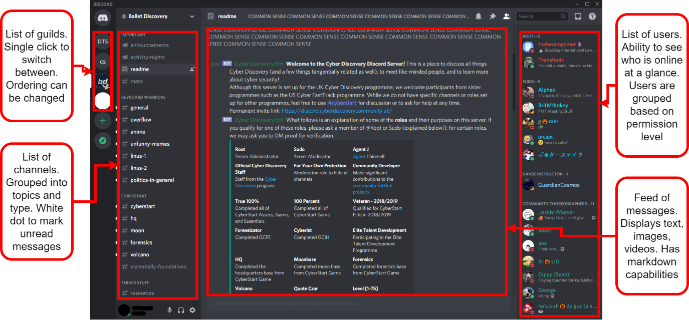

The results from this question show me that the most used messaging app among the respondents was WhatsApp (42%), followed by Snapchat (33%) – both privacy-focused, end-to-end encrypted messaging apps with Snapchat defaulting to deleting users’ messages after 24 hours. This, along with the results from question 1, confirm to me that the respondents are suitable representative for the solution’s stakeholders. Also of note is the fact that Discord (17%) came in 3rd. This means that *1.2.1* *Existing Program – Discord* was a suitable investigation as it is relevant to at least 17% of the survey’s respondents and, by extension, solution stakeholders.

**Question 3 – “What is your favourite feature of messaging apps?”**

The results of this question show me that the stakeholders’ favourite features are group messages (33%) and “Seen” receipts (25%). Therefore, I will consider including these features in my solution. However, group messaging may be outside of the solution’s scope. I only chose to include it as an option in this survey as it is too important of a feature in modern messaging apps to exclude. I will make a final decision on the feature when deciding the solution’s requirement and success criteria.

**Question 4 – “What is your least favourite feature of messaging apps?”**

This question was the direct inverse of question 4. Its results show me that in-app sounds (37%), un-sending messages (18%) and emojis (18%) are the most disliked features. Therefore, I will not consider including these in my solution. The dislike of emojis by 17% of respondents is not a surprise here since it was identified as the 2nd least used message type on Discord in *1.3.1* *Interview with Ethan Sandy*.

**Question 5 – “How important are the following features?”**

The results of this question show me that the stakeholders do not think the following features make a significant impact on a messaging app: in-app sounds, emojis, “typing…” indicator, and un-sending messages. From this, along with the results from question 4, I can see that these features are non-essential. Therefore, I will not consider these for the list of necessary features for my solution.

Another finding from the data is the four most important features: group messages, individual messages, encryption, and media sharing. Since these are important to the stakeholders, I will consider these for the list of features for the final solution. These findings are supported by the results from question 3 as well as in *1.3.1* *Interview with Ethan Sandy*.

**Question 6 – “What do you look for in a messaging app?”**

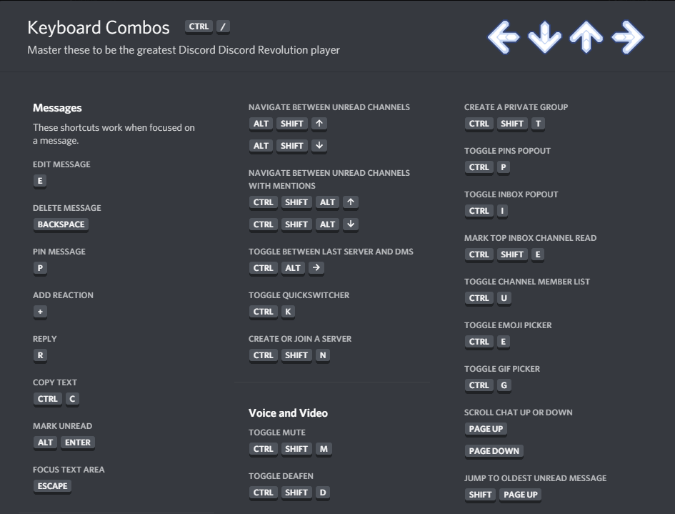

Question 6 shows me the simplicity (33%) is by far the most important quality of a messaging app with ease of use (17%) coming in second. I will try to reflect these qualities in my solution by considering them while designing my UI and by asking the stakeholders for feedback on my designs

**Question 7 – “What do you mainly use messaging apps for?”**

Socialising (60%) and sharing media (20%) appeared at the top of question 7’s ranking which was expected. However, the other two answers were surprising: work (13%) and sharing links (7%). To accommodate for the stakeholders who put down sharing links, I will investigate automatically hyperlinking text and opening browsers. However, I am unsure of how to accommodate the working users so may consider adding profanity filters unless any other features arise. Also of note is the fact that neither of these surprising answers got a higher percentage of votes, therefore, adding such features should not be a priority.

**Question 8 – “What feature might you want to see added to messaging apps?”**

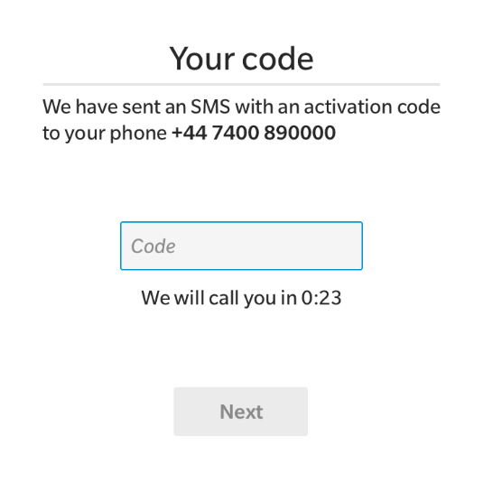

Next, the findings from question 8 are that many stakeholders want to see voice notes (50%) added to messaging apps. However, I think that this feature is beyond the scope of the project as it will require file storage and microphone access. I may still consider the feature but do not expect it to reach the final list of requirements and the success criteria. The joint second-highest scoring features are bigger file limits (25%) and “Notification read at …” (25%). Including a bigger file size limit could be done by raising the cap above 8MB for example (Discord’s cap for non-paying members as found in *1.2.1* *Existing Program – Discord*) so will be considered as a feature to potentially include in my solution. “Notification read at …” on the other hand will not be possible to be considered as it is beyond the project’s scope: it would require me to firstly send notifications to the user and secondly somehow track when this notification has been read.

**Question 9 – “How important is privacy for you?”**

Lastly, to further confirm the suitability of the respondents, there was an average rating of 4.3/5 for how important privacy to them is. Privacy is very important for this project as it aims to make a secure, end-to-end encrypted instant messaging program for users who care about who is viewing their data, so having stakeholders who are conscious about their privacy is paramount.

**Conclusion**

Overall, I am satisfied with the results of the survey. The respondents have been proven through many metrics that they are appropriate representatives of the stakeholders, which allows me to trust the survey’s results. In addition, I now have a list of several features to consider for the solution and a general guide for how to approach the UI design.

## Requirements

### Stakeholder Requirements

**Primary requirements**

The following are features raised in *1.1.4* *Stakeholder Identification* and *1.3* *Stakeholders* that are deemed essential for the program. These will be the priority in development and likely to be present in the project’s success criteria.

| Feature                                                 | Justification                                                                              | Reference                                                                |
|---------------------------------------------------------|--------------------------------------------------------------------------------------------|--------------------------------------------------------------------------|
| Accounts are needed to use the program                  | Accounts make contacts recognisable and accountable for their messages                     | *1.3.1* *Interview with Ethan Sandy* (Topic: Accounts)                   |
| Passwords must pass a minimum complexity check          | Security is important for the program so secure passwords is a must                        | *1.3.1* *Interview with Ethan Sandy* (Topic: Accounts)                   |
| Passwords and keys are not stored in plaintext          | Storing sensitive data as plaintext will undermine the system’s security                   | *1.1.4* *Stakeholder Identification*                                     |
| Messages are end-to-end encrypted                       | This is the most important feature for the stakeholders as it’s the purpose of the program | *1.1.4* *Stakeholder Identification* and *1.3.3* *Survey Results* (Q9)   |
| The client program works without the need for any setup | The stakeholders want simplicity and usability                                             | *1.1.4* *Stakeholder Identification* and *1.3.3* *Survey Results* (Q6)   |
| Tab based navigation                                    | This is a common and intuitive navigation method preferred by the stakeholders             | *1.3.1* *Interview with Ethan Sandy* (Topic: Messages and conversations) |

**Secondary Requirements**

These features were also raised in the sections stated above. However, they are not deemed essential so will not be a priority in development.

| Feature                                          | Justification                                                                            | Reference                                                                                        |
|--------------------------------------------------|------------------------------------------------------------------------------------------|--------------------------------------------------------------------------------------------------|
| Different types of messages (text, media, files) | It is a feature in Discord that the stakeholders would like to see in this program       | *1.3.1* *Interview with Ethan Sandy* (Topic: Discord research) and *1.3.3* *Survey Results* (Q5) |
| Messages are sent via pressing the \<enter> key  | It is intuitive and the most common method                                               | *1.3.1* *Interview with Ethan Sandy* (Topic: Program controls)                                   |
| View historic messages                           | Being able to read old messages makes the program more like instant messaging than email | *1.3.1* *Interview with Ethan Sandy* (Topic: Messages and conversations)                         |
| Standardised usernames                           | Users using the platform for work would benefit from standardised usernames              | *1.3.3* *Survey Results* (Q7)                                                                    |
| Send files greater than 8 MB                     | This is a paid feature of Discord that the stakeholders would like to see in the program | *1.3.1* *Interview with Ethan Sandy* (Topic: Discord research) and *1.3.3* *Survey Results* (Q8) |

### Software Requirements

For simplicity, I will only be building a Windows x86 version of the solution for development and the final evaluation. However, using the dotnet compiler, executables for all the following operating systems can be built from the source.

| OS         | Version                    | Architectures     |
|------------|----------------------------|-------------------|
| Windows    | 7 SP1+, 8.1                | x64, x86          |
| Windows 10 | 1607+                      | x64, x86          |
| Mac OS X   | 10.13+                     | x64               |
| Fedora     | 32+                        | x64               |
| Debian     | 9+                         | x64, ARM32, ARM64 |
| Ubuntu     | 20.10, 20.04, 18.04, 16.04 | x64, ARM32, ARM64 |

Information from the .NET Core GitHub repository \[6\]

The final user of the program will not be required to install the .NET runtime as the solution will be published self-contained. This means that the download will be larger as it will contain the .NET libraries, runtime and dependencies needed.

Internet access will be required to run the program as the client program needs to communicate with the server.

### Limitations

**Hardcoded server IP:**

When a client tries to connect to the server, it will use a hardcoded IP address as its target. This means that the IP address of the server must be static and cannot be moved onto another network. For this limitation to be fixed the server would have to be added to a DNS server so that the domain can dynamically point to the server. However, this is beyond the scope of the project.

**Group messaging:**

Group messaging – the most chosen “favourite feature” and rated the third most important feature from the stakeholders’ survey – will not be implemented in the solution. This is down to the vast increase in complexity from individual end-to-end encrypted messaging to group end-to-end encrypted messaging; implementing such a feature will take up too much time and would require the redesign of many of the procedures of the solution. For these reasons, I will be unable to implement the feature.

## Success Criteria

| ID  | Requirement                                                                       | Justification                                                                                               | Reference                                     |
|-----|-----------------------------------------------------------------------------------|-------------------------------------------------------------------------------------------------------------|-----------------------------------------------|
| 1   | Client sockets connect to server at start-up of the program                       | The app needs a connection to the server so it should connect while the app starts to minimise waiting time | Discord (splash screen)                       |
| 2   | Client socket tells the server it is closing before the app is closed             | Prevents any errors from occurring and begins the client disconnect procedure                               |                                               |
| 3   | The socket sends heartbeats to the server to show that it is still open           | Stops the possibility that a client has disconnected without the server realising which will lead to errors | IRC (PING)                                    |
| 4   | Users must log in to their account to access the program                          | Ensures that only people with valid credentials can view an account’s messages                              | IRC (?) or Stakeholders                       |
| 5   | New users can create an account                                                   | New users need a way of accessing the app                                                                   | IRC (?) or Stakeholders                       |
| 6   | Users are not allowed to try to log in if the socket cannot connect               | With no connection, logins cannot be authorised so the login process cannot be done                         |                                               |
| 7   | Usernames must be unique                                                          | Prevents situations where two people can accidentally share credentials                                     | Existing solution - Internet Relay Chat (IRC) |
| 8   | Password must be of a minimum strength (upper, lower, digits, special characters) | Makes sure the password is not a security flaw for the user                                                 | Discord (account creation)                    |
| 9   | Users can type out a message and send it with a "Send" button                     | Intuitive button to send the message                                                                        | Discord (UI)                                  |
| 10  | Users can type out a message and send it with the Enter key                       | Enter is a common key to press to send a message                                                            | Discord (controls)                            |
| 11  | Users can see a list of their contacts                                            | Users can easily see whom they are sending the message to                                                   | Existing program - Discord                    |
| 12  | Users can click on a contact to message with them                                 | No need to manually address each message they send like an email                                            | Discord (UI)                                  |
| 13  | Users can see past conversations with a contact                                   | Users do not have to worry that old messages will be lost                                                   | Stakeholder survey                            |
| 14  | Users can be added to contacts by searching their username                        | Usernames are easier for a user to remember than an IP address                                              | Discord (add friend)                          |
| 15  | Messages are encrypted with the recipient's public key                            | The recipients public and private keys are a keypair as it is asymmetric encryption                         |                                               |
| 16  | Messages are decrypted with the recipient's private key                           | Only the intended recipient can view the message as the decryption key is private                           |                                               |
| 17  | Messages are signed with the sender's private key                                 | The sender can prove their identity by using a key that only they know                                      |                                               |
| 18  | Signatures are checked with the sender's public key                               | The recipient must be able to prove that a message came from the user it claims to be from                  |                                               |
| 19  | Messages cannot be read while in the server                                       | End-to-end encryption requires messages to not be able to be read during transit                            |                                               |
| 20  | Key pairs can be generated                                                        | Public and private keys are needed for the encryption of all messages                                       |                                               |
| 21  | Public keys can be accessed by anyone                                             | Public keys are used to check signatures and encrypt messages so they must be visible to everyone           |                                               |
| 22  | The server can accept incoming client connections                                 | Allows clients to connect to the server when they are opening the app                                       |                                               |
| 23  | Each connected client is handled a separate thread                                | Concurrency allows for greater scalability in the number of clients and reduces their response time         |                                               |
| 24  | The server authorises logins against its database                                 | Only clients supplying valid credentials can view a user's messages                                         |                                               |
| 25  | The server can create new accounts                                                | New clients must be issued an account to start using the app                                                |                                               |
| 26  | Messages are routed to the intended recipient                                     | Users must only receive messages addressed to them                                                          | Existing solution – Internet Relay Chat (IRC) |
| 27  | Messages are held in the server if the recipient is not connected                 | Users may not be connected when a message is being sent so that must be accounted for                       | Existing solution – Internet Relay Chat (IRC) |
| 28  | Undelivered messages are sent the next time the recipient connects                | Users should not miss out on messages because they were not online                                          | Existing solution – Internet Relay Chat (IRC) |

# Design

## System Decomposition

*Networking – Sockets*

**Asynchronous:** Using sockets, I will be able to do asynchronous operations as to not block the program’s GUI for the user. This is paramount for the networking as if the operations are synchronous the IO will almost always be blocked for the user due to the constant communication with the server. To implement this part of the program I will need to implement callback functions and threading.

**TCP streams:** By using TCP, a connection orientated protocol, the server and client will have a dedicated stream to communicate via. The retransmission of lost packets is also important for the user as waiting longer for a message is better than receiving a malformed or incomplete message. In comparison, using UDP does have faster speeds but that is not necessary for this application and the unreliability is too significant to ignore. To implement this part of the program I will need to bind a socket to a port on the server and infinitely listen, I will then need to bind a socket to the same port on the server’s IP on the client.

**Client-server heartbeat:** A constant heartbeat message that will be pinged between the client and server will be used to give both parties up-to-date information about whether either party has ungracefully disconnected. This needs to be in the program as either socket may not get the opportunity to send a proper close message (such as in the event of the ethernet cable being pulled out) so the client/server will only find out when they try to send a transmission and never get a reply. To implement this part of the program I will need to send a message at a constant interval between the client and server, then if one of the parties does not get the message after a certain time it can be assumed that the other party has ungracefully closed.

*Networking – Protocol*

**Standardised encoding:** Using a standardised character encoding across all my transmissions will ensure that any text that is entered into one client will be displayed the same way in another client. This is included in response to the problems faced in IRC where character encoding was client determined and so some characters were different when viewed from a different client. To implement this part of the program I will pass all text inputs through the same encoder as part of the data validation process and the same decoder as part of the transmission receiving procedure.

**Encryption:** Since the program requires end-to-end encryption, making sure that no messages can be read during transit is important. Therefore, all transmission data will be encrypted with the recipient’s public key and signed with the sender’s private key. This will be implemented as a part of the transmission creation and receiving procedure so that it is done to all messages.

**Serialised object:** For easier sending and receiving of transmission, a common format that will be easy to read values from is needed. Since the transmission will be an object before its sent, I will create an object that will be serialised when sent. When the recipient gets the transmission, it can be de-serialised and immediately used by the receiver. This part of the program will possibly be implemented by using JObjects, this is a JSON object that contains many tokens that will be used to transfer information between the client and server.

**Flags determine command type:** Creating a general format for all transmission and then giving more information and specifying the purpose of the message via flags gives consistency to the transmission while not sacrificing functionality. These flags will declare the purpose of a request as, due to the structure of the transmission, I am unable to prefix messages with a command name so will need to integrate the request’s purpose into the object that will be sent. This part of the solution will most likely be done with Boolean values in the JObject or a token dedicated to holding a command name.

*Encryption – Public-key Cryptography*

**Asymmetric encryption vis RSA:** To encrypt the transmission, there are two routes to go down. Firstly, there is symmetric encryption which will require a Diffie-Helman key exchange to establish a shared secret key between two parties while the messages are being sent in plaintext through the server and then AES could be used once the secret key is established. The other is asymmetric encryption, this involves each party generating a random public key which is sent to the server to be available to all clients, and a private key which decrypts messages encrypted by the public key (the key is only known by the owner). I will implement the latter as symmetric encryption will require each time two clients communicate each client will need to fetch the key specifically for that pair whereas with asymmetric encryption the same key pair is used for all communications. I will implement this part of my solution by fetching or generating a key pair immediately after the login process.

**Key generator seeded with RNG:** To generate an effective private key, it must use truly random data rather than pseudorandom (from a PRNG). This is because using non-random data can open the possibility for keys to be guessed easier which undermines all the program’s security. This part of the solution will be implemented by using an RNG to generate as close to a truly random seed for the key generator.

**Key derivation functions:** To allow users to sign in to their account from any computer, their private keys must be stored on the server. However, this would be very poor practice if the key is stored in plaintext so it must be encrypted. However, the question of how you store the key to that encryption then arises. The solution is using a symmetric encryption algorithm that derives the key using the user’s password via a key derivation function (KDF). Using a KDF means that the key to decrypt a user’s password never makes its way out of a client’s memory let alone stored anywhere so the clients are not restricted to where they can log in from. This part of the program will be implemented by putting the user’s password through a KDF (possibly PBKDF2) after the log-in process, then fetching the encrypted private key from the server and decrypting it for use.

**Digital signatures:** By storing all users’ public keys in a centralised server that also handles all the traffic, there is the possibility of man-in-the-middle (MITM) attacks. One way to prevent this is to authenticate all messages. This will involve encrypting a small bit of data with the sender’s private key and appending it to the message; this extra data is called the signature. The recipient can then decrypt this signature with the sender’s public key, if the resulting plaintext matches an agreed-upon value the message has successfully been authenticated, else it has not come from the sender it claims to have been from and is most likely the result of an attempted MITM attack. To implement this part of the program I will use RSA once again as it is asymmetrical and the generated key pair from message encryption can be used.

*Interface – GUI*

**Tab based navigation:** To move about the program, windows will be organised into tabs which the user can click on to view. This will mean that when a conversation is opened with another user the conversation view is opened in the same window as the contact list. To implement this part of the solution I will need to have a TabControl in the main view and a UserControl for each conversation.

**Dynamic conversation view:** Since the nature of a messaging app means that messages will appear while the user is looking at a certain conversation, I will need to dynamically add controls to the UserControl in which the conversation is being displayed. This part of the program will likely be implemented by creating a template for a message – time, content, shape to hold text, sender/recipient – which can then be filled out with the data of each incoming message and added to the view.

**Login screen:** Upon opening the program, users will be required to sign in to an account or create an account. This means that a login screen will need to open first before the user can get access to the main part of the program. This will need to be done after connecting to the server since the login request will need to be sent from the socket. This part of the solution will be implemented by triggering a window to open only once the connection has been established, which will then lead to the main view being opened once a successful login has occurred.

*Accounts – Log-in*

**Input validation:** When the user inputs their username and password, a request will be sent off to the server to check the credentials against the database. This request should only go through when the form has been properly completed will valid data. Therefore, there must be checks in place to make sure inputs are completed and properly validated before being sent to the server. To implement this part of the program I will be doing some simple checks on the presence of data, the length of data and cleaning out whitespace and non-permitted characters from the input.

**Hash password:** Since the communication channel between the client and server is insecure until the client logs into an account. There is the possibility of using an ephemeral key to temporarily encrypt these communications, but I do not think this added complexity will be necessary for this use case. Therefore, to protect the user’s credentials the password will be hashed before being sent. This will then be checked against the hash in the server’s database to make sure the password is correct. By hashing the password, the plaintext is unknown, but it can still be used to compare against other hashed values. This part of the program will be implemented using the SHA-256 hashing algorithm.

**Fetch and decrypt private key:** As mentioned in the sections about KDFs, the user’s private key is stored on the server. Therefore, upon a successful log-in, the fetched encrypted private key must be decrypted. This part of the program will be implemented by putting the user’s plaintext password through the KDF and using the output as the decryption key. The private key will then only be stored in memory which will be wiped when the program is closed.

*Accounts – Sign-in*

**Postfix a discriminator:** Addressing the issue encountered in IRC and solved in Discord, username collisions will be prevented by postfixing a new user’s username with a two-digit number which Discord called the discriminator. This number will be automatically assigned so can add “uniqueness” to two otherwise identical usernames. This part of the solution will be implemented as a random number or as an automatically incrementing value (the latter being more likely) that will be in the format username#discriminator.

**Password strength check:** The weakest link in a system’s security chain is typically the endpoints and more specifically the user’s password. Therefore, to prevent all the encryption behind the scenes from being undermined I will force the user to have a strong password. This part of the solution will be implemented by only accepting new accounts with passwords that have both upper-case and lower-case letters, at least one letter, digit and special character and be at least 8 characters long.

**Generate new key pair:** Before any encrypted messages are sent between users, the new user must generate a key pair for RSA. The public key will then need to be sent to the server so that it can be accessed by any other client. The public key on the other hand should not be accessible to any other client but should be accessible to the user when they sign in on another machine: so, will be encrypted and stored in the server. The user’s password will be passed through a KDF (possibly PBKDF2) to generate the key for a symmetric encryption algorithm (possible AES) which the private key will be passed through before being sent off to the server for storage.

## User Design Requirements

### Primary User Requirements

### Secondary User Requirements

## Initial Design

### Design Specification

### Initial Designs

## Interface Design

### Interface Designs

Several low fidelity wireframes have been created for the different windows that will be shown in the program. These designs have incorporated the ideas from the *1.3.1* *Interview with Ethan Sandy* as well as some alternative ideas I have come up with inspired by the existing solutions seen in *1.2* *Research*. After getting feedback on these I will convert them to medium to high fidelity wireframes and prototypes to again send to the stakeholders for feedback.

**Conversation View**

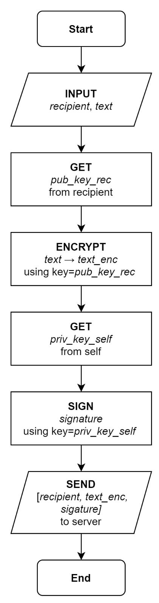

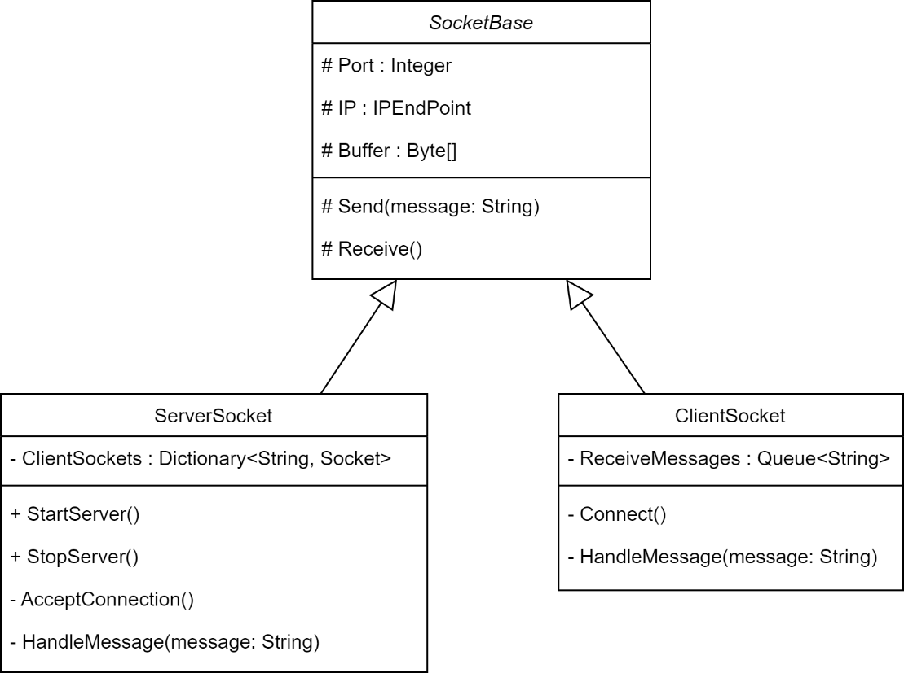

**Login View**

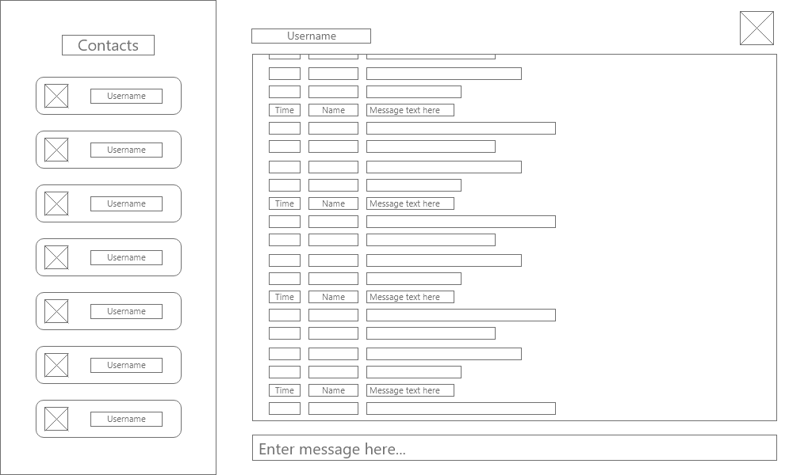

**Account creation views**

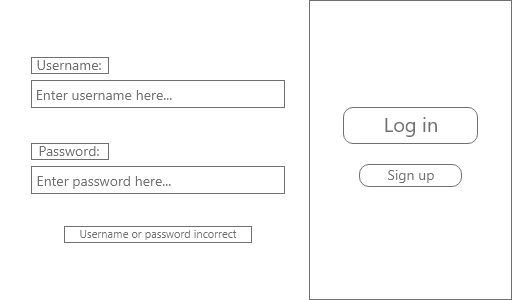

### Interface Feedback 

### Improved Interface

## Interface Features

### User Experience

### Usability Features

**Descriptive input fields**

To help aid the user in using the login screen, I will have descriptive labels on all the input boxes. These will be non-intrusive as to not get in the way for users who do not need them, but still visible enough so that it's clear as to which input box they describe. Also, highlighted labels will be added when an incorrect username or password is entered to give feedback to the user as to which fields they need to amend and, in the case of account creation, how.

**Pop-up error dialogues**

In the event of an error, the program will display an error dialogue to the user to tell them what has happened. If these were not shown to the user the program would just freeze, causing the user to not know what is going on. I will also play an error tone when this box appears to audibly inform the user that something has gone wrong. This box will most likely only have buttons to close the program or restart the program as the error would have to be irrecoverable for an error dialogue to be needed.

**Intuitive navigation**

To simplify the navigation, the main program will all be displayed in one window (login screen and error dialogues are the exception) where the user can choose which user to send a message using the tabs. This was determined during *1.3.1* *Interview with Ethan Sandy* in response to seeing the navigation style in the research of Discord. Since this style is common in many programs, the user will likely find it very natural and intuitive to use. Limiting the program to only one window also reduces the risk of users who do not use computer programs often getting “lost” or being confused by the child-parent relationship of pop-out windows (the alternative navigation method proposed to the stakeholder during the interview).

**Conversation view**

Quickly identifying the sender of a message is crucial to messaging apps. From the *1.3.1* *Interview with Ethan Sandy,* it was decided that this will be achieved by using a similar conversation view to that found on Discord: all messages are left-aligned in the format \[time\]\[user\]\[message\]. This will help the users in three ways. Firstly, the timestamps on the left mean that finding messages from a certain time can be done by quickly scanning down the left column. Secondly, having the username displayed for each message means that the sender of the messages can be quickly identified. Lastly, the username can be padded with whitespace to ensure that all messages begin at the same point to improve readability for the user; this has the added benefit that in situations where the two users talking have different username lengths time to determine the sender will be reduced due to the visible difference.

### Input Validation

## Internal Structures

### Client Algorithm – Logging in

This routine will be triggered by default when the user opens the program. The user can enter their credentials and log in, allowing them to progress onto the next screen with their messages, or they can press the button to create a new user account.

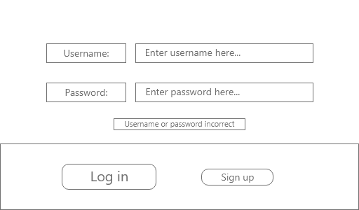

A change from this routine that may be considered is the use of a single password-based key derivation function (PBKDF), possibly Scrypt, to generate the “hash” for login validations and the seed for the RSA keygen algorithm. Being able to reproduce the key pair’s seed will allow the key pair to be generated client-side at log in rather than receiving them from the server, meaning only each client’s public key will need to be stored (rather than their public key and a symmetrically encrypted private key).

### Client Algorithm – Creating a new user account (1)

**Summary** – This algorithm will be executed when a new user wants to create an account. This is because all users will require an RSA key pair to facilitate encrypted communications and a pair of credentials to allow them to log in from any device.

**Line 3 to 4** – The username and password will be fetched from text boxes in the UI. The submit button that will call the subroutine CreateAccount() will only be enabled when both fields because enabling it right away will lead to the possibility of empty strings being used in the function and the visual aid will guide the user.

**Line 7 to 12** – The input validation for the username will require the username’s length to be between 5 and 128 characters long and does not contain any non-encodable characters. Due to the requirement of eliminating nickname collisions, a discriminator needs to be postfixed to prevent nickname collisions, this will be done on line 8 if the username is valid.

**Line 13 to 17** – Due to the success criterion “strong minimum password strength”, the input validation for the password will require the following criteria to be satisfied:

-   Both uppercase and lowercase characters

-   A mix of letters and numbers

-   At least one special characters

-   Between 8 and 128 characters

**Line 18** – To allow users to amend their credentials if they are not accepted, a “repeat…until” (or “do…while”) loop is used to continue requesting usernames and passwords until a valid pair is supplied. This will appear in the UI in the form of the invalid text box(es) being highlighted.

**Line 26** – As addressed in *2.1* *System Decomposition*, a key derivation function will be required to generate a symmetric key for AES to decrypt and encrypt the user’s private key that will be stored on the server. There are a few possible functions that the KDF in the pseudocode can be: KDF1, PBKDF2 or KBKDFVS. The final implementation will be chosen based on .NET implementation, security, and computation time.

**Line 28** – Since all passwords need to be stored securely, the password must be hashed first. This will be done via MD5 with the possibility of an added salt. The salt will be different for each user and will mean that even if two users have the same password, their password hashes will not be the same. This also has the benefit of helping to reduce the effectiveness of hash table attacks.

**Line 29 to 30** – Lastly, all the new information to make the user’s account must be sent to the server. Even though this will be transmitted over an insecure channel, all the sensitive information has been either hashed or encrypted. Although, man-in-the-middle attacks are (very much) possible at this point, addressing this vulnerability is beyond the scope of this program so will have to remain in the program.

### Client Algorithm – Creating a new user account (2)

This routine is a revision of the pseudocode described above. This has been done to align the new user account creation process more with the standard login process. For example, after a new account has been made on the server, the client is not automatically signed into this new account. This means that the client still must send the same login request that would be sent normally; this will allow me to only write one procedure for how message and user information will be sent after the login (triggered by the successful login request).

There has also been an additional step of validation added to the routine: the name that the user selects will be checked against all the existing names. This eliminates the need for the discriminators being appended to the end of names by only allowing unique usernames. Conversely, the checks for the validity of the username and password have been abstracted away as they have already been explained in the section above, and I do not think they need to be changed.

### File Organisation

### Variables

### Class Diagrams

## Final Design

### Final Design

### System Walkthrough

## Testing Strategy

### Testing algorithms

**1 – GetValidCredentials**

|            |                                                                                    |
|------------|------------------------------------------------------------------------------------|
| Procedure  | GetValidCredentials, from *2.6.1* *Algorithm – Creating a new user account*        |
| Parameters | None; (string) username and (string) password are fetched from UI during execution |
| Returns    | (string) username and (string) password                                            |

When a new account is created, GetValidCredentials is called. The function firstly gets the username and password the user entered into the UI. These credentials will then be checked against the requirements of the program, as specified by the stakeholders, to ensure their strength and correct length. The output of this function will be used in the subroutine CreateAccount that generates a keypair for the user, hashes the password, encrypts the private key, and sends all the necessary data associated with the account to the server.

The credentials supplied to CreateAccount must be valid as if they are empty or malformed, they will cause errors that may crash the client’s program, crash the server’s program, or make the login process vulnerable by storing incorrect usernames and passwords. Therefore, it is important to have test cases for each form of normal (N), erroneous (E) and boundary (B) data.

<table><colgroup><col style="width: 7%" /><col style="width: 28%" /><col style="width: 6%" /><col style="width: 28%" /><col style="width: 28%" /></colgroup><thead><tr class="header"><th>ID</th><th>Test</th><th>Type</th><th>Data</th><th>Expected</th></tr></thead><tbody><tr class="odd"><td>1.1</td><td>Valid username and password</td><td>N</td><td>
username = “Daniel”

password = “Password123!”
</td><td>username + # + discriminator and password returned</td></tr><tr class="even"><td>1.2</td><td>Empty variable from UI</td><td>E</td><td>
username = “”

password = “Password123!”
</td><td>Repeat credential input</td></tr><tr class="odd"><td>1.3</td><td>Null variable from UI</td><td>E</td><td>
username = null

password = “Password123!”
</td><td>Repeat credential input</td></tr><tr class="even"><td>1.4</td><td>Username contains invalid character</td><td>N</td><td>
username = “Dan iel”

password = “Password123!”
</td><td>Repeat credential input</td></tr><tr class="odd"><td>1.5</td><td>Username length lower bound</td><td>B</td><td>
username = 5 valid chars

password = “Password123!”
</td><td>username + # + discriminator and password returned</td></tr><tr class="even"><td>1.6</td><td>Username length upper bound</td><td>B</td><td>
username = 128 valid chars

password = “Password123!”
</td><td>username + # + discriminator and password returned</td></tr><tr class="odd"><td>1.7</td><td>Password does not contain upper and lower case</td><td>N</td><td>
username = “Daniel”

password = “password123!”
</td><td>Repeat credential input</td></tr><tr class="even"><td>1.8</td><td>Password contains no number</td><td>N</td><td>
username = “Daniel”

password = “Password!”
</td><td>Repeat credential input</td></tr><tr class="odd"><td>1.9</td><td>Password contains no special character</td><td>N</td><td>
username = “Daniel”

password = “Password123”
</td><td>Repeat credential input</td></tr><tr class="even"><td>1.10</td><td>Password length lower bound</td><td>B</td><td>
username = “Daniel”

password = 8 valid chars
</td><td>username + # + discriminator and password returned</td></tr><tr class="odd"><td>1.11</td><td>Password length upper bound</td><td>B</td><td>
username = “Daniel”

password = 128 valid chars
</td><td>username + # + discriminator and password returned</td></tr></tbody></table>

# Development

## Iteration 1

###  Shared

#### SocketBase class

Both the client and server require a socket to be networked together, to do this I used the System.Net.Sockets library and have created an abstract class called SocketBase. SocketBase houses all the shared socket functionality which is extended in a specific client and server child class. This solves the problem of duplicate client-server code and reduces the change of error since there is no chance of variable names or values being different.

**Features of SocketBase**

-   Properties

    -   Port number: 31416

    -   IP address: localhost for now

    -   Socket type: TCP stream

    -   Buffer: Empty 2048-byte array

-   Methods

    -   Constructor

    -   Sending data (begin and end asynchronous)

-   Abstract and virtual methods

    -   Receiving data (begin and end asynchronous)

    -   Handling messages

Since some methods will need to be implemented but will have different implementations depending on whether it is for the client or server, some methods have been declared but not defined. These are the abstract methods of the class as they will need to be defined by the child classes.

#### Protocol

To allow communication between the client and server to be consistent, I have created a Protocol class that encodes text in a standardised way (UTF-8). This was done to address the problem found of incompatible character encodings from *1.2.2* *Existing Solution – Internet Relay Chat (IRC)*.

I have used two constructors in this class as an instance of the Protocol needs be able to be created from a string (when being converted to binary for transmission) or from binary (when being converted to string from a transmission).

In future iterations, this is where I will put the code used to encrypt and decrypt messages since the process must be identical for all users to be consistent.

#### Creating the socket

Figure 2. MessengerAppShared.SocketBase.SocketBase

I have chosen the size of the socket’s buffer to be 2048 bytes as now 2KiB of data is enough for the text that is being transferred. Once multimedia messages are implemented, this buffer could be increased.

Secondly, the server is currently only available to the computer it is running on (as seen in IPAddress.Loopback). This has been done as opening it up to the Internet is both insecure and unnecessary during this phase of development. To open the program to the Internet the user would need to open a firewall port for inbound and outbound traffic, which leaves the chance for vulnerabilities to be introduced to whichever network I am testing on as that port needs to be closed once testing is over.

#### Receiving a message

Figure 3. MessengerAppShared.Receive

Both child sockets will use these asynchronous methods for receiving data since synchronous methods would be blocking and so very disruptive for the user. The methods are also both virtual as the child classes may extend them.

In future iterations, the decoding of the message into text and passing to the message handler will have to be moved out of the shared method and into the child-specific overrides as decryption keys will need to be used by the client.

#### Sending a message

Figure 5. MessengerAppShared.SocketBase.Send and MessengerAppShared.SocketBase.SendCallback

For the moment, sending data is simpler than receiving the data. Therefore, there is no need for it to be virtual as all its functionality can be defined in the shared socket base. Once encryption is introduced to the solution, encryption keys will need to be used by the client so the methods will need to be made abstract to allow the child classes to define their specific processes.

### Server

#### 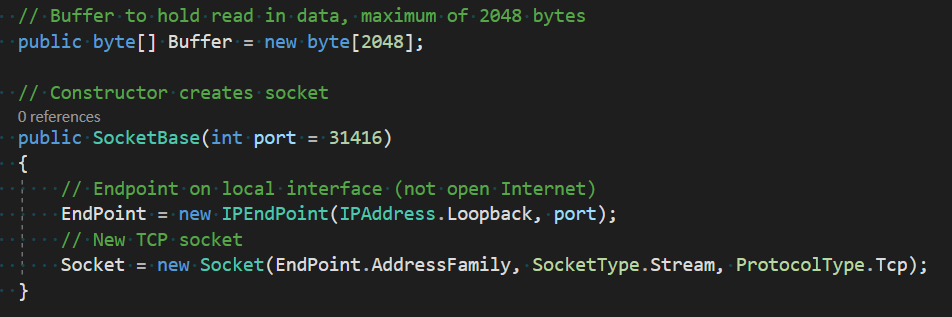Starting the server

Inside the server program’s main function, a socket (ServerSocket is a child of SocketBase) is created and set to start. This will begin an infinite loop that accepts new connections from clients and creates a virtual thread for each client which has begun an infinite loop of receiving data.

This code should not need to change for the rest of the development since the connection process will be the same even after adding user authentication and encryption.

#### Stopping the server

To stop the server, enter must be pressed. In future iterations, this could be made more secure by requiring a passcode to be entered however it is not crucial so is not important now.

Currently, there are two issues with the shutdown process. Firstly, the clients connected to the server are not notified that the server has been shut down. Which can cause fatal errors for the client if they try to send anything to the server. This problem can be solved by sending a shutdown notice to all connected clients before closing the socket. Secondly, a non-fatal error is thrown in the server program during the shutdown process, but I am yet to figure out the cause.

Figure 11. Server console output after \[enter\] is pressed

#### Accepting a new client

Figure 12. MessengerAppServer.ServerSocket.AcceptCallback

This method is called at the end of ServerSocket.Start (*Figure 7*) to finalise the new client connection and will call ServerSocket.Start once it has finished, continuing the infinite loop.

In future iterations of the solution, this method will be extended by adding the user login system which will, in turn, improve the name and socket relations system in use here. It currently consists of two dictionaries: one for IP to socket lookups and one for the socket to IP lookups. This will be replaced with usernames as each socket’s unique identifier as to send a user a message now, the exact IP and port need to be entered, which is not user-friendly enough for the final solution.

#### Receiving a message from a client

Figure 13. MessengerAppServer.ServerSocket.ReceiveCallback

During development, I encountered the problem of the server crashing whenever a client program closed. I found the cause of this to be the infinite receive loop still trying to receive data from the client even though its connection has closed. To solve the problem, I added some validation to make sure the client is still connected before trying to read any data. This addition also had the added benefit of ensuring that the name to socket relation dictionaries is up to date with the connected clients

In the future, I may move the client disconnect process to a separate method. This is because the process will only get longer and methods should only do one thing: just finish receiving the data, not also remove disconnected clients.

#### Handling a message from a client

Figure 15. MessengerAppServer.ServerSocket.HandleMessages

This method is called after receiving any data from the client. Firstly, data sanitation removes leading and trailing whitespace to ensure that all command word and parameter matches are accurate. Secondly, the string is exploded into an array of words which has been done to make reading specific parts of the message easier.

To determine which command the message contains, the first words are matched against several cases. To avoid errors when the message is empty or null, the null coalescing operator (??) is used. This operator returns the left-hand side if it does not equal null, and the right-hand side if it is. This could have been done in an if statement before the switch but combining the two pieces of logic reduces code duplication and makes the method easier to maintain in the future.

In future iterations, this switch case block will have to be modified as the plan for the commands is for them to be object- or markup-based: possibly JObjects or XML. However, the same principle will remain.

#### ECHO command handling

Figure 16. MessengerAppServer.ServerSocket.Command_ECHO

This method will not be part of the final solution, instead, I am using it to test the sending of data between the client and server. By echoing any data sent back to the client, I can see immediately what data was transmitted, its form and therefore any problems, without the need to do variable watches in debugging.

Figure 17. ECHO command as seen from client's and server's perspective

At this point in development, the server can see all messages in plaintext. This is not an issue as I am yet to implement the encryption process. In a future iteration when encryption has been implemented, the above situation should produce the same results on the client’s side while not showing “Hello World!” on the server’s side.

#### SEND command handling

Figure 18. MessengerAppClient.ServerSocket.Command_SEND

One difficulty faced when writing this method was the command’s dependency on positional arguments. This required validation for the number of words in the message and tests of whether arguments were intended to be recipients or not, which meant there had to be many nested conditionals. This problem will be solved in future iterations where I will move away from a text-based protocol like this and into an object- or markup-based protocol as discussed in *2.1* *System Decomposition*.

Another change I will make to this method in the future is changing the recipient argument into a username rather than an IP address and port. However, this can only be done once I have implemented user accounts. This will help the end-user by making the syntax easier and less likely to cause mistypes; although, in the final solution all commands will be generated by the client program so this improvement will lose its effect.

Figure 19. SEND message from left (port 1070) to right (port 1071)

As seen above, when sending a message, it is not immediately displayed by the recipient. I believe that this is because the client programs do not have an infinite receive loop like the server program. This means that they only read in data from their socket after they send a message to the server. Having a message waiting to be read by the socket introduces a permanent one-message delay on all communications from that program, which increases for each further message they receive via a SEND. To solve this problem, I will create a virtual thread that continually listens for messages from the server to process/display them in real-time.

### Client

#### Connecting to the server

This method is used to interface the UI with the socket functions: pressing the “Connect to server” button will call this and once the socket has connected to the server, it will update the status label.

One issue with this current method is that if the socket does not connect to the server successfully, the UI would still show “Connected” (currently the program crashes first, but if the crashing were fixed). This could be solved by adding a conditional to determine if the connection were successful.

In future iterations of the solution, this method to begin the connection with the server would be where an infinitely looping receiving data thread would begin. This is needed in the program as it would solve the issue seen in *3.5.1* *Testing* with the SEND command not updating the received message field on the recipient’s program until they next communicate with the server.

#### Sending a message to the server

This method is called when the “Send Message” button is pressed. It sends the message in a text field to the button’s left to the server, gets a response from the server and displays the response. This linear process is needed as the response to the sent message is directly related to the sent message. However, this method is the only method used by the client to communicate with the server, which is not good when messages are sent to the client without the client first sending a message.

I will solve this problem by adding an infinite receive loop like that seen in the server program. The consequences of not having this loop can be seen in the example from *3.2.7* *SEND command handling.*

Another problem I faced when writing this method was how will I store the message received. Originally, I was going to have a string to hold the received message, but then I realised that there may be a situation where I need to access past messages. Therefore, I implemented a list that new messages are appended to. In the future, I will switch this to a queue as I need a FIFO data structure that can hold a backlog of messages while the current message is being processed.

#### Messaging screen

Figure 22. Client program's user interface

The current UI has not been made for usability. It only has the essential components for testing and debugging the networking portion of the solution: my aim for this first iteration. In future iterations, I will focus more on recreating the designs which the stakeholders and I decided on. This includes adding the feature to send messages via pressing the enter key, connecting to the server automatically upon opening the program and most importantly, having the program write all the commands which are sent to the server, so the user only needs to write the message they want to send.

Secondly, there are no limits on window size, taskbar icon and descriptive name. All of which are not important features but will need to be added to the final solution before it is sent out to stakeholders.

### Testing

#### Testing plan

I will be testing this iteration through a predominantly black-box testing method – with some tests targeting specific conditionals like white-box testing. This is being used to see how the expected output to the user compares to the intended output. Most of the tests conducted will be for all the possible messages sent to the server from the client program, the rest will be seeing how the client program handles malformed messages and clicking buttons that cannot complete their intended actions.

<table><colgroup><col style="width: 4%" /><col style="width: 26%" /><col style="width: 26%" /><col style="width: 41%" /></colgroup><thead><tr class="header"><th>ID</th><th>Testing</th><th>Input Data</th><th>Expected Output</th></tr></thead><tbody><tr class="odd"><td>1</td><td>ECHO, normal</td><td>“ECHO Test”</td><td>“Test”</td></tr><tr class="even"><td>2</td><td>ECHO, no message</td><td>“ECHO”</td><td>“Invalid ECHO: Missing argument [message]”</td></tr><tr class="odd"><td>3</td><td>ECHO, whitespace message</td><td>“ECHO ”</td><td>“Invalid ECHO: [message] IsNullOrWhiteSpace”</td></tr><tr class="even"><td>4</td><td>SEND, normal</td><td>“SEND 127.0.0.1:123 Test”</td><td>
Sender: “SUCCESSFUL SEND”

Recipient: “MESSAGE 127.0.0.1:123 Test”
</td></tr><tr class="odd"><td>5</td><td>SEND, no arguments</td><td>“SEND”</td><td>“Invalid SEND: Missing arguments [recipient] and [message]”</td></tr><tr class="even"><td>6</td><td>SEND, no message, valid recipient</td><td>“SEND 127.0.0.1:123”</td><td>“Invalid SEND: Missing argument [message]”</td></tr><tr class="odd"><td>7</td><td>SEND, no message, invalid recipient</td><td>“SEND 0.0.0.0:0”</td><td>“Invalid SEND: Invalid [recipient] “0.0.0.0:0” and missing [message]”</td></tr><tr class="even"><td>8</td><td>SEND, whitespace message, valid recipient</td><td>“SEND 127.0.0.1:123 “</td><td>“Invalid SEND: [message] IsNullOrWhiteSpace”</td></tr><tr class="odd"><td>9</td><td>SEND, valid message, invalid recipient</td><td>“SEND 0.0.0.0:0 Test”</td><td>“Invalid SEND: Invalid [recipient]”</td></tr><tr class="even"><td>10</td><td>No message</td><td>“”</td><td>“Invalid message: Is null or whitespace”</td></tr><tr class="odd"><td>11</td><td>Invalid command</td><td>“RUN Test”</td><td>“Invalid command: Command “RUN” not found”</td></tr><tr class="even"><td>12</td><td>Leading and trailing whitespace</td><td>“ ECHO Test ”</td><td>“Test”</td></tr><tr class="odd"><td>13</td><td>Extra whitespace between arguments</td><td>“SEND 127.0.0.1:123 Test”</td><td>
Sender: “SUCCESSFUL SEND”

Recipient: “MESSAGE 127.0.0.1:123 Test”
</td></tr><tr class="even"><td>14</td><td>Message longer than 2048 bytes</td><td>“ECHO &lt;more than 2043-byte string&gt;”</td><td>The string truncated to 2043 bytes</td></tr><tr class="odd"><td>15</td><td>Sending a message without connected to the server</td><td>“ECHO Test”</td><td>Not allowed</td></tr><tr class="even"><td>16</td><td>Sending a message after the server has closed</td><td>“ECHO Test”</td><td>Not allowed</td></tr><tr class="odd"><td>17</td><td>Connecting an already connected client</td><td>Press “Connect to server”</td><td>Not allowed</td></tr><tr class="even"><td>18</td><td>Connected when the server is not running</td><td>Press “Connect to server”</td><td>Not allowed</td></tr></tbody></table>

#### Testing results

<table><colgroup><col style="width: 4%" /><col style="width: 8%" /><col style="width: 56%" /><col style="width: 30%" /></colgroup><thead><tr class="header"><th>ID</th><th>Status</th><th>Actual Output</th><th>Comments</th></tr></thead><tbody><tr class="odd"><td>1</td><td>Pass</td><td>
Client:

Server:

</td><td>Output as expected</td></tr><tr class="even"><td>2</td><td>Pass</td><td>
Client:

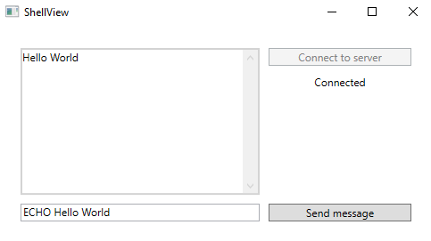

Server:

</td><td>Output as expected</td></tr><tr class="odd"><td>3</td><td>Fail</td><td>
Client:

Server:

</td><td>The whitespace message was removed by the data sanitisation earlier in the algorithm, so the transmission appeared as having no message</td></tr><tr class="even"><td>4</td><td>Fail</td><td>
Sender (127.0.0.1:62839):

Recipient (127.0.0.1:63008):

Server:

</td><td>Due to the lack of an infinite receive loop on the client, the recipient does not receive the message until they next communicate with the server</td></tr><tr class="odd"><td>5</td><td>Pass</td><td>
Client: 

Server:

</td><td>Output as expected</td></tr><tr class="even"><td>6</td><td>Pass</td><td>
Client:

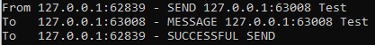

Server:

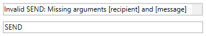
</td><td>Output as expected</td></tr><tr class="odd"><td>7</td><td>Pass</td><td>
Client:

Server:

</td><td>Output as expected</td></tr><tr class="even"><td>8</td><td>Fail</td><td>
Client:

Server:

</td><td>Like test 3, the whitespace message was removed by data sanitisation earlier in the algorithm, so the transmission appeared as having no message</td></tr><tr class="odd"><td>9</td><td>Pass</td><td>
Client:

Server:

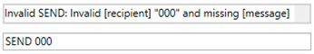
</td><td>Output as expected</td></tr><tr class="even"><td>10</td><td>Fail</td><td>(Program hung, had to be killed)</td><td>An unknown error caused the program to hang, I will investigate the cause</td></tr><tr class="odd"><td>11</td><td>Pass</td><td>
Client:

Server:

</td><td>Output as expected</td></tr><tr class="even"><td>12</td><td>Pass</td><td>
Client:

Server:

</td><td>Output as expected</td></tr><tr class="odd"><td>13</td><td>Fail</td><td>
Client:

Server:

</td><td>When splitting the string on space characters, the position of the recipient was replaced by an empty string</td></tr><tr class="even"><td>14</td><td>Fail</td><td>
Client:

Server Part 1:

Server Part 2:

</td><td>The first 2048 bytes were processed correctly. The remainder was processed as in independent command, so caused a command not found error. The 2nd message suffered the same timing issue as test 4</td></tr><tr class="odd"><td>15</td><td>Fail</td><td>(Program hung, had to be killed)</td><td>An unknown error caused the program to hang, I will investigate the cause</td></tr><tr class="even"><td>16</td><td>Fail</td><td>(Program hung, had to be killed)</td><td>An unknown error caused the program to hang, I will investigate the cause</td></tr><tr class="odd"><td>17</td><td>Pass</td><td>
Expected output

</td><td>Output as expected</td></tr><tr class="even"><td>18</td><td>Fail</td><td>(Program hung, had to be killed)</td><td>An unknown error caused the program to hang, I will investigate the cause</td></tr></tbody></table>

The failure of tests 3 and 8 was not a problem, they only failed because the data sanitisation did not allow the introduced malformations to reach the targeted conditionals. I will investigate removing these conditionals as if they are never reached there is no need to keep them in the code.

Test 4 not producing the expected output was expected as the lack of a receive loop was identified in *3.2.7* *SEND command handling* as well as the necessary steps to solve the problem.

The failure of tests 10, 15, 16 and 17 was unexpected. During the next development cycle, I will investigate the errors that were thrown causing the program to hang in a debugging environment and do the necessary changes to the code. Since they were all client-side errors, they will likely be mitigated by checking the contents of fields and status of buttons before allowing any action to begin.

Lastly, test 14 failed. This can be solved by adding a limit on the maximum number of characters allowed in the client program so that no transmission is greater than 2048 bytes.

## Iteration 2

### Plan

| ID  | Requirement                                              |
|-----|----------------------------------------------------------|
| 4   | Users must log in to their account to access the program |
| 24  | The server authorises logins against its database        |

In this iteration, I plan to add the login system (success criteria 4 and 24). This is because if I want to progress further with the development of client-to-client messaging, I need a more solid connection between a client and their identity. The best way to implement this is by bringing forward the development of the login system. To satisfy the UI design requests made by the stakeholders, I will design this login system following 2.4.1 Interface Designs.

As mentioned at the end of the last iteration, I will also transition the text-based protocol to object-based so that validation and ease of processing are improved. However, I do not know whether JObjects or XML objects will be used so I will need to investigate and experiment with those options during the development.

### Shared

#### Application layer networking protocol changes

**Overview**

In this iteration, I successfully transitioned the program’s application layer networking protocol from text-based to object-based. This was done in response to the discussion in *2.1* *System Decomposition* as well as the practical findings of *3.2.7* *SEND command handling* in iteration 1. The benefits of the object-based protocols include the following:

1.  Fewer errors caused by the protocol’s reliance on positional arguments and syntax

    -   The incorrect placement of a SPACE character previously caused errors

2.  Simpler message handling

    -   Subtype polymorphism allows me to perform actions on all message objects irrespective of their intended purpose

    -   Access to the contents of a message is much easier through the attributes of an object compared to the components of a string

3.  Better extensibility

    -   New message types can be quickly created by inheriting from a shared message class base

**Class diagram**

**Implementation**

During the design of the class diagram that matched and extended the functionality of the text-based protocol, I quickly realised that custom objects would be best to implement the protocol – rather than JObject or XML objects as I previously thought and had suggested in 3.6 Iteration 2, Plan.

To implement the new protocol, I first made an abstract base message class called MessageBase which can be seen in the class diagram above and then the several derived message classes that inherit from this base. Each of these derived classes corresponds to one action or request. For example, when the client sends a MessageEcho object to the server the contents of the object will be echoed back to the client; this class was made especially for debugging and allows me to test the sockets’ connection (just like its text-based equivalent seen in *3.2.6* *ECHO command handling*).

For some parts of the program, I only partially transitioned to the object-based protocol. These parts will be fully transitioned in future iterations as I don’t deem them a priority now. To accommodate for this partial transition, the MessageBase class has StringToBinary and BinaryToString that allow it to act as a messenger for the text-based protocol albeit wrapped in the object-based protocol.

#### Serialisation and deserialisation

Figure 23. MessengerAppShared.MesssageBase.Serialise and MessengerAppShared.MessageBase.Deserialise

These methods from MessageBase facilitate the object-based protocol as only binary can be transmitted across the program’s sockets.

The serialisation method works by taking in an object of unknown type, then creating a byte array stream to which the object’s binary representation is written. This stream is then converted into a normal byte array and returned. The deserialisation process is just the reverse of this: taking the byte array stream in and returning the object of an unknown type.

I chose to make these methods static as if they were regular methods, the methods would be serialising or deserialising the object that they are a part of. This self-referencing during the deconstruction or construction would make it impossible to send any messages across the network, the situation would be like having a language’s sole compiler written in the language that it is there to compile. Making the method static and passing the object/binary as arguments solved this problem by detaching the method from the object they are acting on.

To improve these methods, in future iterations I may implement a size restriction check that the byte arrays do not exceed the 2048-byte size of the buffer used by the sockets. I may also do validation checks on the type of the object as if the object is not one of the derived classes of MessageBase the program will not be able to understand it properly.

### Server

#### Handling an inbound message

Figure 24. MessengerAppServer.ServerSocket.HandleObject

This function is called after the socket receives an object. Its purpose is to call the object’s corresponding handling routine. This is achieved through a switch-case block that switches on the object’s type. I chose this as it is the most succinct conditional for this scenario, the alternative is many if-statements containing very similar conditions that add unnecessary repetition. A benefit of this function is that it allows me to in future implement actions easily as all I need to do is add another case to pass on to that action’s handler.

In the situation that the object received by the socket does not match any of the cases, the default case will be reached. This currently has no functionality. I plan to have the HandleObject_Invalid function send an error message back to whoever sent the message so that know that their message was not properly handled.

Another case that currently doesn’t have functionality is the MessageSend case. This will be implemented in the next iteration when I move to develop the messaging, as in this current iteration I have been working on the login system (hence HandleObject_Login being finished). The steps in HandleObject_Send will be to determine the recipient; send the message to the recipient; send confirmation to the sender.

The purpose of the MessageEcho class was mentioned above in *3.6.2* *Serialisation and deserialisation*. Despite it only being for debugging, it will remain in the final program since, if it is not called, it will not affect the client and still allow testing in the future.

#### Login procedure

Figure 25. MessengerAppServer.ServerSocket.HandleObject_Login

This method is triggered by the received object handler explained in the section above. The method compares the username and password provided by the user to all the stored usernames and passwords in the AccountCredentials.csv file. When a match is found, an appropriate message is returned to the user as a pop-up box.

On the client side, the response has no functionality other than telling the user that their credentials were found. In subsequent iterations, I will make it so that a successful response progresses the user onto the messaging screen to satisfy success criterion 4 – the aim of this iteration.

On the server side, the dictionary that contains the relations between clients and identities is unchanged from the previous iteration. Now that the user account framework is in place, I will alter the identities to be usernames rather an IP addresses. This will then set up the lookup table for when encryption is implemented as public keys can be added here alongside usernames (to satisfy success criterion 21).

#### CSV handling

Figure 26. MessengerAppServer.CSVHandler

This class handles reading data from AccountCredentials.csv by the server. When called it reads the file and transforms each record into an Account object. The Account class has attributes corresponding to each header in the CSV (Username, Password) and no methods, it merely exists to hold data. The list of Account objects is then returned to the program so that it can be searched as seen above in the 3.8.2 Login procedure.

Currently, there are no restrictions on allowed usernames and passwords since there is no way to create an account (all the test records in AccountCredentials.csv are from manual input). When I do implement an account creation system, I need to consider the following standardised usernames as raised in 1.4.1 Stakeholder Requirements. To define the rules for the usernames and passwords I will use the grammar below.

<table><colgroup><col style="width: 100%" /></colgroup><thead><tr class="header"><th>Username and password grammar (EBNF)</th></tr></thead><tbody><tr class="odd"><td>
upper ::= [A-Z]

lower ::= [a-z]

digit ::= [0-9]

special ::= "$" | "#" | "@" | "!" | "%" | "^" | "&amp;" | "*"

character ::= [A-Z] | [a-z] | [0-9] | special

first_name ::= upper { lower }

last_name ::= upper { lower | "-" upper }

username ::= first_name [ "_" last_name ]

password ::= character { character }
</td></tr></tbody></table>

As all login attempts are processed by the server by checking the supplied credentials against those in AccountCredentials.csv, success criterion 24 has been completed as planned for this iteration.

### Client

#### Login request

Figure 27. MessengerAppClient.LoginViewModel.LoginButton

This function is called when the user clicks the “Log in” button on the login dialogue (as seen in 3.10 Iteration 2, Client UI). The contents of the username and password field are used to create a new MessageLogin object. This object is then sent to the server and the server’s response is received. The UI fields are also cleared.

In future iterations, I plan to add data validation to ensure that UsernameInput and PasswordInput are not empty when this function is called. Currently, zero-length strings do not cause errors, although they may cause issues once hashing and encryption are introduced.

Another change that needs to be implemented is the move away from the one-to-one send and receive messages between the client and server. In the last iteration, this was the cause of the timing issues seen in test ID 4 in *3.5.2* *Testing results*: it caused a queue of transmissions to build upon the server’s socket that only dequeued when the client sent a message. I plan to fix this by implementing an infinite receiving loop on the client giving a one-to-many relation instead.

When a response is received from the server, the client shows a pop-up box to the user containing the response. This is fine for testing, although for the program to be functional and success criterion 4 to be satisfied the client should do something different: if the response is for a valid login, pass the user onto the messaging screen; if the response is for an invalid login, continue showing the login screen (as already mentioned in 3.7.2 Login procedure).

#### Login screen 

Figure 28. Client login screen

Figure 29. Unsuccessful login attempt

Figure 30. Successful login attempt for user "test"

When the user runs the program, they are shown the login screen above. After filling out the fields they can click the “Log in” button (defined above in 3.9.1 Login request) to attempt to log into the server. If the server finds a matching pair of credentials in their CSV, the client is shown the successful login attempt message (Figure 30). If the server cannot find a matching pair of credentials, the client is shown the unsuccessful login attempt message (Figure 29). The user can then close these pop-up boxes and they are shown the login screen again.

In this iteration, I planned to have the login screen progress onto the messaging screen from Iteration 1. However, due to unforeseen difficulties with maintaining state while destroying one window and making another I was unable to implement that feature. I have ideas on how to solve this problem – such as making both “windows” be contained in the same windows so all I need to do is switch the window’s contents – that I will investigate in future iterations.

Because users cannot access the program after a successful login, success criterion 4 has not been met. Although, the login validation is already in place all that needs to be added to satisfy the criterion is the screen transfer.

### Testing

#### Testing plan

In this iteration’s testing, I will mainly carry out black-box tests of all the possible input scenarios from the user on the client login screen. However, I will also include some white-box style tests that have been made to test certain validation checks and validation in the program. Specific tests for the transition from the text-based to the object-based protocol will not be outlined as they will be covered in the tests for all the different types of login requests.

<table><colgroup><col style="width: 5%" /><col style="width: 26%" /><col style="width: 26%" /><col style="width: 41%" /></colgroup><thead><tr class="header"><th>ID</th><th>Testing</th><th>Input Data</th><th>Expected Output</th></tr></thead><tbody><tr class="odd"><td>1.0</td><td>The “Log in” button</td><td>Click the “Log in” button</td><td>Send a login request to the server, then the user is passed to messaging screen</td></tr><tr class="even"><td>1.1</td><td>The “Sign up” button</td><td>Click the “Sign up” button</td><td>Send a sign-up request to the server, then the user is passed to messaging screen</td></tr><tr class="odd"><td>2.0</td><td>Valid credentials</td><td>
U: test

P: test
</td><td>The client is told login was successful</td></tr><tr class="even"><td>2.1</td><td>Invalid username</td><td>
U: Testing123

P: test
</td><td>The client is told login was unsuccessful</td></tr><tr class="odd"><td>2.2</td><td>Invalid password</td><td>
U: test

P: Testing123
</td><td>The client is told login was unsuccessful</td></tr><tr class="even"><td>2.3</td><td>Invalid credentials</td><td>
U: Testing123

P: Testing123
</td><td>The client is told login was unsuccessful</td></tr><tr class="odd"><td>2.4</td><td>Blank username</td><td>
U:

P: test
</td><td>The client is prevented from submitting a login request</td></tr><tr class="even"><td>2.5</td><td>Blank password</td><td>
U: test

P:
</td><td>The client is prevented from submitting a login request</td></tr><tr class="odd"><td>2.6</td><td>Blank credentials</td><td>
U:

P:
</td><td>The client is prevented from submitting a login request</td></tr><tr class="even"><td>2.7</td><td>Mix two accounts’ credentials</td><td>
U: test

P: password123
</td><td>The client is told login was unsuccessful</td></tr></tbody></table>

#### Testing results

<table><colgroup><col style="width: 5%" /><col style="width: 8%" /><col style="width: 46%" /><col style="width: 39%" /></colgroup><thead><tr class="header"><th>ID</th><th>Status</th><th>Actual Output</th><th>Comments</th></tr></thead><tbody><tr class="odd"><td>1.0</td><td>Fail</td><td>
Server:

Client:

</td><td>The request successfully reached the server and was processed as expected. However, when the response reached the client, the user was not passed to the messaging screen</td></tr><tr class="even"><td>1.1</td><td>Fail</td><td>
Server:

[nothing]

Client:

</td><td>A request was never made to the server and the user was shown an “under construction” placeholder</td></tr><tr class="odd"><td>2.0</td><td>Pass</td><td>
Server:

Client:

</td><td>Output is as expected</td></tr><tr class="even"><td>2.1</td><td>Pass</td><td>
Server:

Client:

</td><td>Output is as expected</td></tr><tr class="odd"><td>2.2</td><td>Pass</td><td>
Server:

Client:

</td><td>Output is as expected</td></tr><tr class="even"><td>2.3</td><td>Pass</td><td>
Server:

Client:

</td><td>Output is as expected</td></tr><tr class="odd"><td>2.4</td><td>Fail</td><td>
Server:

Client:

</td><td>The user is not stopped from sending a login request with an empty field</td></tr><tr class="even"><td>2.5</td><td>Fail</td><td>
Server:

Client:

</td><td>The user is not stopped from sending a login request with an empty field</td></tr><tr class="odd"><td>2.6</td><td>Fail</td><td>
Server:

Client:

</td><td>The user is not stopped from sending a login request with empty fields</td></tr><tr class="even"><td>2.7</td><td>Pass</td><td>
Server:

Client:

</td><td>Output as expected</td></tr></tbody></table>

Test 1.0 only partially failed. The request, processing and response sent to the client were what was expected. However, when the client received the response, it should have passed the user onto the messaging screen. This has not been implemented yet so did not happen. This issue is discussed in the sections above and I plan to correct it by making both the login and messaging screens occupy the same window so state information can be more easily transferred between the two (which was the reason I was unable to implement the correction earlier).

Test 1.1 failed as this functionality has not been implemented. I do not plan to implement this soon as there are more important features to add first and some features which, if added after the sign-up code, would require the sign-up code to be modified.

Tests 2.4, 2.5 and 2.6 all failed as the user was allowed to send login requests to the server will one or both the fields being empty. Even though this did not cause errors in the program, it is not good practice. When encryption and hashing are implemented, the zero-length strings will cause errors. Therefore, in the next iteration, I will add restrictions so that the user can only send a login request when both fields are populated.

### Evaluation

| ID  | Status   | Requirement                                              |
|-----|----------|----------------------------------------------------------|
| 4   | Partial  | Users must log in to their account to access the program |
| 24  | Complete | The server authorises logins against its database        |

Success criterion 4 has only been partially completed as when a user makes a login request, the request is handled as planned by the server and the client is told if the login was successful or not. Although, the client does not then pass the user onto the messaging screen if the login was a success. I have outlined what needs to be done to correct this in the iteration’s analysis above and I will implement it in the next iteration.

All logins are checked by the server against the AccountCredentials.csv file to check whether an account with those credentials exists. This is what is required by success criterion 24 so that has successfully been met.

# Evaluation

# References

|     |     |
|-----|-----|
|     |     |
|     |     |
|     |     |
|     |     |
|     |     |
|     |     |
|     |     |

\[1\] C. Corberly, “Discord has surpassed 250 million registered users,” TechSpot, 13 May 2019. \[Online\]. Available: www.techspot.com/news/80064-discord-has-surpassed-250-million-registered-users.html. \[Accessed 12 February 2021\].\[2\] A. Schmelyun, “Password requirements for Discord,” \[Online\]. Available: passhints.co/discord/. \[Accessed 13 April 2021\].\[3\] A. Gelhausen, “IRC Networks - Top 10 in the annual comparison,” Netsplit, 2005. \[Online\]. Available: netsplit.de/networks/top10.php?year=2005. \[Accessed 19 February 2021\].\[4\] A. Gelhausen, “IRC Network QuakeNet,” Netsplit, \[Online\]. Available: netsplit.de/networks/QuakeNet/. \[Accessed 19 February 2021\].\[5\] J. Schwartz, “Messaging Apps: Average Usage Time Around the World,” SimilarWeb, 30 June 2016. \[Online\]. Available: www.similarweb.com/corp/blog/messaging-apps/. \[Accessed 18 April 2021\].\[6\] Collaborative, “.NET Core 3.1 - Supported OS Versions,” 15 October 2019. \[Online\]. Available: github.com/dotnet/core/blob/main/release-notes/3.1/3.1-supported-os.md. \[Accessed 18 March 2021\].\[7\] C. Kalt, *Internet Relay Chat: Architecture,* RFC 2810 ed., 2000. \[8\] J. Oikarinen and D. Reed, *Internet Relay Chat Protocol,* RFC 1459 ed., 1993.

[1] Nitro is Discord’s paid subscription service

  [1 Analysis 3]: #analysis
  [1.1 Problem Identification 3]: #problem-identification
  [1.1.1 Problem Outline 3]: #problem-outline
  [1.1.2 How can the Problem be Solved by Computational Methods? 3]: #how-can-the-problem-be-solved-by-computational-methods
  [1.1.3 Computational Methods 3]: #computational-methods
  [1.1.4 Stakeholder Identification 4]: #stakeholder-identification
  [1.2 Research 5]: #research
  [1.2.1 Existing Program – Discord 5]: #existing-program-discord
  [1.2.2 Existing Solution – Internet Relay Chat (IRC) 8]: #existing-solution-internet-relay-chat-irc
  [1.2.3 Existing Program – Telegram 11]: #existing-program-telegram
  [1.2.4 Existing Program – WhatsApp 13]: #existing-program-whatsapp
  [1.3 Stakeholders 15]: #stakeholders
  [1.3.1 Interview with Ethan Sandy 15]: #interview-with-ethan-sandy
  [1.3.2 Survey Aims 18]: #survey-aims
  [1.3.3 Survey Results 18]: #survey-results
  [1.4 Requirements 23]: #requirements
  [1.4.1 Stakeholder Requirements 23]: #stakeholder-requirements
  [1.4.2 Software Requirements 24]: #software-requirements
  [1.4.3 Limitations 24]: #limitations
  [1.5 Success Criteria 25]: #success-criteria
  [2 Design 27]: #design
  [2.1 System Decomposition 27]: #system-decomposition
  [2.2 User Design Requirements 31]: #user-design-requirements
  [2.2.1 Primary User Requirements 31]: #primary-user-requirements
  [2.2.2 Secondary User Requirements 31]: #secondary-user-requirements
  [2.3 Initial Design 32]: #initial-design
  [2.3.1 Design Specification 32]: #design-specification
  [2.3.2 Initial Designs 32]: #initial-designs
  [2.4 Interface Design 33]: #interface-design
  [2.4.1 Interface Designs 33]: #interface-designs
  [2.4.2 Interface Feedback 38]: #interface-feedback
  [2.4.3 Improved Interface 38]: #improved-interface
  [2.5 Interface Features 39]: #interface-features
  [2.5.1 User Experience 39]: #user-experience
  [2.5.2 Usability Features 40]: #usability-features
  [2.5.3 Input Validation 41]: #input-validation
  [2.6 Internal Structures 42]: #internal-structures
  [2.6.1 Client Algorithm – Logging in 42]: #client-algorithm-logging-in
  [2.6.2 Client Algorithm – Creating a new user account (1) 43]: #client-algorithm-creating-a-new-user-account-1
  [2.6.3 Client Algorithm – Creating a new user account (2) 45]: #client-algorithm-creating-a-new-user-account-2
  [2.6.4 File Organisation 46]: #file-organisation
  [2.6.5 Variables 46]: #variables
  [2.6.6 Class Diagrams 46]: #class-diagrams
  [2.7 Final Design 47]: #final-design
  [2.7.1 Final Design 47]: #final-design-1
  [2.7.2 System Walkthrough 47]: #system-walkthrough
  [2.8 Testing Strategy 48]: #testing-strategy
  [2.8.1 Testing algorithms 48]: #testing-algorithms
  [3 Development 49]: #development
  [3.1 Iteration 1 49]: #iteration-1
  [3.1.1 Shared 49]: #shared
  [3.1.2 Server 52]: #server
  [3.1.3 Client 59]: #client
  [3.1.4 Testing 61]: #testing
  [3.2 Iteration 2 65]: #iteration-2
  [3.2.1 Plan 65]: #plan
  [3.2.2 Shared 66]: #shared-1
  [3.2.3 Server 68]: #server-1
  [3.2.4 Client 71]: #client-1
  [3.2.5 Testing 1]: #testing-1
  [3.2.6 Evaluation 4]: #evaluation
  [4 Evaluation 5]: #evaluation-1
  [5 References 6]: #_Toc89883099
  [WeeChat.org]: https://weechat.org/about/screenshots/
