# Contents

[1 Analysis 4][]

[1.1 Problem Identification 4][]

[1.1.1 Problem and Proposed Solutions 4][]

[1.1.2 Computational Methods 5][]

[1.2 Stakeholders 6][]

[1.2.1 Stakeholder Identification 6][]

[1.2.2 Interview with Ethan S 7][]

[1.2.3 General Stakeholder Survey 9][]

[1.3 Research 14][]

[1.3.1 Discord 14][]

[1.3.2 Internet Relay Chat (IRC) 17][]

[1.3.3 Telegram 19][]

[1.3.4 WhatsApp 20][]

[1.4 Solution Scope 21][]

[1.4.1 Essential Features 21][]

[1.4.2 Identifying Limitations 22][]

[1.5 Requirements 23][]

[1.5.1 Stakeholder 23][]

[1.5.2 Hardware 24][]

[1.5.3 Software 24][]

[1.6 Success Criteria 25][]

[2 Design 27][]

[2.1 Problem Decomposition 27][]

[2.1.1 Networking 27][]

[2.1.2 Encryption 29][]

[2.1.3 Interface 30][]

[2.1.4 Accounts 31][]

[2.2 Solution Structure 32][]

[2.3 Algorithms 33][]

[2.3.1 Logging In 33][]

[2.3.2 Signing Up 34][]

[2.3.3 Validation and Keys 35][]

[2.3.4 Sending a message 37][]

[2.3.5 Receiving a message 38][]

[2.4 Usability Features 39][]

[2.5 Internal Structures 40][]

[2.5.1 Variables 40][]

[2.5.2 Data Structures 41][]

[2.5.3 Class Diagrams 42][]

[2.5.4 Validation 44][]

[2.6 Data 45][]

[2.6.1 Log In Test Data 45][]

[2.6.2 Sign Up Test Data 46][]

[2.6.3 Message Test Data 47][]

[2.6.4 Further Data 48][]

[2.7 Interface Design 49][]

[2.7.1 Conversation View 49][]

[2.7.2 Login View 51][]

[2.7.3 Signup view 52][]

[3 Development 53][]

[3.1 Iteration 1 53][]

[3.1.1 Plan 53][]

[3.1.2 Shared 54][]

[3.1.3 Server 58][]

[3.1.4 Client 66][]

[3.1.5 Testing 69][]

[3.1.6 Evaluation 73][]

[3.2 Iteration 2 74][]

[3.2.1 Plan 74][]

[3.2.2 Shared 75][]

[3.2.3 Server 77][]

[3.2.4 Client 80][]

[3.2.5 Testing 82][]

[3.2.6 Evaluation 86][]

[3.3 Iteration 3 87][]

[3.3.1 Plan 87][]

[3.3.2 Conductors and Screens 89][]

[3.3.3 Event Aggregator 92][]

[3.3.4 Testing 93][]

[3.3.5 Evaluation 97][]

[3.4 Iteration 4 98][]

[3.4.1 Plan 98][]

[3.4.2 Encryption 99][]

[3.4.3 Client 100][]

[3.4.4 Testing 102][]

[3.4.5 Evaluation 104][]

[4 Evaluation 105][]

[4.1 Post-Development Testing 105][]

[4.1.1 Functionality 105][]

[4.1.2 Robustness 112][]

[4.1.3 Usability Features 116][]

[4.2 Success Criteria 120][]

[4.2.1 Evaluation 120][]

[4.2.2 Further Development 121][]

[4.3 Usability Features 122][]

[4.3.1 Evaluation 122][]

[4.3.2 Further Development 123][]

[4.4 Maintenance Issues and Limitations 124][]

[4.5 Future Development 125][]

[5 References 126][]

[6 Appendix 127][]

# Analysis

## Problem Identification

### Problem and Proposed Solutions

Currently, the most widely used encryption system for instant messaging apps is encryption in-transit. This system is based on the assumption that the client and server are secure, but the connection between them (the internet) is not. The process for encryption in-transit is for the sender to encrypt the message before it is sent to the server, the server then decrypts and reads the message, then the server encrypts the message again and sends it to the recipient. Lastly, the recipient decrypts the message and reads its contents.

in practice, having all conversations in plaintext while passing through the server allows anyone with access to the server to read and/or modify anyone’s conversations. This breaches the privacy of all users and should not be sufficient for modern instant messaging apps. To solve this breach of privacy, I will make an end-to-end encrypted instant messaging app.

End-to-end encryption (E2EE) is based on the assumption that no other parties should be trusted, and all channels are insecure. The process for E2EE is for the sender to encrypt and sign their message before sending the message to the server. The server then only routes the message to the recipient user. The recipient user can then decrypt the message and verify the signature to prove that the message is from who it claims to be from and that the message has not been tampered with.

### Computational Methods

This problem is well suited to a computational approach as it can be solved using computational methods. This is because the processes of encrypting, sending, then decrypting messages over a network can be greatly abstracted for the user so that they do not need any prior technical knowledge to use the program. The solution will also have many algorithms to carry out processes without the need for complex input from the user.

Problem recognition

The general problem is creating a program where sensitive information can be exchanged through a server in real-time. However, the more specific problems are the following:

-   Storing a key pair securely on the server

-   Users being able to log in to their account from another computer

-   Secure networking that allows transmissions to be sent with confidence in their origins

-   Establishing a protocol for transmissions to follow

Once these are overcome the rest of the solution is using those keys to do the encryption/decryption and presenting the messages to the user in an intuitive form.

Abstraction

It is not necessary (or feasible) for the user to have hands-on control over every process that happens when sending their message. Therefore, abstraction will be used to hide most of the processes from the user to streamline their experience by only showing relevant detail. Some of the abstracted processes will be the following: encrypting and decrypting messages; sending and retrieving keys from the server and all the client-server networking.

Thinking ahead

I have thought ahead by choosing to write the program in C# with the WPF framework rather than Python (the language I am most familiar with). I expect the backend to require most of my focus in the project so will utilise C#’s support for the Visual Studio WYSIWYG GUI builder (and more specifically WPF’s XAML) to quickly and easily build the frontend giving me more time to focus on the backend.

Procedural thinking & decomposition

The problem can be decomposed into a set of much smaller problems, using procedural thinking I will develop a solution to each of these in turn. This set of problems will also allow me to use test harnesses during development to isolate certain parts of the program during the development process. This structure will make the overall solution easier to work with by making the development and design process more efficient.

Thinking concurrently

Using concurrent processing, I will make the server-side program more efficient by processing each user’s requests on a virtual thread. This will mean that the program can deal with requests from multiple users and the same time, which is important as if they were handled serially the bandwidth of the system would be extremely limited reduced leading to very high latency for the clients.

Performance modelling

I will make use of performance modelling to ensure that the program functions efficiently. On a smaller scale, I will use performance modelling to profile the encryption of messages to make sure that there is a balance between processing time and security; since for this application, an algorithm that sufficiently encrypts data in a few milliseconds is vastly superior to an algorithm that more complexly encrypts data in a few minutes. On a larger scale, I will use performance modelling to ensure that my server-side program has properly utilised threads to have a bandwidth that supports both the average and peak throughput.

## Stakeholders

### Stakeholder Identification

Client type 1

The first group of potential stakeholders are the users who will prioritise privacy and security. The needs of this group are that all communications are encrypted so they cannot be read while passing through the server and that their sensitive information (e.g., passwords and keys) is protected while being stored. This group will most likely use the solution for everyday use as their main communication platform; for this reason, the solution must be robust enough for that use case.

I have selected the following user to represent this group of stakeholders: Ethan S. He is a student who believes that privacy is very important, especially online where he makes a conscious effort to minimise his digital footprint by limiting any personally identifiable information about himself. For these reasons, I believe that he will be a fair representation of this group’s needs.

Client type 2

The second group of potential stakeholders are the users who want a messenger app that is lightweight and easy to use. The needs of this group are the following: all components of the user interface are intuitive and clearly labelled; the program requires no prior setup or configuration, and the program can easily be installed and immediately used. This group will most likely only infrequently use the solution to keep in touch with friends and family. For this reason, the solution must have a low barrier of use as to not discourage them.

I have not chosen a specific stakeholder to represent this group but rather will take the ideas from a group of stakeholders. This is because usability is a priority for most general users so selecting a group will give me the most “averaged” opinions on any ideas. If I do need specific feedback on the program for usability, I will use the identified stakeholder for the first group as I think that the views of the second group are approximately a subset of the views of the first group.

### Interview with Ethan S

This interview is being conducted to investigate the following: the opinion of the stakeholder on common features in messages apps; comments on some of the findings from the research into Discord and opinions on some decisions for features in my solution.

**Topic: Discord research**

1.  Do you use Discord?

> Yes, often

2.  Which features from Discord would you like to see in my program?

> The ability to send different types of messages

3.  Are there any message types in Discord that are not important?

> They all have their uses, but files are sent the least

4.  Can you rank the message types in Discord in descending order of importance?

> Text, media, emojis, files

5.  Which features from Discord would you like changed?

> The Nitro exclusive features (animated emojis and bigger file size limits)

From question 1, it was established that Ethan has a lot of experience with messaging apps. Because of this, I know that his answers and opinions are based on previous experience rather than preconceptions.

In question 2, he said that including a range of message types would benefit my solution. This agrees with what I found during the Discord research.

Question 3 told me that all the types of messages found in Discord are important. This surprised me as I expected some formats to be neglected. However, by asking question 4 I was able to find out that there is a hierarchy of importance that I can investigate further.

Lastly, in question 5, Ethan identified a shortcoming in Discord that I can consider implementing a solution for in my program: since there is no need for exclusive content in my solution as it will be completely free.

**Topic: Program controls**

1.  Do you use keyboard shortcuts in apps?

> No, I was not even aware Discord had shortcuts until now

2.  Would you like to see keyboard shortcuts in my program?

> No, they would likely not be used

3.  Should messages be sent by pressing a send button or by pressing “Enter”?

> “Enter” as it is the most common and intuitive

Questions 1 and 2 showed me that users often do not utilise keyboard shortcuts in programs, and it will therefore be an unnecessary feature to include in my solution.

For question 3, Ethan said that the pressing Enter method of sending messages is the most common and intuitive. Since being easy to use is important for the solution I make this the way users send messages.

**Topic: Messages and conversations**

1.  Do you want to be able to view old messages you have sent somebody?

> Yes

2.  How far back should the old messages go back?

> All messages. If you are storing messages, it should be all or nothing

3.  Should multiple conversations be tabs (like Discord) or individual pop-out windows (like Steam)?

> A tab per conversation

4.  Should messages be on both the left and right (like WhatsApp) or all on the left with usernames (like Discord)?

> Along the left with usernames

For questions 1 and 2, Ethan said that having all past messages between two users visible would be a good feature to include in my program. I especially agree with his comment on including past messages being “all or nothing”.

Next, the answers to questions 3 and 4 gave me an idea of the design that he wants to see for the program. I will use these as the basis for my UI mock-up in the design section.

**Topic: Accounts**

1.  Should accounts be needed to use the program?

> Yes

2.  Should you have to be friends with someone to send them a message?

> No, a friend system is not needed with so few users

3.  Should usernames have a common structure or be completely custom?

> Custom

4.  Should there be requirements on the strength of account passwords?

> Yes

5.  Should the login process include two-factor authentication?

> Yes, although it should be optional

In question 1, Ethan says that accounts should be required for the program. This confirmed my expectations that accounts, and therefore accountability, are important for security-focused applications.

For question 2, he said that – due to the small user base of the program – a friend system is not needed. For this reason, I will not prioritise this feature but will rather deem it a feature that could be added to the feature.

Questions 3 and 4 showed me that no restrictions on usernames and restrictions on passwords are preferred. This is a common pair of rules for usernames and passwords and will be the rules I include in my program.

Lastly, question 5 was about two-factor authentication. Ethan said that it should be included but not be forced upon the user. This is the industry standard when it comes to 2FA as many people forgo the security in exchange for convenience.

### General Stakeholder Survey

To help me better understand the requirements of the stakeholders, I have created a survey to send to them (since in-person interviews are not possible at this time).

Aims for the survey:

Firstly, I want to investigate the stakeholders’ current use patterns with messaging apps. I believe this will give me a good insight into standards and expectations. This is especially relevant for my stakeholders whose needs involve an easy-to-use platform as I will research some of the most used platforms and see what makes their user interface so accessible.

Secondly, I wanted to hear the stakeholders’ opinions on some common features of messaging apps. This information from the stakeholders will be crucial as I will use it to inform my decision of whether a feature is worth including in my final solution.

Question 1 – “How much time do you spend on messaging apps each day?”

The results of question 1 tell me that the respondents to this survey had above average messaging app usage. The data had a modal class of 30-60 minutes and a (linearly interpolated) median of 55 minutes: these are much greater than the UK’s average of 28 minutes \[1\]. This is the best case for a group of respondents as it means that the survey was more likely to be completed using respondents’ actual experiences, rather than their preconceptions, meaning more accurate results.

Question 2 – “What is your most used messaging app?”

The results from this question show me that the most used messaging app among the respondents was WhatsApp (42%), followed by Snapchat (33%) – both privacy-focused, end-to-end encrypted messaging apps with Snapchat defaulting to deleting users’ messages after 24 hours. This, along with the results from question 1, confirm to me that the respondents are suitable representative for the solution’s stakeholders. Also of note is the fact that Discord (17%) came in 3rd. This means that Discord will be a suitable investigation as it is relevant to at least 17% of the survey’s respondents and, by extension, solution stakeholders.

Question 3 – “What is your favourite feature of messaging apps?”

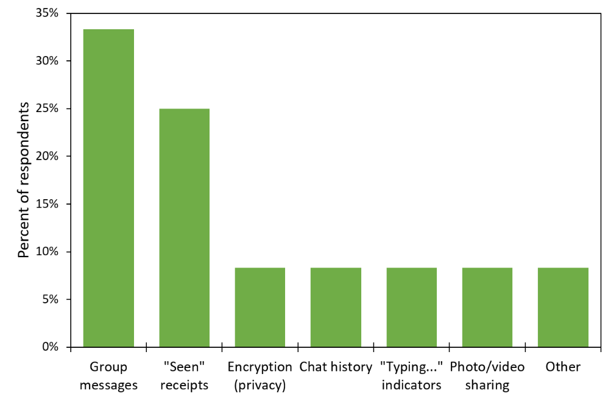

The results of this question show me that the stakeholders’ favourite features are group messages (33%) and “Seen” receipts (25%). Therefore, I will consider including these features in my solution. However, group messaging may be outside of the solution’s scope. I only chose to include it as an option in this survey as it is too important of a feature in modern messaging apps to exclude. I will make a final decision on the feature when deciding the solution’s requirement and success criteria.

Question 4 – “What is your least favourite feature of messaging apps?”

This question was the direct inverse of question 4. Its results show me that in-app sounds (37%), un-sending messages (18%) and emojis (18%) are the most disliked features. Therefore, I will not consider including these in my solution. The dislike of emojis by 17% of respondents is not a surprise here since it was identified as the 2nd least used message type on Discord in the interview with Ethan S.

Question 5 – “How important are the following features?”

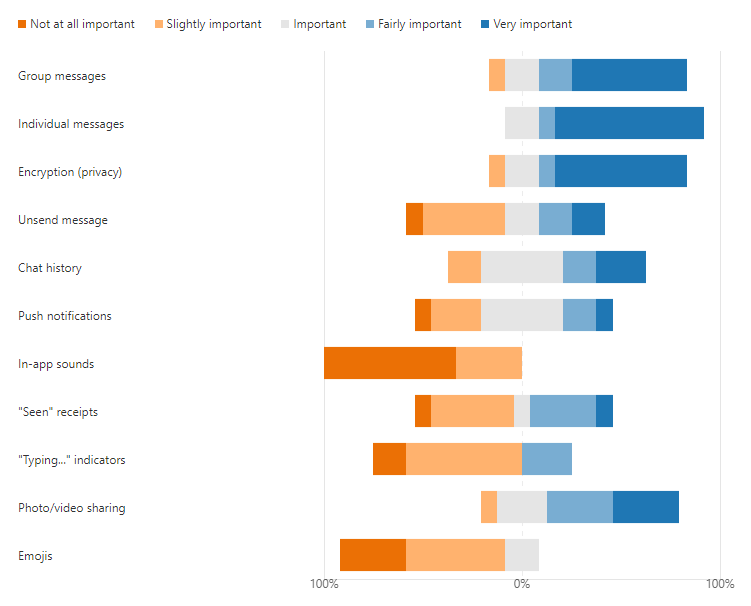

The results of this question show me that the stakeholders do not think the following features make a significant impact on a messaging app: in-app sounds, emojis, “typing…” indicator, and un-sending messages. From this, along with the results from question 4, I can see that these features are non-essential. Therefore, I will not consider these for the list of necessary features for my solution.

Another finding from the data is the four most important features: group messages, individual messages, encryption, and media sharing. Since these are important to the stakeholders, I will consider these for the list of features for the final solution. These findings are supported by the results from question 3 as well as in the interview with Ethan S.

Question 6 – “What do you look for in a messaging app?”

Question 6 shows me that simplicity (33%) is by far the most important quality of a messaging app with ease of use (17%) coming in second. I will try to reflect these qualities in my solution by considering them while designing my UI and by asking the stakeholders for feedback on my designs

Question 7 – “What do you mainly use messaging apps for?”

Socialising (60%) and sharing media (20%) appeared at the top of question 7’s ranking which was expected. However, the other two answers were surprising: work (13%) and sharing links (7%). To accommodate for the stakeholders who put down sharing links, I will investigate automatically hyperlinking text and opening browsers. However, I am unsure of how to accommodate the working users so may consider adding profanity filters unless any other features arise. Also of note is the fact that neither of these surprising answers got a higher percentage of votes, therefore, adding such features should not be a priority.

Question 8 – “What feature might you want to see added to messaging apps?”

Next, the findings from question 8 are that many stakeholders want to see voice notes (50%) added to messaging apps. However, I think that this feature is beyond the scope of the project as it will require file storage and microphone access. I may still consider the feature but do not expect it to reach the final list of requirements and the success criteria. The joint second-highest scoring features are bigger file limits (25%) and “Notification read at …” (25%). Including a bigger file size limit could be done by raising the cap above 8MB for example (Discord’s cap for non-paying members as found in *1.3.1* *Discord*) so will be considered as a feature to potentially include in my solution. “Notification read at …” on the other hand will not be possible to be considered as it is beyond the project’s scope: it would require me to firstly send notifications to the user and secondly somehow track when this notification has been read.

Question 9 – “How important is privacy for you?”

Lastly, to further confirm the suitability of the respondents, there was an average rating of 4.3/5 for how important privacy to them is. Privacy is very important for this project as it aims to make a secure, end-to-end encrypted instant messaging program for users who care about who is viewing their data, so having stakeholders who are conscious of their privacy is paramount.

Conclusion

Overall, I am satisfied with the results of the survey. The respondents have been proven through many metrics that they are appropriate representatives of the stakeholders, which allows me to trust the survey’s results. In addition, I now have a list of several features to consider for the solution and a general guide for how to approach the UI design.

## Research

### Discord

Discord is a free instant messaging and VoIP platform created in 2015 centred around enabling communities to connect through guilds: collections of chat rooms and voice channels. The platform also offers direct messages (DMs) between individual users which will be focused on in this research. In 2019 the platform saw 250 million users with a total of 25 billion messages being sent per month \[2\] making it the largest gaming-focused communication platform available; this large, vocal, userbase means that all features of the platform have been rigorously tested and are therefore a good source of information on how to approach my solution.

Security

Discord is not a privacy-focused platform and users are expected to forfeit their privacy in exchange for ease of use and versatility. Discord uses the encryption in-transit system meaning that all traffic is decrypted on the server-side; for non-audio/video data, the HTTPS protocol is used which is encrypted using TLS or SSL (since Discord uses the Electron framework which runs the program as a web app). It is also known that Discord inspects all user traffic whilst it passes through their server, this very much places the security of the users in hands of the Discord servers.

My solution will use the opposite approach to security, by placing it in the hands of the user. End-to-end encryption instead of encryption in-transit, as well as the TCP protocol, will be in my solution. The e2ee will solve the problem of potential spying found in Discord while the TCP is being used as HTTPS is not suitable for this project.

Splash Screen

When starting Discord, a splash screen appears showing the user that processes are occurring behind the scenes. This is useful as it gives visual feedback to the user and gives the program time to connect to the server and load all the required resources into the RAM.

I will consider this feature for my solution as it will give my program time to establish a server connection before the user can try to log in without appearing to the user as the program has frozen.

Logging In

To use Discord, users must first log in. This can be done with an email and password or by scanning a QR code from the Discord mobile app. In my solution, I will also require the user to log into an account before they can use the program. This is because protecting messages behind a password improves privacy which is one of the requirements for the program. A login system will also be useful as it provides each user with a unique identifier that can be used when addressing messages and viewing contacts.

Two-factor authentication

Discord has the option to enable two-factor authentication. This means that when logging in to your account you need both the correct credentials and access to another method of proving your identity. Common methods are SMS message, email or a dedicated authenticator app, Discord chose the latter.

I will consider this feature for my program as it will add more security to the login process which would further satisfy the stakeholders’ requirements.

Creating an account

When creating a Discord account, usernames are case sensitive and are automatically postfixed with a number after a ‘#’ called a discriminator. This robust naming system is done to allow up to ten thousand people to have the same username. I will consider implementing this feature in my solution as preventing username collisions improves the experience for the user by allowing them to continue using their username from any other service.

Discord’s password requirements are on the other hand very lenient: “Must be between 6 and 128 characters long”. Therefore, it is up to the user to choose a sufficiently broad character pool for their password which many users will forgo in exchange for convenience. So, for my solution, I will consider implementing some further requirements for the strength of passwords. This is because the privacy given by the end-to-end encryption will be undermined by an easily guessed password.

Adding friends

To add a friend (contact), you enter their complete Discord Tag (username) and send them a Friend Request. A complete username is needed as there are many users of Discord who have the same username so the only thing that differentiates these users is their discriminator. The recipient of this request can then accept or decline this request.

In my solution, I will consider a similar method of adding contacts by searching their username. However, since my user base will be much smaller than that of Discord, I may give the user feedback to similar names to what they entered by pattern matching the string they want to search and a list of all registered accounts.

Home page

The default home page for Discord is a list of the user’s online friends. This page consists of four tabs: “Online” the default; “All” which includes offline friends; “Pending” which are accounts that the user has sent friend requests to and “Blocked”. Upon clicking on a friend in either of the first two tabs, a DM (direct message) thread is opened. This gives users quick access to all their DM threads and a helpful overview of who is currently online.

I will consider having a similar homepage in my solution as immediate, easy access to conversations will greatly improve the flow of the program for the user. The online statuses and overview of online friends will also be a helpful addition to the program.

Direct Messages

DM threads on Discord are the conversations between users. These can show historic conversations if the users have sent each other messages in the past or empty when beginning a conversation. The messages that users send each other can be generalised as one of two formats:

1.  Text, up to 2000 characters

    -   Emojis

    -   Embeds

    -   Colouring

    -   Code blocks with syntax highlighting

    -   All the other Markdown formatting features

2.  Files, up to 8MB (100MB with subscription)

    -   Images (including GIFs) with previews

    -   Playable audio files and videos with picture-in-picture

    -   All other file types must be downloaded

        -   Executable files cannot be sent for security reasons

In my solution, I will consider including the feature of viewing historic messages since if messages were lost after being viewed this would not make the program very helpful for the user. Secondly, I will consider including the ability to send multiple types of messages. This is because limiting the program to only text would be restrictive for the users when compared to alternative programs.

Navigation

Discord has many shortcuts which are helpfully listed on a dedicated help screen in the program. This streamlines the experience for power users of the program while allowing regular users to continue using their normal cursor orientated navigation.

Many parts of the Discord UI are divided into groups of tabs: servers, DM threads and channels are all formatted as such. This makes the program very friendly for most users as tab-based navigation is a common UI style in websites, mobile apps, and desktop applications.

For my solution, I will consider also using tab-based navigation as it is well established and fits well with messaging apps and their lists of contacts/conversations. I may also consider giving the user the option to operate some features in my program via keyboard shortcuts, albeit on a smaller scale to Discord as complete keyboard navigation is not a requirement.

### Internet Relay Chat (IRC)

Internet Relay Chat is an internet protocol created in 1988 to allow group plaintext conversations with channels working on a client-server model or to individuals with private messages using the Direct Client-to-Client protocol (DCC). In February 2005 at the height of IRC, the largest network – QuakeNet – saw a peak user count of almost a quarter of a million users \[3\]. This has dramatically reduced since then and is now at an average of 10 thousand users \[4\]. However, the protocol is still used by some services today as a means of lightweight communication typically attached to a larger service: The Twitch IRC network is responsible for the live chat in a Twitch stream and some games such as Tabletop Simulator, StarCraft, and Unreal Tournament use IRC for their in-game chat.

*Image via [WeeChat.org][]*

Networking

The structure of an IRC network is a distributed network with a spanning tree topology. To connect to the network, clients connect to one of the network’s multiple servers with which it will send and receive all its data from. All the servers in the network share the same state so this client-server connection can be used to communicate to any other client.

This introduces the first limitation of IRC: the distributed network structure gets increasingly inefficient as the network grows. This is down to the state sharing between servers. Constantly copying data about connected clients, messages and channels is very resource-intensive but required to ensure all clients see the same information.

The second limitation is that if one of the server-server connections was to go down, the network would become a disconnected network due to the nature of its spanning-tree topology. This causes users of one half of the network to see those on the other half as disconnected, and vice versa, in what is called a netsplit.

In my solution, I will use a centralised network. This means that I will not have to constantly share state between servers like in an IRC network meaning easier configuration and maintenance. This also removes the problem of netsplits but introduces a single point of failure.

However, the solution will be limited with scalability as the maximum throughput of the network is limited to the bandwidth of one machine. This also means the only way to scale up the network is to upgrade the parts in that one machine.

Group Messaging

To access channels, users must install an IRC client and select the network they want to connect to. Once connected they choose a display name (nickname) which is shown to all other users when they send a message. A nickname is needed to be supplied on every connect because users do not need to register to use IRC. This does, however, introduce the chance of nickname collisions where multiple people have or want the same name. Nickname collisions are especially common when joining two networks after a netsplit as there was no way to tell if a nickname was being used in the other half of the network. Finally, once they join a channel, the server they are connected to relays (hence Internet Relay Chat) all the messages they send to the channel to all the other connected users, and vice versa.

In my solution, I will require users to register accounts before they can use the program. This will prevent nickname collisions and means that users do not need to enter a nickname upon each connection. The more concrete connection between nickname and user will also reduce confusion in users as there will be less chance of mistaken identity. Secondly, I will also use a server to relay messages as both my solution and IRC are using a client-server model.

Offline Messages

Some IRC networks offline messages via “bouncers”, these are daemons on a server that act as a proxy for the client. When a client is connected to the bouncer, the bouncer simply relays all the traffic to and from the server. However, in the event the client disconnects, the bouncer stores the messages that the client would have received if they were still connected. These will then be sent to the client once they reconnect.

A similar implementation for offline messages is having an IRC client run on an always-on server to which users connect via SSH for their session. This also allows users who do not have an IRC client installed to connect.

In my solution, I could include a way of archiving messages for users when they are not online. This could be implemented in a similar way to the bouncer where if the server detects that the client is no longer connected it will reroute the messages to a daemon. However, I will need to find a way of securely storing the user’s messages as security is a focus point of the solution.

Typical Client User Interface:

The UI for many IRC clients is the following: channels on the left, a nickname list on the right and the chat in the middle (this has become a common messaging program layout as can be seen in Discord’s UI in the section prior).

I will consider using this tried and tested UI format for my solutions; since if users are used to it from other platforms, it will make using my solutions even easier and more natural for them.

Another form of IRC client is integrated into another program: Opera had a client attached to Opera Mail and Firefox had a client called ChatZilla. These differed from those mentioned at the start of the research as they lack the abstraction layer found in the modern integrated use cases, so they offered users the full IRC experience. IRC being used as an add-on to an existing program is a testament to IRC being a lightweight protocol with not many needs besides a socket to run off.

In my solution, I will also be trying to create a lightweight protocol that only requires a single socket as it is a requirement from my stakeholders for my solution to be lightweight.

Protocol

The IRC protocol is all done over ASCII encoded TCP with the structure “\[origin\] \[command\] \[parameters\]”. An example of a message would be “:daniel!test.domain.org PRIVMSG #channel1 :This is a test”. The origin is formatted “:\[nickname\]!\[server\]” and is not in the message when it is sent, instead it is prepended by the server relaying the message. Commands can be either a word or a 3-digit value if it is a response from the server. Lastly, the parameters are all separated by a space except for the last which can be prefixed with a colon. Prefixing the last parameter with a colon means that all characters past the colon, including spaces, are part of the parameter. This allows parameters such as message bodies to contain spaces in them.

In my solution, I will also use a text-based protocol over TCP. However, I will use the more common UTF-8 encoding. I will consider using the same origin, command, parameters format for messages although instead of the final parameter’s colon, wrapping in speech marks sounds like a better method as it allows messages to have multiple parameters which contain spaces and removes some of the ambiguity.

### Telegram

Telegram is an instant messaging platform created in 2013; as of 2020, it has 500 million active monthly users. Telegram is privacy-focused and – in addition to messaging – provides filesharing, news articles and end-to-end encrypted video and voice calling. The features of Telegram that I am going to investigate are the accounts system and end-to-end encrypted “secret chats”.

Accounts

All users are required to have an account to use Telegram. To create an account, all a user needs is an Android or iOS phone and a phone number. The user can optionally choose an alias (username) to hide their phone number. To sign into an account, users are sent an SMS message with a one-time authentication code. Users can also create a password as the second step of authentication.

Secret chats

Instant messages on Telegram use encrypt-in-transit by default, get use Telegram’s end-to-end encryption users must enter “secret chats”. To initiate a secret chat, an invite must be sent. Upon confirmation of this invite, encryption keys for this session are exchanged (the exact process is explained in the section below). The messages sent in this chat are only available on the devices that the chat was initiated on, and the messages can be deleted at any time or made to self-destruct.

Encryption

The encryption protocol Telegram uses is MTProto. MTProto is a symmetric encryption protocol that is based on AES (256-bit, symmetric) and RSA (2048-bit, asymmetric). These two encryptions are used in a Diffie-Hellman key exchange to generate a shared secret key which is used by the two users in their secret chat. A new shared secret is established every week or every 100 messages (whichever comes first) to maintain the conversation’s long-term security.

The benefit of using a Diffie-Hellman key exchange is that a shared secret key can be established over a presumed insecure channel (Telegram’s server). The process is as follows:

1.  Both users generate a private value (Alice: A, Bob: B)

2.  The server generates a public value (Server: Z)

3.  Both users combine their private value with the server’s value (Alice: AZ, Bob: BZ)

4.  The users then swap their values (Alice: BZ, Bob: AZ)

5.  The users combine this received value with their private value (Alice: ABZ, Bob: ABZ)

6.  The resulting value is their shared secret (ABZ)

Flaws

The fatal flaw in Telegram is its login process: having user authentication codes sent via SMS (a known insecure system) undermines the rest of the system’s security. Through the interception of SMS authentication messages, users’ secret chats have been leaked. This has had the most impact in Russia and Iran where both the public and government use Telegram to circumvent censorship and restrictions. In Russia, several of Putin’s opposition have had their conversations leaked while in Iran it is thought that the details of 42 million nationals were leaked.

Takeaways

A feature from Telegram that I like is the Diffie-Hellman key exchange. This allows me to generate encryption keys for both parties without compromising their security. However, the differences from Telegram are that I will have messages end-to-end encrypted by default and I will have all users create a password for their account. This is because having the option to not have private messages will be unnecessary in my solution as its purpose is private communications and implementing SMS authentication is both beyond the scope of my solution and introduces security flaws.

### WhatsApp

WhatsApp is an instant messaging platform created in 2009; as of 2020, it has 2 billion active monthly users making it the most used instant messaging platform. In addition to messaging, WhatsApp provides filesharing, individual video and voice calling, and group video and voice calling. The features of Telegram that I am going to investigate are the accounts system and the individual messaging.

Accounts

To send messages, WhatsApp uses a variant of XMPP (Extensible Messaging and Presence Protocol). To create a WhatsApp account only a phone number needs to be provided. This number is then used by WhatsApp to make a Jabber account (an XMPP service) with the username formatted as *\[phone number\]@s.whatsapp.net*. The password to this account was generated as the following until 2012: the phone’s IMEI reversed and then MD5-hashed. This was changed in 2012 to be generated randomly on the server. There is no way for a user to set their password. The only additional authentication that can be added is a layer of biometric security.

Individual messaging

To send a message, the sender sends the message to the server, which stores the message. The server then sends the message to the recipient and awaits a confirmation that the message was received. Only once the confirmation is received by the server will the server delete the message from its storage. If there is no confirmation message, the server will try to send the message again. This is done to solve the issues that may arise if the recipient does not have a stable internet connection.

Encryption

Before 2012, all WhatsApp messages were sent as plain text and it took until 2016 for end-to-end encryption to be implemented on all messages. WhatsApp uses the Signal Protocol – an encryption protocol for instant messaging also used in Signal, Viber, Facebook Messenger, and Skype.

To begin a conversation, both parties fetch the other party’s public key from the WhatsApp key server. The following algorithms are used to establish a shared secret key and maintain its security.

> Extended Triple Diffie-Hellman (X3DH)

-   Is a modified Diffie-Hellman key exchange – DH is explained in *1.3.3* *Telegram*

-   Allows two parties to establish a shared secret key even when one of the parties is offline

> Symmetric “ratchet” algorithm

1.  Input is a shared secret key

2.  Combines with a temporary key via a key derivation function (KDF)

3.  Derive a new shared key, this is the input for the next iteration

What separates this protocol from other public-key protocols is its “ratchet” algorithm. To encrypt using the protocol, a collection of temporary key pairs for each user are generated. Then, the ratchet algorithm combines the temporary and permanent key pairs to create a shared secret key – facilitating the forward secret, symmetric encryption. This forward secrecy means the protocol is referred to as “self-healing” because in the event a session key is compromised, only one message can be decrypted. As soon as the racket algorithm “moves along” to the next key pair the messages are secure again.

Takeaways

A feature of WhatsApp that I would like to include in my program is the server holding onto messages if the recipient is not online. This will allow my solution to be more resilient in the case of unstable network connections and more like other instant messages apps that users may have used (since almost all messaging apps allow messages to be sent to offline users).

## Solution Scope

### Essential Features

Client

This is the list of features that must be included in the client’s side of the solution for the program to be considered functional and a solution to the proposed problem.

| Feature              | Explanation                                                                                                                                                                                  |
|----------------------|----------------------------------------------------------------------------------------------------------------------------------------------------------------------------------------------|
| Login screen         | The client must be able to log into an existing account so they can have access to a set of encryption keys and be identified by the server and other clients.                               |
| Signup screen        | If the client wants to create a new account, this screen will allow it. After creating an account, the program should function the same as if the client had logged in.                      |
| Contacts list        | For the client to select who they want to message, a contacts list must be included. This can be in the form of a combo box or a button for each user.                                       |
| Message field        | This field is required as the message to be sent to another client or the server needs to come from somewhere. This can be a basic text box or allow rich text formatting.                   |
| Conversation display | When messages are received by the client, they need to be shown to the user. This will be where they will be displayed. The design of this display will follow instant messaging conventions |
| Encryption           | The problem that this solution is trying to solve is that of encryption so encrypting messages going out and decrypting messages coming into the client is essential.                        |

Server

This is the list of features that must be included in the server’s side of the solution for the program to be considered functional and a solution to the proposed problem.

| Feature              | Explanation                                                                                                                                                      |
|----------------------|------------------------------------------------------------------------------------------------------------------------------------------------------------------|
| One thread per user  | The server will need to handle several users at once, this cannot be done on a single thread without significant delays so each user must be allocated a thread. |
| Routes messages      | An important responsibility of the server is to route messages from a sender to the recipient. The server must be able to do this for messaging to occur.        |
| Credentials database | Since accounts are required, a database will be needed to store the username, password, and key pair for each user. This will be accessed during login attempts. |
| Cannot read messages | For the system to qualify as end-to-end encrypted, the messages sent between clients cannot be read while they are passing through the server.                   |
| Connects clients     | Connecting two client programs through a network is a basic responsibility for the server as this is required for any messaging to occur.                        |

### Identifying Limitations

Hardcoded server IP

When a client tries to connect to the server, it will use a hardcoded IP address as its target. This means that the IP address of the server must be static and cannot be moved onto another network. For this limitation to be fixed the server would have to be added to a DNS server so that the domain can dynamically point to the server. However, this is beyond the scope of the project.

Group messaging

One limitation will be that group messaging (the most chosen “favourite feature” and third most important feature from the stakeholders’ survey) cannot be implemented in the proposed solution. This is down to the vast increase in complexity from individual end-to-end encrypted messaging to group end-to-end encrypted messaging. Implementing such a feature will take up too much time and would require the redesign of many of the procedures of the solution. Because of these reasons, this feature will not be able to be implemented for the stakeholders.

Local Area Networks

The solution will have to be limited to operating on a local area network. This is because the server program will be identified by its private IP, if the server program was to be identified by its public IP there would need to be a firewall port opened in the LANs router. This introduces an unnecessary weakness in the host’s network. Therefore, the program will be limited to a LAN during development and the solution will be tested as a proof of concept of what can be achieved on a WAN if security was not an issue.

Endpoint Security

The purpose of this solution is to protect the privacy of users while they use messaging apps. The solution that will be implemented uses the assumption that the only trusted party is itself. However, if the user endpoint has been compromised, the assumption is false. Therefore, a limitation of the solution is that if the user endpoint has been compromised the privacy of the communications can no longer be assured.

Metadata Privacy

A limitation of end-to-end encrypted systems and by extension this solution is that metadata is not protected. This means that the identity of the sender and recipient, and the times of all the communications are all open information while in the server. This limitation cannot be addressed feasibly as it would require building the solution around a distributed network rather than a centralised network. Centralised networks are easier to design and the industry standard for instant messaging apps (if decentralised networks are considered centralised networks with server resources), but distributed networks allow onion routing which provides anonymity for users. Therefore, since I will be implementing a centralised network, this limitation will remain.

## Requirements

### Stakeholder

Primary requirements

The following are features raised after the interview and survey with the stakeholders that are deemed essential for the program. These will be the priority in development and likely to be present in the project’s success criteria.

<table><colgroup><col style="width: 33%" /><col style="width: 33%" /><col style="width: 33%" /></colgroup><thead><tr class="header"><th>Feature</th><th>Justification</th><th>Reference</th></tr></thead><tbody><tr class="odd"><td>Accounts are needed to use the program</td><td>Accounts make contacts recognisable and accountable for their messages</td><td>
Interview with Ethan S

(Topic: Accounts)
</td></tr><tr class="even"><td>Passwords must pass a minimum complexity check</td><td>Security is important for the program so secure passwords is a must</td><td>
Interview with Ethan S

(Topic: Accounts)
</td></tr><tr class="odd"><td>Passwords and keys are not stored in plaintext</td><td>Storing sensitive data as plaintext will undermine the system’s security</td><td>
Stakeholder Identification

(Private information)
</td></tr><tr class="even"><td>Messages are end-to-end encrypted</td><td>This is the most important feature for the stakeholders as it’s the purpose of the program</td><td>
Stakeholder Identification

and Survey (Q9)
</td></tr><tr class="odd"><td>The client program works without the need for any setup</td><td>The stakeholders want simplicity and usability</td><td>
Stakeholder Identification

and Survey (Q6)
</td></tr><tr class="even"><td>Tab based navigation</td><td>This is a common and intuitive navigation method preferred by the stakeholders</td><td>
Interview with Ethan S

(Topic: Messages and conversations)
</td></tr></tbody></table>

Secondary Requirements

These features were also raised in the sections stated above. However, they are not deemed essential so will not be a priority in development.

<table><colgroup><col style="width: 33%" /><col style="width: 33%" /><col style="width: 33%" /></colgroup><thead><tr class="header"><th>Feature</th><th>Justification</th><th>Reference</th></tr></thead><tbody><tr class="odd"><td>Different types of messages (text, media, files)</td><td>It is a feature in Discord that the stakeholders would like to see in this program</td><td>
Interview with Ethan S

(Topic: Discord research) and Survey (Q5)
</td></tr><tr class="even"><td>Messages are sent via pressing the ENTER key</td><td>It is intuitive and the most common method</td><td>
Interview with Ethan S

(Topic: Program controls)
</td></tr><tr class="odd"><td>View historic messages</td><td>Being able to read old messages makes the program more like instant messaging than email</td><td>
Interview with Ethan S

(Topic: Messages and conversations)
</td></tr><tr class="even"><td>Standardised usernames</td><td>Users using the platform for work would benefit from standardised usernames</td><td>Survey (Q7)</td></tr><tr class="odd"><td>Send files greater than 8 MB</td><td>This is a paid feature of Discord that the stakeholders would like to see in the program</td><td>
Interview with Ethan S

(Topic: Discord research) and Survey (Q8)
</td></tr></tbody></table>

### Hardware

Computer

A computer will be required to run the solution. This is because the solution requires the .NET runtime which is only available on computers (the exact OS needed will be specified in the software requirements below).

Monitor

A monitor that is between 1366 by 768 and 3840 by 2160 pixels will be required to see the interface of the solution. The reason that this range was chosen is that any smaller and the interface’s buttons would not all fit on the screen and any bigger and the labels on the fields would be too small to read comfortably. There are no requirements on the colour specification of the monitor (e.g., greyscale or 32-bit colour) because the interface will not need colour to differentiate the interface components.

Network

The computer that is running the client will need to be connected to the same network as the server. This can either be a WAN such as the internet or a LAN such as a home network. This is a requirement because the client program must be able to connect to the server and unless the server and client are on the same machine the transmission will need to be sent across a network

### Software

Operating system and CPU architecture

| OS         | Version                    | Architectures     |
|------------|----------------------------|-------------------|
| Windows    | 7 SP1+, 8.1                | x64, x86          |
| Windows 10 | 1607+                      | x64, x86          |
| Mac OS X   | 10.13+                     | x64               |
| Fedora     | 32+                        | x64               |
| Debian     | 9+                         | x64, ARM32, ARM64 |
| Ubuntu     | 20.10, 20.04, 18.04, 16.04 | x64, ARM32, ARM64 |

Information from the .NET Core GitHub repository \[5\]

For simplicity, I will only be building a Windows x86 version of the solution for development and the final evaluation. However, using the dotnet compiler, executables for all the following operating systems can be built from the source.

.NET runtime

The final user of the program will not be required to install the .NET runtime as the solution will be published self-contained. This means that the download will be larger as it will contain the .NET libraries, runtime and dependencies needed. I will use this format of distribution for the program because one of the stakeholder groups required an easy program setup with no configuration etc.

Admin privileges

During the installation of the program, admin privileges will be required. This is needed because the program needs to access a port on the computer and ports are typically protected for security.

## Success Criteria

| ID  | Requirement                                                                       | Justification                                                                                               | Reference                                                    |
|-----|-----------------------------------------------------------------------------------|-------------------------------------------------------------------------------------------------------------|--------------------------------------------------------------|
| 1   | Client sockets connect to the server at the start-up of the program               | The app needs a connection to the server so it should connect while the app starts to minimise waiting time | Used in the Discord splash screen                            |
| 2   | Client socket tells the server it is closing before the app is closed             | Prevents any errors from occurring and begins the client disconnect procedure                               | Best practice for TCP connections                            |
| 3   | The socket sends heartbeats to the server to show that it is still open           | Stops the possibility that a client has disconnected without the server realising which will lead to errors | Best practice for TCP connections                            |
| 4   | Users must log in to their account to access the program                          | Ensures that only people with valid credentials can view an account’s messages                              | The stakeholders identified accounts as an essential feature |
| 5   | New users can create an account                                                   | New users need a way of accessing the app                                                                   | The stakeholders identified accounts as an essential feature |
| 6   | Users are not allowed to try to log in if the socket cannot connect               | With no connection, logins cannot be authorised so the login process cannot be done                         | Necessary as requests cannot be made without a connection    |
| 7   | Usernames must be unique                                                          | Prevents situations where two people can accidentally share credentials                                     | Identified as the solution to nickname collisions in IRC     |
| 8   | Password must be of a minimum strength (upper, lower, digits, special characters) | Makes sure the password is not a security flaw for the user                                                 | Discord requires a minimum password strength                 |
| 9   | Users can type out a message and send it with a "Send" button                     | Intuitive button to send the message                                                                        | The feature was in all researched programs                   |
| 10  | Users can type out a message and send it with the ENTER key                       | Enter is a common key to press to send a message                                                            | The feature was in all researched programs                   |
| 11  | Users can see a list of contacts                                                  | Users can easily see who they are sending the message to                                                    | Feature of the contacts list in Discord                      |
| 12  | Users can click on a contact to message with them                                 | No need to manually address each message they send like an email                                            | Feature of the contacts list in Discord                      |
| 13  | Users can see past conversations with a contact                                   | Users do not have to worry that old messages will be lost                                                   | Identified as important by the stakeholders                  |
| 14  | Users can be added to contacts by searching their username                        | Usernames are easier for a user to remember than an IP address                                              | Feature of the contacts list in Discord                      |
| 15  | Messages are encrypted with the recipient's public key                            | The recipient’s public and private keys are a keypair as it is asymmetric encryption                        | Necessary for E2EE                                           |
| 16  | Messages are decrypted with the recipient's private key                           | Only the intended recipient can view the message as the decryption key is private                           | Necessary for E2EE                                           |
| 17  | Messages are signed with the sender's private key                                 | The sender can prove their identity by using a key that only they know                                      | Solves identity limitation with E2EE                         |
| 18  | Signatures are checked with the sender's public key                               | The recipient must be able to prove that a message came from the user it claims to be from                  | Solves identity limitation with E2EE                         |
| 19  | Messages cannot be read while in the server                                       | End-to-end encryption requires messages to not be able to be read during transit                            | Necessary for E2EE                                           |
| 20  | Key pairs can be generated                                                        | Public and private keys are needed for the encryption of all messages                                       | Necessary for E2EE                                           |
| 21  | Public keys can be accessed by anyone                                             | Public keys are used to check signatures and encrypt messages so they must be visible to everyone           | Necessary for E2EE                                           |
| 22  | The server can accept incoming client connections                                 | Allows clients to connect to the server when they are opening the app                                       | Necessary for communication with the server                  |
| 23  | Each connected client is handled by a separate thread                             | Concurrency allows for greater scalability in the number of clients and reduces their response time         | Best practice for servers serving multiple clients           |
| 24  | The server authorises logins against its database                                 | Only clients supplying valid credentials can view a user's messages                                         | Necessary for users to have accounts                         |
| 25  | The server can create new accounts                                                | New clients must be issued an account to start using the app                                                | Necessary for users to have accounts                         |
| 26  | Messages are routed to the intended recipient                                     | Users must only receive messages addressed to them                                                          | Necessary for instant messaging                              |
| 27  | Messages are held in the server if the recipient is not connected                 | Users may not be connected when a message is being sent so that must be accounted for                       | Features of IRC networks (bouncers)                          |
| 28  | Undelivered messages are sent the next time the recipient connects                | Users should not miss out on messages because they were not online                                          | Features of IRC networks (bouncers)                          |

# Design

## Problem Decomposition

### Networking

Asynchronous

Using sockets, I will be able to do asynchronous operations as to not block the program’s GUI for the user. This is paramount for the networking as if the operations are synchronous the IO will almost always be blocked for the user due to the constant communication with the server. To implement this part of the program I will need to implement callback functions and threading.

TCP streams

By using TCP, a connection orientated protocol, the server and client will have a dedicated stream to communicate via. The retransmission of lost packets is also important for the user as waiting longer for a message is better than receiving a malformed or incomplete message. In comparison, using UDP does have faster speeds but that is not necessary for this application and the unreliability is too significant to ignore. To implement this part of the program I will need to bind a socket to a port on the server and infinitely listen, I will then need to bind a socket to the same port on the server’s IP on the client.

Client-server heartbeat

A constant heartbeat message that will be pinged between the client and server will be used to give both parties up-to-date information about whether either party has ungracefully disconnected. This needs to be in the program as either socket may not get the opportunity to send a proper close message (such as in the event of the ethernet cable being pulled out) so the client/server will only find out when they try to send a transmission and never get a reply. To implement this part of the program I will need to send a message at a constant interval between the client and server, then if one of the parties does not get the message after a certain time it can be assumed that the other party has ungracefully closed.

Standardised encoding

Using a standardised character encoding across all my transmissions will ensure that any text that is entered into one client will be displayed the same way in another client. This is included in response to the problems faced in IRC where character encoding was client determined and so some characters were different when viewed from a different client. To implement this part of the program I will pass all text inputs through the same encoder as part of the data validation process and the same decoder as part of the transmission receiving procedure.

Encryption

Since the program requires end-to-end encryption, making sure that no messages can be read during transit is important. Therefore, all transmission data will be encrypted with the recipient’s public key and signed with the sender’s private key. This will be implemented as a part of the transmission creation and receiving procedure so that it is done to all messages.

Serialised object

For easier sending and receiving of transmission, a common format that will be easy to read values from is needed. Since the transmission will be an object before its sent, I will create an object that will be serialised when sent. When the recipient gets the transmission, it can be de-serialised and immediately used by the receiver. This part of the program will possibly be implemented by using JObjects, this is a JSON object that contains many tokens that will be used to transfer information between the client and server.

Flags determine command type

Creating a general format for all transmissions and then giving more information and specifying the purpose of the message via flags gives consistency to the transmission while not sacrificing functionality. These flags will declare the purpose of a request as, due to the structure of the transmission, I am unable to prefix messages with a command name so will need to integrate the request’s purpose into the object that will be sent. This part of the solution will most likely be done with Boolean values in the JObject or a token dedicated to holding a command name.

### Encryption

Asymmetric encryption vis RSA

To encrypt the transmission, there are two routes to go down. Firstly, there is symmetric encryption which will require a Diffie-Helman key exchange to establish a shared secret key between two parties while the messages are being sent in plaintext through the server and then AES could be used once the secret key is established. The other is asymmetric encryption which involves each party generating a random public key that is sent to the server to be available to all clients, and a private key that decrypts messages encrypted by the public key (the key is only known by the owner). I will implement the latter as symmetric encryption will require each time two clients communicate each client will need to fetch the key specifically for that pair whereas with asymmetric encryption the same key pair is used for all communications. I will implement this part of my solution by fetching or generating a key pair immediately after the login process.

Key generator seeded with RNG

To generate an effective private key, it must use truly random data rather than pseudorandom (from a PRNG). This is because using non-random data can open the possibility for keys to be guessed easier which undermines all the program’s security. This part of the solution will be implemented by using an RNG to generate as close to a truly random seed for the key generator.

Key derivation functions

To allow users to sign into their account from any computer, their private keys must be stored on the server. However, this would be very poor practice if the key is stored in plaintext so it must be encrypted. However, the question of how you store the key to that encryption then arises. The solution is using a symmetric encryption algorithm that derives the key using the user’s password via a key derivation function (KDF). Using a KDF means that the key to decrypt a user’s password never makes its way out of a client’s memory let alone stored anywhere so the clients are not restricted to where they can log in from. This part of the program will be implemented by putting the user’s password through a KDF (possibly PBKDF2) after the log-in process, then fetching the encrypted private key from the server and decrypting it for use.

Digital signatures

By storing all users’ public keys in a centralised server that also handles all the traffic, there is the possibility of man-in-the-middle (MITM) attacks. One way to prevent this is to authenticate all messages. This will involve encrypting a small bit of data with the sender’s private key and appending it to the message; this extra data is called the signature. The recipient can then decrypt this signature with the sender’s public key, if the resulting plaintext matches an agreed-upon value the message has successfully been authenticated, else it has not come from the sender it claims to have been from and is most likely the result of an attempted MITM attack. To implement this part of the program I will use RSA once again as it is asymmetrical and the generated key pair from message encryption can be used.

### Interface

Tab based navigation

To move about the program, windows will be organised into tabs that the user can click on to view. This will mean that when a conversation is opened with another user the conversation view is opened in the same window as the contact list. To implement this part of the solution I will need to use WPF’s TabControl in the main view and a UserControl for each conversation.

Dynamic conversation view

Since the nature of a messaging app means that messages will appear while the user is looking at a certain conversation, I will need to dynamically add controls to the UserControl in which the conversation is being displayed. This part of the program will likely be implemented by creating a template for a message – time, content, shape to hold text, sender/recipient – which can then be filled out with the data of each incoming message and added to the view.

Login screen

Upon opening the program, users will be required to sign into an account or create an account. This means that a login screen will need to open first before the user can get access to the main part of the program. This will need to be done after connecting to the server since the login request will need to be sent from the socket. This part of the solution will be implemented by triggering a window to open only once the connection has been established, which will then lead to the main view being opened once a successful login has occurred.

### Accounts

Input validation

When the user inputs their username and password, a request will be sent off to the server to check the credentials against the database. This request should only go through when the form has been properly completed will valid data. Therefore, there must be checks in place to make sure inputs are completed and properly validated before being sent to the server. To implement this part of the program I will be doing some simple checks on the presence of data, the length of data and cleaning out whitespace and non-permitted characters from the input.

Hash password

Since the communication channel between the client and server is insecure until the client logs into an account. There is the possibility of using an ephemeral key to temporarily encrypt these communications, but I do not think this added complexity will be necessary for this use case. Therefore, to protect the user’s credentials the password will be hashed before being sent. This will then be checked against the hash in the server’s database to make sure the password is correct. By hashing the password, the plaintext is unknown, but it can still be used to compare against other hashed values. This part of the program will be implemented using the SHA-256 hashing algorithm.

Fetch and decrypt the private key

As mentioned in the sections about KDFs, the user’s private key is stored on the server. Therefore, upon a successful log-in, the fetched encrypted private key must be decrypted. This part of the program will be implemented by putting the user’s plaintext password through the KDF and using the output as the decryption key. The private key will then only be stored in memory which will be wiped when the program is closed.

Postfix a discriminator

Addressing the issue encountered in IRC and solved in Discord, username collisions will be prevented by postfixing a new user’s username with a two-digit number which Discord called the discriminator. This number will be automatically assigned so can add “uniqueness” to two otherwise identical usernames. This part of the solution will be implemented as a random number or as an automatically incrementing value (the latter being more likely) that will be in the format username#discriminator.

Password strength check

The weakest link in a system’s security chain is typically the endpoints and more specifically the user’s password. Therefore, to prevent all the encryption behind the scenes from being undermined I will force the user to have a strong password. This part of the solution will be implemented by only accepting new accounts with passwords that have both upper-case and lower-case letters, at least one letter, digit and special character and be at least 8 characters long.

Generate new key pair

Before any encrypted messages are sent between users, the new user must generate a key pair for RSA. The public key will then need to be sent to the server so that it can be accessed by any other client. The public key on the other hand should not be accessible to any other client but should be accessible to the user when they sign in on another machine: so, will be encrypted and stored in the server. The user’s password will be passed through a KDF (possibly PBKDF2) to generate the key for a symmetric encryption algorithm (possible AES) which the private key will be passed through before being sent off to the server for storage.

## Solution Structure

The development of the solution will be divided into three categories: client, server, and shared. I have chosen to include a shared codebase along with ones for the client and server because there will be overlap between the two programs in areas such as networking and data formatting standards so having a shared codebase eliminates duplicated code.

These codebases will each be a C# project within a wider Visual Studio solution, described in the following hierarchy diagram.

<table><colgroup><col style="width: 100%" /></colgroup><thead><tr class="header"><th>
MessengerApp

│

├───MessengerAppClient

│ ├───Exe

│ ├───Resources

│ ├───Models

│ ├───Views

│ └───ViewModels

│

├───MessengerAppServer

│ ├───Exe

│ └───Resources

│

└───MessengerAppShared

└───Resources
</th></tr></thead><tbody></tbody></table>

Figure 1. Solution hierarchy diagram

Client

This project will be a C# WPF application that targets .NET Core. This framework was chosen as it allows simple distribution of the program to users without the need for any setup or configuration. In comparison, if .NET Framework was targeted the user would have to install the correct framework version before the application would be able to run.

Since this project will have a graphical user interface, I will employ the MVVM design pattern. This will separate the logic (the Model) from the GUI (the View) with an interfacing layer in-between (the ViewModel). Doing this allows separate development of the components and independent Views mean that even if the content of the Model is changing frequently during development, the binding to the GUI will not need to be changed.

Server

This project will be a C# console application that also targets .NET Core. This project will not benefit from targeting .NET Core as it does not need the requirement of easy setup (since the end-user is not who will be running the server) but targeting .NET Framework does not provide any benefits either so I will choose .NET Core for consistency between the projects.

I will not employ a design pattern in the server project since I do not think there will be enough files to organise to justify the overhead that implementing a design pattern creates. During the development, if I find this to not be the case, I can always refactor the project’s architecture to match a design pattern.

Shared

Lastly, this project will be a C# class library that is required to target .NET Core as it will be used by the other two projects. The shared project will likely be the smallest of the three projects as all it will hold will be a transmission protocol, encryption protocol, and base classes for the network connection handlers. As with the server project, I do not plan on employing a design pattern for this project due to its small size in comparison to the client project.

## Algorithms

### Logging In

This is a client-side routine that will trigger on the login page when the user presses the login button. There will be data validation on the login button to prevent the routine from being triggered when one or both username and password fields are empty. This is because passing an empty string into some of the functions used in this method (e.g., hashing) will throw errors.

The first thing this procedure does is send the username and hashed password to the server in the form of a login request. The reason that the password is being hashed is that the server should not see the plaintext password of the user, so hashes are stored in the server’s database to be compared against. Comparing hashes provides the client with a method of doing zero-knowledge proof that they are the user they say they are.

The login process is contained within a condition-controlled loop, this means that the client will keep being asked for credentials until the login response has the status “logged in”. Looping this part of the algorithm means that the user can try as many times as they want to log into the program

Once the login is successful, the encryption keys are extracted from the log response object. This assumes the login response is an object as the plan for the transmission protocol is for it to be markup- or object-based; however, the first few iterations will likely use a text-based protocol as it will be quicker to develop and test.

Now that the user has their keys, the private key must be decrypted. Once again this is required because the server should not have access to the private key in plaintext. The way that the private key is decoded is by using the plaintext password as the key for a symmetric decryption algorithm such as AES.

Lastly, the login screen is closed, and the messaging screen is opened to allow the user to message other users from the account that they have just signed into.

<table><colgroup><col style="width: 100%" /></colgroup><thead><tr class="header"><th>
valid = False

while not valid

name = fetchFromUI("username")

password = fetchFromUI("password")

pass_hash = MD5(input=password)

response = send("login request", name, pass_hash)

if response.status == "logged in" then

valid = True

else

displayOnUI("Invalid username or password")

end if

end while

priv_key_enc = response.priv_key_enc

pub_key = response.pub_key

priv_key = AES(text=priv_key_enc, key=password)
</th></tr></thead><tbody></tbody></table>

### Signing Up

This routine handles the sign-up process for a new user. This is a special case of the login process seen above where a new account needs to be created before it can be successfully logged into.

Firstly, the user will request a list of all the current user accounts, this is done to prevent the new accounts from having the same username as a pre-existing account. This validation is being included as multiple accounts having the same username would cause nickname collisions as seen in the IRC research.

When a username and password are inputted, there will be validation done to ensure that the username and password are an acceptable size and that the password fits the minimum strength requirements for the program (as outlined by the stakeholders).

The next step is for the asymmetric encryption keys to be generated. The seed of this algorithm does not matter as the keys will only be generated once.

Using the plaintext password entered earlier in the algorithm, the private key will be encrypted with a symmetric encryption algorithm such as AES. Encrypting the private key symmetrically using a secret means that both parts of the key pair can be stored in the server securely.

The last part of the processing on the client-side is to hash the password for the user. The username, hashed password, public key and encrypted private key are then sent to the server in a new account request.

When the client receives confirmation from the server that the new account has been successfully made the client will send a login request to the server for that new account using the credentials that it already has stored.

Once the server confirms that the user has been successfully signed into the account (there should be no chance for this being unsuccessful unless an unexpected error has occurred) the login screen is closed, and the messaging screen is shown to the user.

<table><colgroup><col style="width: 100%" /></colgroup><thead><tr class="header"><th>
user_list = send("request user list")

valid = False

while not valid

name = fetchFromUI("username")

password = fetchFromUI("password")

if not (name in user_list) then

if valid(name) and valid(password) then

valid = True

else

dislay("Invalid username or password")

end if

else

display("This name is already in use")

end if

valid = True

end while

(priv_key, pub_key) = RSA_Key_Gen()

priv_key_enc = AES(text=priv_key, key=password)

pass_hash = MD5(password)

send("new account", name, pass_hash, priv_key_enc, pub_key)

send("login request", name, pass_hash)
</th></tr></thead><tbody></tbody></table>

### Validation and Keys

This algorithm will be executed when a new user wants to create an account. This is because all users will need encryption keys to facilitate encrypted communications and a pair of login credentials to allow them to log in from any device.

Figure 2. Procedure for creating a new account written using LATEX, see appendix for source code

Line 4 to 5

The username and password will be fetched from text boxes in the UI. The submit button that will call the subroutine CreateAccount will only be enabled when both fields because enabling it right away will lead to the possibility of empty strings being used in the function and the visual aid will guide the user.

Line 6 to 10

The input validation for the username will require the username’s length to be between 5 and 128 characters long and does not contain any non-encodable characters. Due to the requirement of eliminating nickname collisions, a discriminator needs to be postfixed to prevent nickname collisions, this will be done on line 8 if the username is valid.

**Line 11 to 13**

Due to the success criterion “strong minimum password strength”, the input validation for the password will require the following criteria to be satisfied:

-   Both uppercase and lowercase characters

-   A mix of letters and numbers

-   At least one special characters

-   Between 8 and 128 characters

Line 14

To allow users to amend their credentials if they are not accepted, a “repeat…until” (or “do…while”) loop is used to continue requesting usernames and passwords until a valid pair is supplied. This will appear in the UI in the form of the invalid text box(es) being highlighted.

Line 20

As addressed in *2.1* *Problem Decomposition*, a key derivation function will be required to generate a symmetric key for AES to decrypt and encrypt the user’s private key that will be stored on the server. There are a few possible functions that the KDF in the pseudocode can be: KDF1, PBKDF2 or KBKDFVS. The final implementation will be chosen based on .NET implementation, security, and computation time.

Line 22

Since all passwords need to be stored securely, the password must be hashed first. This will be done via MD5 with the possibility of an added salt. The salt will be different for each user and will mean that even if two users have the same password, their password hashes will not be the same. This also has the benefit of helping to reduce the effectiveness of hash table attacks.

Line 23 to 24

Lastly, all the new information to make the user’s account must be sent to the server. Even though this will be transmitted over an insecure channel, all the sensitive information has been either hashed or encrypted. Although, man-in-the-middle attacks are (very much) possible at this point, addressing this vulnerability is beyond the scope of this program so will have to remain in the program.

### Sending a message

This routine happens when a user is on the messaging screen, and they press the button to send a message. I will have data validation on the button to send a message so that the button is only available when there is text in the message field and a valid user is selected as the recipient. This will prevent the routine from running when the data is not complete as some of the functions require a non-empty string as their input (e.g., encryption).

The first step of the process is to get the public encryption key for the recipient from the server or a local copy of the server’s credentials list if it is up to date. The key is then used to encrypt the message. The recipient’s public key to asymmetrically encrypt the message means that the private key is needed to decrypt the message – the only person with the private key is the recipient so the message is not secure.

Next, the private key of the party that is sending the message is fetched. This will not be stored in the server so will be held in the client program’s RAM from the login process still. Using the private key, the message contents will be signed. This is done by hashing the contents of the message and then asymmetrically encrypting the message digest (the result of the hash).

Lastly, the recipient username, encrypted message and signature are sent to the server. The only piece of data that is insecure while the message is passing through the server is the recipient’s username. This is needed since it is what the server uses to figure out who to route the message to.

### Receiving a message

This routine happens when the server sends a message to a client program from another client. The client will be listening for messages using an infinite receive loop where every time a transmission is received the client begins listening for another transmission. This gets around the limitation of one-to-one server-client iterations but will require the algorithm to be run on a separate thread than the main program execution thread.

The first step of the algorithm is to fetch the public key of the sender from the server or a local copy of the credentials list if the copy is up to date. The public key is then used to verify the signature of the message. This is done by decrypting the signature using an asymmetric encryption algorithm and the public key, then hashing the encrypted message. The plaintext signature and message digest should be the same if the message has not been tampered with and originated from who it claims to be from.

Next, the private key of the party that is receiving the message is fetched. This is not stored in the server so will be fetched from a store in RAM that was likely made during the login process. Then the encrypted message is decrypted using this private key to give the plaintext message.

Lastly, the sender username and plaintext message are outputted. Assuming the receiving this logic is in the ViewModel of the client, this algorithm’s outputs can be bound to fields in the View (GUI) so that the text can be added to the appropriate user’s conversation view.

## Usability Features

Send button mapped to “Enter” key

Researching several pre-existing instant messaging apps showed me that it is very common to have messages sent by pressing the “Enter” key instead of clicking a send button with the mouse. I then confirmed this with my stakeholders. Therefore, to make the program more intuitive and easier to use I will map the send button to the “Enter” key so that any users who are used to using other platforms will be able to quickly learn how to use my program.

Descriptive input fields

To help aid the user in using the login screen, I will have descriptive labels on all the input boxes. These will be non-intrusive as to not get in the way for users who do not need them, but still visible enough so that it's clear as to which input box they describe (i.e., “Enter username” and “Enter password”). Also, highlighted labels will be added when an incorrect username or password is entered to give feedback to the user as to which fields they need to amend, and how they need to be amended. When the user is attempting to log in, this will only provide information to say that the login attempt failed but when the user is trying to create an account it would contain the password strength requirements for the user to read and any other requirements the credentials don’t satisfy.

Pop-up error dialogues

In the event of an error, the program will display an error dialogue to the user to tell them what has happened. If these were not shown to the user the program would just freeze, causing the user to not know what is going on. I will also play an error tone when this box appears to audibly inform the user that something has gone wrong. This box will most likely only have buttons to close the program or restart the program as the error would have to be irrecoverable for an error dialogue to be needed.

Intuitive navigation

To simplify the navigation, the main program will all be displayed in one window (the login screen and pop-up error dialogues are the exceptions) where the user can choose which user to send a message using the tabs. This was determined during the interview with Ethan S in response to seeing the navigation style in the research of Discord. Since this style is common in many programs, the user will likely find it very natural and intuitive to use. Limiting the program to only one window also reduces the risk of users who do not use computer programs often getting “lost” or being confused by the child-parent relationship of pop-out windows (the alternative navigation method proposed to the stakeholder during the interview).

Conversation view

Quickly identifying the sender of a message is crucial to messaging apps. From the interview with Ethan S*,* it was decided that this will be achieved by using a similar conversation view to that found on Discord: all messages are left-aligned in the format \[time\]\[user\]\[message\]. This will help the users in three ways. Firstly, the timestamps on the left mean that finding messages from a certain time can be done by quickly scanning down the left column. Secondly, having the username displayed for each message means that the sender of the messages can be quickly identified. Lastly, the username can be padded with whitespace to ensure that all messages begin at the same point to improve readability for the user; this has the added benefit that in situations where the two users talking have different username lengths time to determine the sender will be reduced due to the visible difference.

Window Resizing

When the program first opens, it will be a standards size. If this is not the size of the user’s screen, then the user may not be able to see everything. Therefore, having the program be resizable is important. This will mean that the position of elements in the program’s GUI will have to be defined in terms of relative distances rather than absolute values. For example, a button might be positioned two-thirds of the way across the window’s width rather than exactly 40px in from the left since this position will update as the window changes. As well as relative positions for all elements in the GUI, the window will need to have constraints on how big or how small it can get as there gets the point where elements can no longer physically fit in the window. These measures combine to make a GUI that is accessible for users of all screen sizes and orientations.

## Internal Structures

### Variables

| Name                  | Type          | Purpose                                                                                 | Justification                                                                                                  |
|-----------------------|---------------|-----------------------------------------------------------------------------------------|----------------------------------------------------------------------------------------------------------------|
| ClientSocket          | Socket        | Sends and receives messages from the server                                             | Necessary for the client to communicate with the server                                                        |
| ServerSocket          | Socket        | Receives requests from clients and returns responses                                    | Clients need to connect to the server to contact other users                                                   |
| Username              | String        | Holds the username that the user is trying to log in with                               | Connects the GUI field for the username and data for the login request                                         |
| Password              | String        | Holds the password that the user is trying to log in with                               | Connects the GUI field for the password and data for the login request                                         |
| MessageToSend         | String        | Holds the message to send to the selected recipient                                     | Connects the GUI field for the text and data for the message to the server                                     |
| RecipientUsername     | String        | Holds the username of the intended recipient of the message                             | Connects the GUI field for the recipient and data for the message to the server                                |
| ReceivedMessages      | List          | Holds all the messages received by a client from a user                                 | The View will bind to a list of messages so that the conversation view can be created                          |
| ReceivedTransmissions | Queue         | Transmissions from the server need to be stored before they are handled                 | A FIFO data structure is needed as the order in which messages are received from the server is important       |
| PrivateKey            | Base64 String | Decrypting inbound messages and signing outbound messages                               | The private key can only be held locally in plaintext so it will be kept in a variable after the login process |
| RecipientPublicKey    | Base64 String | Encrypting outbound messages                                                            | The encryption key for the asymmetric encryption function is the recipient’s public key                        |
| SenderPublicKey       | Base64 String | Verifying inbound message signatures                                                    | The decryption key for the signature’s encryption function is the sender’s public key                          |
| ServerIP              | String        | Tells the ClientSocket where to connect to when the program starts up                   | The IP of the server needs to be coded into the program as there is no way for the program to know otherwise   |
| ServerPort            | Integer       | Tells the ClientSocket where on the server’s host machine the server process is running | The server will only be bound to a single port so the client must know which port to connect to                |

### Data Structures

Queue

When the client receives messages from the server, they will have an order. Therefore, if the client receives a login success message and an inbound text message their order must be preserved. The data structure that will allow the order to be preserved is a queue. Queues are first in first out (FIFO) data structures so if the program enqueues incoming messages and dequeues messages to process them there will be no altering of the message order. The same applies to the server program when it receives multiple requests from the same client: all the requests will need to be stored in a queue to preserver order.

Dictionary

When clients connect to the server, the server will accept a connection to a socket object. It is then established which user is using this socket via the login process. Then, the username and socket object need to be related so that when other users want to communicate with this user, they are directed towards the correct socket object. To achieve this, I will implement a dictionary where the key is the username of the user, and the value is the socket object. This will allow the server to maintain a lookup table for all online users.

List

To populate the combo box in the client program’s UI for selected message recipients, a list of clients will be needed. This is because the WPF combo box control needs a data source to bind to. To produce the list, the server will take the keys from their username-socket dictionary. The server will then send this list of client usernames to any client when they connect to first populate their list. When new users join, all online users will need to be sent a notice with the new user’s username so each user can update their lists.

Key container

When encrypting data asymmetrically clients need the recipient’s public key, when decrypting data clients need their private key. These keys will be stored in a container alongside information about their implementation (e.g., what algorithm they are for). This container will be created by the cryptographic server provider (CSP) when the server creates a new account and creates an implementation of the chosen encryption algorithm (most likely RSA). The container will then be exported from the CSP and stored so that the public key can be fetched by anyone, and the private key can only be fetched by the owner. This means that the data structure will require some encryption at rest for when the container is in the server’s database. When the container is fetched for use, it can simply be imported back into a CSP for encryption/decryption to begin.

### Class Diagrams

Server and Client socket

Figure 3. Proposed class diagram for server and client sockets

There will be shared functionality between the server and client socket. For example, both sockets will send and receive data and both sockets will have to know their IP and port. Therefore, I will have a base class in the shared codebase of the solution that will house the shared functionality. Then, in the separate codebases for the client and server, I will define classes that inherit from the base class.

For the case of the server socket, the extra functionality will be for starting and stopping the server as well as accepting and maintaining new clients. For the client socket, the extra functionality will be for connecting to the server.

Both sockets will need to handle the messages that they receive; however, each socket will need a different implementation of this handling method. To achieve this, I may separately define a handling method in the two sockets (the case shown in the class diagram above). Another option is to declare the method in the base class and then define the implementations as overridden methods in the derived classes.

Message objects

Figure 4. Proposed class diagrams for message objects

When the solution uses an object-based network protocol, the commands need to be encoded into the transmission. To achieve this, I will define a separate class for each command, this determines their purpose (e.g., MessageLogin tells the server that this message is a login request). To include data in the messages, these objects will have attributes (e.g., Username and Password) that the server can fetch the data from these fields.

So that the server program does not need to define all interactions with the messages each time for each class, I will make all the messages inherit from the same base class. This will reduce repeated code and simplify the structure of the functions that use the messages. This will allow me to write all interactions with the transmission in terms of the base class and use polymorphism to run the specific processes.

Since there will be a base class for the messages, I will house the functionality for serialisation and deserialisation in the base class. These methods will be static methods and the base class will be abstract since there will never need to be an instance of the base class.

### Validation

Since much of the program will be user input that will be passed across a network, there will need to be several data and input validation checks in place throughout the program, a few have been outlined in this section.

Non-empty fields

Firstly, for most fields (username, password, text) there will be validation in place to prevent the user from submitting empty fields. This is because issues could be caused in the networking of the program if the sockets are expecting information such as a username to be in a certain variable only to find that variable empty. This could cause the socket to fail to complete the data processing required to convert the data into a valid network transmission. This could in turn cause fatal errors in the program.

Input sizes

Conversely, most fields will also require a maximum input size. Since the sockets will read transmissions to a buffer of finite size, the event the socket receives a transmission bigger than the buffer the data received will be missing information and may not be able to be properly reconstructed at the other end. To avoid this issue, the length of inputs can be checked and then as an added layer of validation, the transmissions can also be checked just before they are sent across the network.

Standardised usernames

Standardised usernames were identified by the stakeholders as a requirement. This means that when users want to create a new account, the username they attempt to use must pass data validation criteria before being sent to the server. The standardisation can be in many forms, but I will assume the stakeholders wants to incorporate the user’s first name and last name since business usage was also identified as a use case for messaging apps. A possible grammar for the username and passwords is outlined in the Extended Backus-Naur Form below.

<table><colgroup><col style="width: 100%" /></colgroup><thead><tr class="header"><th>Username and password grammar (EBNF)</th></tr></thead><tbody><tr class="odd"><td>
upper ::= [A-Z]

lower ::= [a-z]

digit ::= [0-9]

special ::= "$" | "#" | "@" | "!" | "%" | "^" | "&amp;" | "*"

character ::= [A-Z] | [a-z] | [0-9] | special

first_name ::= upper { lower }

last_name ::= upper { lower | "-" upper }

username ::= first_name [ "_" last_name ]

password ::= character { character }
</td></tr></tbody></table>

## Data

### Log In Test Data

This set of test data will be used to carry out black-box testing of possible input combinations on the client login screen. There are also some white-box testing style data to test some data and input validation that I suspect will be present in the algorithms to implement the login GUI. These test data should also be messaging protocol agnostic so they can be used no both the prototyping text-based protocol can the final solution object- or markup-based protocol.

<table><colgroup><col style="width: 5%" /><col style="width: 15%" /><col style="width: 6%" /><col style="width: 22%" /><col style="width: 23%" /><col style="width: 25%" /></colgroup><thead><tr class="header"><th>ID</th><th>Testing</th><th>Type</th><th>Input Data</th><th>Justification</th><th>Expected Output</th></tr></thead><tbody><tr class="odd"><td>1.0</td><td>The “Log in” button</td><td>N</td><td>Click the “Log in” button</td><td>This is the normal usage of the user</td><td>Send a login request to the server, then the user is passed to messaging screen</td></tr><tr class="even"><td>1.1</td><td>The “Sign up” button</td><td>N</td><td>Click the “Sign up” button</td><td>This is the normal usage of the user</td><td>Send a sign-up request to the server, then the user is passed to messaging screen</td></tr><tr class="odd"><td>2.0</td><td>Valid credentials</td><td>N</td><td>
U: test

P: test
</td><td>This is the normal usage of the user</td><td>The client is told login was successful</td></tr><tr class="even"><td>2.1</td><td>Invalid username</td><td>E</td><td>
U: Testing123

P: test
</td><td>Confirms that server processing is occurring</td><td>The client is told login was unsuccessful</td></tr><tr class="odd"><td>2.2</td><td>Invalid password</td><td>E</td><td>
U: test

P: Testing123
</td><td>Confirms that server processing is occurring</td><td>The client is told login was unsuccessful</td></tr><tr class="even"><td>2.3</td><td>Invalid credentials</td><td>E</td><td>
U: Testing123

P: Testing123
</td><td>Confirms that server processing is occurring</td><td>The client is told login was unsuccessful</td></tr><tr class="odd"><td>2.4</td><td>Blank username</td><td>E</td><td>
U:

P: test
</td><td>Tests whether the procedures are robust to zero-length strings</td><td>The client is prevented from submitting a login request</td></tr><tr class="even"><td>2.5</td><td>Blank password</td><td>E</td><td>
U: test

P:
</td><td>Tests whether the procedures are robust to zero-length strings</td><td>The client is prevented from submitting a login request</td></tr><tr class="odd"><td>2.6</td><td>Blank credentials</td><td>E</td><td>
U:

P:
</td><td>Tests whether the procedures are robust to zero-length strings</td><td>The client is prevented from submitting a login request</td></tr><tr class="even"><td>2.7</td><td>Mix two accounts’ credentials</td><td>E</td><td>
U: test

P: password123
</td><td>Confirms that server processing is occurring</td><td>The client is told login was unsuccessful</td></tr></tbody></table>

### Sign Up Test Data

When a new account is created, GetValidCredentials is called (see algorithms heading for pseudocode). The function firstly gets the username and password from the corresponding GUI fields. These credentials will then be checked against the requirements of the program, as specified by the stakeholders, to ensure their strength and correct length. The output of this function will be used in the subroutine CreateAccount that generates a keypair for the user, hashes the password, encrypts the private key, and sends all the necessary data associated with the account to the server.

|            |                                                                                    |
|------------|------------------------------------------------------------------------------------|
| Procedure  | GetValidCredentials, from *2.3.3* *Validation and Keys*                            |
| Parameters | None; (string) username and (string) password are fetched from UI during execution |
| Returns    | (string) username and (string) password                                            |

The credentials supplied to CreateAccount must be valid as if they are empty or malformed, they will cause errors that may crash the client’s program, crash the server’s program, or make the login process vulnerable by storing incorrect usernames and passwords. Therefore, it is important to have test cases for each form of normal (N), erroneous (E) and boundary (B) data.

<table><colgroup><col style="width: 4%" /><col style="width: 15%" /><col style="width: 6%" /><col style="width: 24%" /><col style="width: 23%" /><col style="width: 24%" /></colgroup><thead><tr class="header"><th>ID</th><th>Test</th><th>Type</th><th>Input Data</th><th>Justification</th><th>Expected Output</th></tr></thead><tbody><tr class="odd"><td>1</td><td>Valid username and password</td><td>N</td><td>
username = “Daniel”

password = “Password123!”
</td><td>This is the normal usage from the user</td><td>username + # + discriminator and password returned</td></tr><tr class="even"><td>2</td><td>Empty variable from UI</td><td>E</td><td>
username = “”

password = “Password123!”
</td><td>Tests whether the procedures are robust to zero-length strings</td><td>Repeat credential input</td></tr><tr class="odd"><td>3</td><td>Null variable from UI</td><td>E</td><td>
username = null

password = “Password123!”
</td><td>Tests whether the procedures are robust to zero-length strings</td><td>Repeat credential input</td></tr><tr class="even"><td>4</td><td>Username contains invalid character</td><td>N</td><td>
username = “Dan iel”

password = “Password123!”
</td><td>This is the normal usage from the user</td><td>Repeat credential input</td></tr><tr class="odd"><td>5</td><td>Username length lower bound</td><td>B</td><td>
username = 5 valid chars

password = “Password123!”
</td><td>Tests that the data validation is functioning correctly</td><td>username + # + discriminator and password returned</td></tr><tr class="even"><td>6</td><td>Username length upper bound</td><td>B</td><td>
username = 128 valid chars

password = “Password123!”
</td><td>Tests that the data validation is functioning correctly</td><td>username + # + discriminator and password returned</td></tr><tr class="odd"><td>7</td><td>Password does not contain upper and lower case</td><td>N</td><td>
username = “Daniel”

password = “password123!”
</td><td>Tests that the data validation is functioning correctly</td><td>Repeat credential input</td></tr><tr class="even"><td>8</td><td>The password contains no number</td><td>N</td><td>
username = “Daniel”

password = “Password!”
</td><td>Tests that the data validation is functioning correctly</td><td>Repeat credential input</td></tr><tr class="odd"><td>9</td><td>Password contains no special character</td><td>N</td><td>
username = “Daniel”

password = “Password123”
</td><td>Tests that the data validation is functioning correctly</td><td>Repeat credential input</td></tr><tr class="even"><td>10</td><td>Password length lower bound</td><td>B</td><td>
username = “Daniel”

password = 8 valid chars
</td><td>Tests that the data validation is functioning correctly</td><td>username + # + discriminator and password returned</td></tr><tr class="odd"><td>11</td><td>Password length upper bound</td><td>B</td><td>
username = “Daniel”

password = 128 valid chars
</td><td>Tests that the data validation is functioning correctly</td><td>username + # + discriminator and password returned</td></tr></tbody></table>

### Message Test Data

This set of test data will be for when clients are sending a message to each other using a text-based protocol. This type of testing will be mainly black-box plus some white-box testing to target specific conditionals that will be in the algorithm to handle messages. This mix is being used to see how the expected output of the tests compares with the actual output of the tests. Many of these tests are with erroneous data (E) as these expose bugs in the code however these are still some normal (N) and boundary (B) data for completeness.

<table><colgroup><col style="width: 4%" /><col style="width: 19%" /><col style="width: 6%" /><col style="width: 15%" /><col style="width: 28%" /><col style="width: 24%" /></colgroup><thead><tr class="header"><th>ID</th><th>Testing</th><th>Type</th><th>Input Data</th><th>Justification</th><th>Expected Output</th></tr></thead><tbody><tr class="odd"><td>1</td><td>ECHO, normal</td><td>N</td><td>“ECHO Test”</td><td>This is normal usage for the user</td><td>“Test”</td></tr><tr class="even"><td>2</td><td>ECHO, no message</td><td>E</td><td>“ECHO”</td><td>Tests if the server can handle missing parameters</td><td>“Invalid ECHO: Missing argument [message]”</td></tr><tr class="odd"><td>3</td><td>ECHO, whitespace message</td><td>E</td><td>“ECHO ”</td><td>Tests if the server can handle whitespace</td><td>“Invalid ECHO: [message] IsNullOrWhiteSpace”</td></tr><tr class="even"><td>4</td><td>SEND, normal</td><td>N</td><td>“SEND 127.0.0.1:123 Test”</td><td>This is normal usage for the user</td><td>
Sender: “SUCCESSFUL SEND”

Recipient: “MESSAGE 127.0.0.1:123 Test”
</td></tr><tr class="odd"><td>5</td><td>SEND, no arguments</td><td>E</td><td>“SEND”</td><td>Tests if the server can handle missing parameters</td><td>“Invalid SEND: Missing arguments [recipient] and [message]”</td></tr><tr class="even"><td>6</td><td>SEND, no message, valid recipient</td><td>E</td><td>“SEND 127.0.0.1:123”</td><td>Tests if the server can handle missing parameters</td><td>“Invalid SEND: Missing argument [message]”</td></tr><tr class="odd"><td>7</td><td>SEND, no message, invalid recipient</td><td>E</td><td>“SEND 0.0.0.0:0”</td><td>Tests if the server can handle missing parameters</td><td>“Invalid SEND: Invalid [recipient] “0.0.0.0:0” and missing [message]”</td></tr><tr class="even"><td>8</td><td>SEND, whitespace message, valid recipient</td><td>E</td><td>“SEND 127.0.0.1:123 “</td><td>Tests if server processes are robust to empty strings</td><td>“Invalid SEND: [message] IsNullOrWhiteSpace”</td></tr><tr class="odd"><td>9</td><td>SEND, valid message, invalid recipient</td><td>E</td><td>“SEND 0.0.0.0:0 Test”</td><td>Tests if server can handle an invalid IP address</td><td>“Invalid SEND: Invalid [recipient]”</td></tr><tr class="even"><td>10</td><td>No message</td><td>B</td><td>“”</td><td>Tests if the server can handle an empty message</td><td>“Invalid message: Is null or whitespace”</td></tr><tr class="odd"><td>11</td><td>Invalid command</td><td>E</td><td>“RUN Test”</td><td>Tests if the server can handle an invalid command</td><td>“Invalid command: Command “RUN” not found”</td></tr><tr class="even"><td>12</td><td>Leading and trailing whitespace</td><td>E</td><td>“ ECHO Test ”</td><td>Tests if the server can handle whitespace</td><td>“Test”</td></tr><tr class="odd"><td>13</td><td>Extra whitespace between arguments</td><td>E</td><td>“SEND 127.0.0.1:123 Test”</td><td>Tests if the server can handle whitespace</td><td>
Sender: “SUCCESSFUL SEND”

Recipient: “MESSAGE 127.0.0.1:123 Test”
</td></tr><tr class="even"><td>14</td><td>Message longer than 2048 bytes</td><td>B</td><td>“ECHO &lt;more than 2043-byte string&gt;”</td><td>Targets the size of the buffer on the server</td><td>The string truncated to 2043 bytes</td></tr><tr class="odd"><td>15</td><td>Sending a message without connected to the server</td><td>E</td><td>“ECHO Test”</td><td>A robust network connection is important</td><td>Not allowed</td></tr><tr class="even"><td>16</td><td>Sending a message after the server has closed</td><td>E</td><td>“ECHO Test”</td><td>A robust network connection is important</td><td>Not allowed</td></tr></tbody></table>

### Further Data

Credentials CSV file

Since the server-side program needs access to a store of the users’ credentials, there must be some form of permanent data storage. For this, I will use a CSV file as all the records will be text-based (username, password, public key, private key) and no complex relational queries will need to be made. If more information will need to be stored about the user requiring more complex queries, I will make an SQL database to hold the credentials as SQL can enable relation databases and greater functionality for querying.

| Username | Password   | Public Key      | Private Key     |
|----------|------------|-----------------|-----------------|
| Alice    | Alice123   | \[binary data\] | \[binary data\] |
| Bob      | Bob123     | \[binary data\] | \[binary data\] |
| Charlie  | Charlie123 | \[binary data\] | \[binary data\] |
| Dave     | Dave123    | \[binary data\] | \[binary data\] |
| Eve      | Eve123     | \[binary data\] | \[binary data\] |
| Frank    | Frank123   | \[binary data\] | \[binary data\] |

Historic Message CSV file

Another part of the program which will require permanent storage is historic messages. This will also be implemented using a CSV in which each message is encrypted so that the messages cannot be read while they are on the server. An alternative method to storing the historic messages is by storing the serialised message objects as a binary file on the server. This second method may be easier to implement as I expect that messages will be held inside custom objects when they are being shown in the UI, so directly serialising these objects removes the need to destroy and then recreate the objects whenever the messages are needed.

| Sender  | Recipient | Message      | Time  |
|---------|-----------|--------------|-------|
| Alice   | Bob       | Hey Bob!     | 12:05 |
| Charlie | Dave      | Hey Dave!    | 14:35 |
| Eve     | Frank     | Hey Frank!   | 15:27 |
| Bob     | Alice     | Hey Alice!   | 19:06 |
| Dave    | Charlie   | Hey Charlie! | 20:41 |
| Frank   | Eve       | Hey Eve!     | 22:16 |

## Interface Design

Several low fidelity wireframes have been created for the different windows that will be shown in the program. These designs have incorporated the ideas from the interview with Ethan S as well as some alternative ideas I have come up with inspired by the existing solutions seen in the research section of the analysis. I will show these to my stakeholders and use their feedback to inform my decision on the interface for the program.

### Conversation View

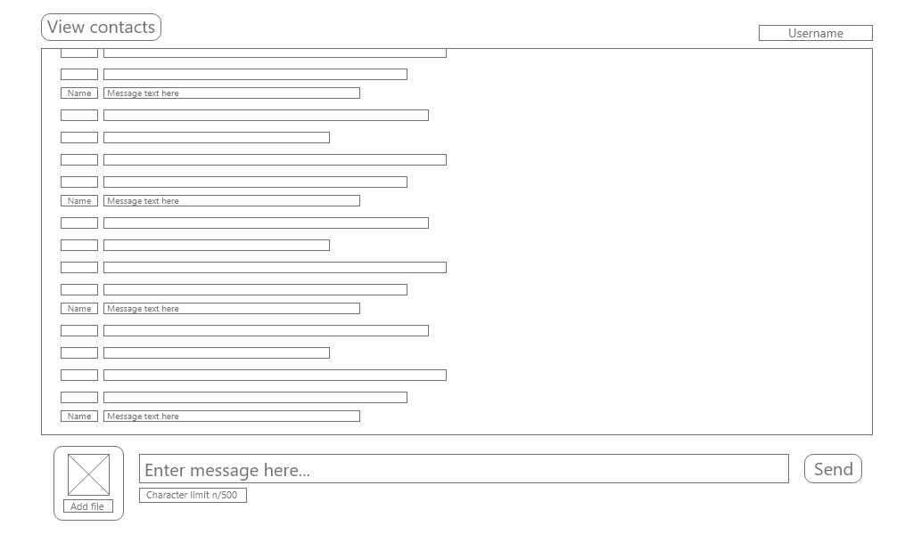

### Login View

### Signup view

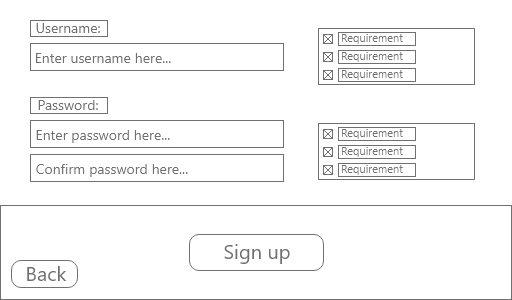

# Development

## Iteration 1

### Plan

| ID  | Requirement                                                             |
|-----|-------------------------------------------------------------------------|
| 1   | Client sockets connect to the server at the start-up of the program     |
| 2   | Client socket tells the server it is closing before the app is closed   |
| 3   | The socket sends heartbeats to the server to show that it is still open |
| 9   | Users can type out a message and send it with a “Send” button           |
| 10  | Users can type out a message and send it with the ENTER button          |
| 22  | The server can accept incoming client connections                       |
| 23  | Each connected client is handled by a separate thread                   |

In this iteration, I plan to create a simple prototype with a client-server connection (success criteria 1 and 22). This is because a stable client-server connection is needed as the base for the rest of my program. I plan to implement this using a TCP socket on both the client and server applications. Then making the client’s socket point to the server socket. To handle the many client connections on the server, I think I will need to split the program into threads (success criterion 23).

Since this will be the base for the rest of my program, I want to make sure the connection is stable. Therefore, I hope to be able to add a heartbeat from the client and closure notices (success criteria 3 and 2) so that any networking errors will be fixed at the lowest level – rather than having to be handled by the application’s logic.

During this iteration, I plan on implementing a text-based protocol for the client-server messages. This will not be the final protocol but will be a quick and easily modifiable solution while I develop the networking. The final protocol will likely be some form of a serialised object as discussed in *2.1* *Problem Decomposition*.

A fundamental part of messaging apps is sending messages, to satisfy the stakeholders’ requirements I will add a “Send” button to send messages (success criterion 9) and allow users to press \[ENTER\] to send messages (success criterion 10). I will implement both even though the stakeholders identified pressing \[ENTER\] as the preferred method as the two methods can both exist in the solution without interfering with one another.

### Shared

#### SocketBase class and its children

Both the client and server require a socket to be networked together, to do this I used the System.Net.Sockets library and have created an abstract base class called SocketBase. SocketBase houses all the shared socket functionality which is extended in child classes for the server and client. This solves the problem of duplicate client-server code and reduces the chance of error.

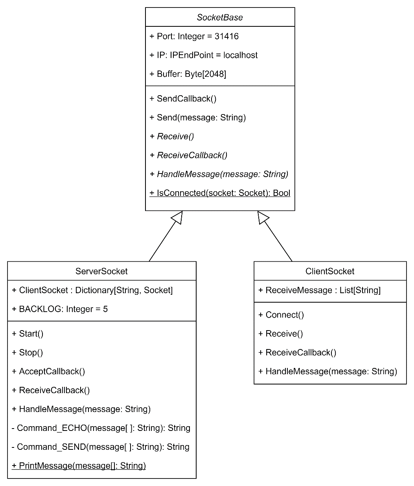

Figure 5. UML class diagram for SocketBase and its derived children

Since some methods need to be implemented differently depending on whether it is for the client or server, some methods have been declared but not defined in SocketBase. These are the abstract methods of the class as they will need to be defined by the child classes.

#### Protocol

To allow communication between the client and server to be consistent, I have created a Protocol class that encodes text in a standardised way (UTF-8). This was done to address the problem found of incompatible character encodings from *1.3.2* *Internet Relay Chat (IRC)*.

Figure 6. MessengerAppShared.Protocol

I have used two constructors in this class as an instance of the Protocol needs be able to be created from a string (sending) or from binary (receiving).

In future iterations, this is where I will put the code used to encrypt and decrypt messages since the process must be identical for the cryptosystem to function correctly across the two programs.

#### Creating the socket

Figure 7. MessengerAppShared.SocketBase.SocketBase

I have chosen the size of the socket’s buffer to be 2048 bytes as currently 2KiB of data is enough for the text that is being transferred. Once multimedia messages are implemented, this buffer could be increased.

Secondly, the server is currently only available to the computer it is running on (as seen in IPAddress.Loopback). This has been done as opening it up to the Internet is both insecure and unnecessary during this phase of development. To open the program to the Internet the user would need to open a firewall port for inbound and outbound traffic, which leaves the chance for vulnerabilities to be introduced to whichever network I am testing on as that port needs to be closed once testing is over.

#### Receiving a message

Figure 8. MessengerAppShared.Receive

Both child sockets will use these asynchronous methods for receiving data since synchronous methods would be blocking and so very disruptive for the user. A blocking method will halt the program’s processing until the receive method has finished. This will disable the GUI for the user for an indeterminate amount of time. Non-blocking methods on the other hand will run in the background and not affect the GUI. I have also made these methods virtual so the child classes can extend their functionality if they need to.

Figure 9. MessengerAppShared.SocketBase.ReceiveCallback

In future iterations, the decoding of the message into text and passing to the message handler will have to be moved out of the shared method and into the child-specific overrides as decryption keys will need to be used by the client while message routing will need to be used by the server.

### Server

#### Starting the server

ServerSocket is a child of SocketBase. Inside the server program’s main function, a ServerSocket instance is created and set to start. This will begin an infinite loop that accepts new connections from clients and creates a virtual thread for each client. In each of these threads is another infinite loop for receiving messages.

<table><colgroup><col style="width: 48%" /><col style="width: 51%" /></colgroup><thead><tr class="header"><th>

Figure 10. MessengerAppServer.Program.Main
</th><th>
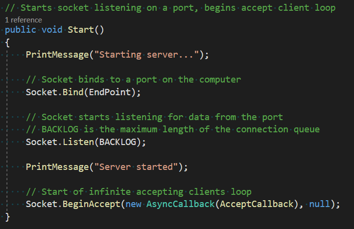

Figure 11. MessengerAppServer.ServerSocket.Start
</th></tr></thead><tbody><tr class="odd"><td>
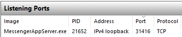

Figure 12. Server socket as seen from Resource Monitor
</td><td>

Figure 13. Server console output upon starting
</td></tr></tbody></table>

This code should not need to be majorly changed for the rest of the development since the connection process will be the same even after adding user authentication and encryption. A possible change would be inserting the user authentication between accepting the user and making it its virtual thread, I will find out when authentication is implemented if this is needed.

#### Stopping the server

Figure 14. MessengerAppServer.ServerSocket.Stop

To stop the server, the ENTER key is pressed. In future iterations, this could be made more secure by requiring a passcode to be entered however it is not crucial so is not a priority now.

Currently, there are two issues with the shutdown process. Firstly, the clients connected to the server are not notified that the server has been shut down. Which can cause fatal errors for the client if they try to send anything to the server. This problem can be solved by sending a shutdown notice to all connected clients before closing the socket. Secondly, a non-fatal error is thrown in the server program during the shutdown process, I believe this is because there is always an open receive happening and it is throwing an error when it is cut off.

Figure 15. Server console output after \[enter\] is pressed

#### Accepting a new client

This method is called at the end of ServerSocket.Start to finalise the new client connection and will call ServerSocket.Start once it has finished continuing the infinite loop.

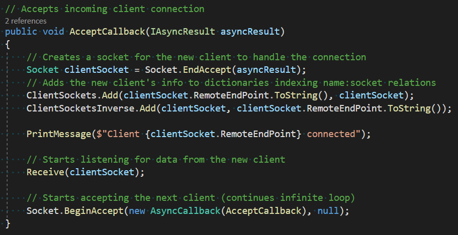

Figure 16. MessengerAppServer.ServerSocket.AcceptCallback

In future iterations of the solution, this method will be extended by adding the user login system which will, in turn, improve the name and socket relations system in use here. The name and socket relations system currently consists of two dictionaries: one for IP to socket lookups and one for the socket to IP lookups. The IPs will be replaced with usernames for each socket’s unique identifier. Currently, to send a user a message the exact IP and port of the recipient must be entered. This is not user-friendly enough for the final solution so I plan to make a list of all the online users that the user can select to send their message to in a later iteration.

#### Receiving a message from a client

Figure 17. MessengerAppServer.ServerSocket.ReceiveCallback

During development, I encountered the problem of the server crashing whenever a client program closed. I found the cause of this to be the infinite receive loop still trying to receive data from the client even though its connection has closed. To solve the problem, I added some validation to make sure the client is still connected before trying to read any data. This addition also had the added benefit of ensuring that the name to socket relation dictionaries is up to date with the connected clients

Figure 18. Server output when a client connects (line 3) and then disconnects (line 4)

In the future, I may move the client disconnect process to a separate method. This is because the process will only get longer and methods should only do one thing: just finish receiving the data, not also remove disconnected clients.

#### Handling a message from a client

This method is called after receiving any data from the client. Firstly, data sanitation removes leading and trailing whitespace to ensure that all command word and parameter matches are accurate. Secondly, the string is split into an array of words which has been done to make reading specific parts of the message easier.

Figure 19. MessengerAppServer.ServerSocket.HandleMessages

To determine which command the message contains, the first words are matched against several cases. To avoid errors when the message is empty or null, the null coalescing operator (??) is used. This operator returns the left-hand side if it does not equal null, and the right-hand side if it is. This could have been done in an if statement before the switch but combining the two pieces of logic reduces code duplication and makes the method easier to maintain in the future.

In future iterations, this switch case block will have to be modified as the plan for the commands is for them to be object- or markup-based: possibly JObjects or XML. However, the same principle will remain.

#### ECHO command handling

Figure 20. MessengerAppServer.ServerSocket.Command_ECHO

This method will not be part of the final solution, instead, I am using it to test the sending of data between the client and server. By echoing any data sent back to the client, I can see immediately what data was transmitted, its form and therefore any problems, without the need to do variable watches in debugging.

Figure 21. ECHO command as seen from client's and server's perspective

At this point in development, the server can see all messages in plaintext. This is not an issue as I am yet to implement the encryption process. In a future iteration when encryption has been implemented, the above situation should produce the same results on the client’s side while not showing “Hello World!” on the server’s side.

#### SEND command handling

Figure 22. MessengerAppClient.ServerSocket.Command_SEND

One difficulty faced when writing this method was the command’s dependency on positional arguments. This required validation for the number of words in the message and tests of whether arguments were intended to be recipients or not, which meant there had to be many nested conditionals. This problem will be solved in future iterations where I will move away from a text-based protocol like this and into an object- or markup-based protocol as discussed in *2.1* *Problem Decomposition*.

Another change I will make to this method in the future is changing the recipient argument into a username rather than an IP address and port. However, this can only be done once I have implemented user accounts. This will help the end-user by making the syntax easier and less likely to cause mistypes; although, in the final solution all commands will be generated by the client program so this improvement will lose its effect.

Figure 23. SEND message from left (port 1070) to right (port 1071)

As seen above, when sending a message, it is not immediately displayed by the recipient. I believe that this is because the client programs do not have an infinite receive loop like the server program. This means that they only read in data from their socket after they send a message to the server. Having a message waiting to be read by the socket introduces a permanent one-message delay on all communications from that program, which increases for each further message they receive via a SEND. To solve this problem, I will create a virtual thread that continually listens for messages from the server to process/display them in real-time.

### Client

#### Connecting to the server

This method is used to interface the UI with the socket functions: pressing the “Connect to server” button will call this and once the socket has connected to the server, it will update the status label.

Figure 24. MessengerAppClient.ShellViewModel.Connect

One issue with this current method is that if the socket does not connect to the server successfully, the UI would still show “Connected” (currently the program crashes first, but if the crashing were fixed). This could be solved by adding a conditional to determine if the connection were successful.

In future iterations of the solution, this method to begin the connection with the server would be where an infinitely looping receiving data thread would begin. This is needed in the program as it would solve the issue seen in *3.1.5* *Testing* with the SEND command not updating the received message field on the recipient’s program until they next communicate with the server.

#### Sending a message to the server

This method is called when the “Send” button is pressed or the \[ENTER\] key is hit. It sends the message in the message text field to the server, gets a response from the server and displays the response. This linear process is needed as the response to the sent message is directly related to the sent message. However, this method is the only method used by the client to communicate with the server, which is not good when messages are sent to the client without the client first sending a message.

Figure 25. MessengerAppClient.ShellViewModel.SendMessage

I will solve this problem by adding an infinite receive loop like that seen in the server program. The consequences of not having this loop can be seen in the example from *3.1.3.7* *SEND command handling.*

Another problem I faced when writing this method was how will I store the message received. Originally, I was going to have a string to hold the received message, but then I realised that there may be a situation where I need to access past messages. Therefore, I implemented a list that new messages are appended to. In the future, I will switch this to a queue as I need a FIFO data structure that can hold a backlog of messages while the current message is being processed.

#### Messaging screen

Figure 26. Client program's user interface

The current UI has not been made for usability. It only has the essential components for testing and debugging the networking portion of the solution: my aim for this first iteration. In future iterations, I will focus more on recreating the designs that the stakeholders and I decided on. This includes adding the feature to send messages via pressing the enter key, connecting to the server automatically upon opening the program and most importantly, having the program write all the commands which are sent to the server, so the user only needs to write the message they want to send.

Secondly, there are no limits on window size, taskbar icon and descriptive name. All of which are not important features but will need to be added to the final solution before it is sent out to stakeholders.

### Testing

#### Testing plan

I will be testing this iteration through a predominantly black-box testing method – with some tests targeting specific conditionals like white-box testing. This is being used to see how the expected output to the user compares to the intended output. Most of the tests conducted will be for all the possible messages sent to the server from the client program, the rest will be seeing how the client program handles malformed messages and clicking buttons that cannot complete their intended actions.

<table><colgroup><col style="width: 4%" /><col style="width: 26%" /><col style="width: 26%" /><col style="width: 41%" /></colgroup><thead><tr class="header"><th>ID</th><th>Testing</th><th>Input Data</th><th>Expected Output</th></tr></thead><tbody><tr class="odd"><td>1</td><td>ECHO, normal</td><td>“ECHO Test”</td><td>“Test”</td></tr><tr class="even"><td>2</td><td>ECHO, no message</td><td>“ECHO”</td><td>“Invalid ECHO: Missing argument [message]”</td></tr><tr class="odd"><td>3</td><td>ECHO, whitespace message</td><td>“ECHO ”</td><td>“Invalid ECHO: [message] IsNullOrWhiteSpace”</td></tr><tr class="even"><td>4</td><td>SEND, normal</td><td>“SEND 127.0.0.1:123 Test”</td><td>
Sender: “SUCCESSFUL SEND”

Recipient: “MESSAGE 127.0.0.1:123 Test”
</td></tr><tr class="odd"><td>5</td><td>SEND, no arguments</td><td>“SEND”</td><td>“Invalid SEND: Missing arguments [recipient] and [message]”</td></tr><tr class="even"><td>6</td><td>SEND, no message, valid recipient</td><td>“SEND 127.0.0.1:123”</td><td>“Invalid SEND: Missing argument [message]”</td></tr><tr class="odd"><td>7</td><td>SEND, no message, invalid recipient</td><td>“SEND 0.0.0.0:0”</td><td>“Invalid SEND: Invalid [recipient] “0.0.0.0:0” and missing [message]”</td></tr><tr class="even"><td>8</td><td>SEND, whitespace message, valid recipient</td><td>“SEND 127.0.0.1:123 “</td><td>“Invalid SEND: [message] IsNullOrWhiteSpace”</td></tr><tr class="odd"><td>9</td><td>SEND, valid message, invalid recipient</td><td>“SEND 0.0.0.0:0 Test”</td><td>“Invalid SEND: Invalid [recipient]”</td></tr><tr class="even"><td>10</td><td>No message</td><td>“”</td><td>“Invalid message: Is null or whitespace”</td></tr><tr class="odd"><td>11</td><td>Invalid command</td><td>“RUN Test”</td><td>“Invalid command: Command “RUN” not found”</td></tr><tr class="even"><td>12</td><td>Leading and trailing whitespace</td><td>“ ECHO Test ”</td><td>“Test”</td></tr><tr class="odd"><td>13</td><td>Extra whitespace between arguments</td><td>“SEND 127.0.0.1:123 Test”</td><td>
Sender: “SUCCESSFUL SEND”

Recipient: “MESSAGE 127.0.0.1:123 Test”
</td></tr><tr class="even"><td>14</td><td>Message longer than 2048 bytes</td><td>“ECHO &lt;more than 2043-byte string&gt;”</td><td>The string truncated to 2043 bytes</td></tr><tr class="odd"><td>15</td><td>Sending a message without connected to the server</td><td>“ECHO Test”</td><td>Not allowed</td></tr><tr class="even"><td>16</td><td>Sending a message after the server has closed</td><td>“ECHO Test”</td><td>Not allowed</td></tr><tr class="odd"><td>17</td><td>Connecting an already connected client</td><td>Press “Connect to server”</td><td>Not allowed</td></tr><tr class="even"><td>18</td><td>Connected when the server is not running</td><td>Press “Connect to server”</td><td>Not allowed</td></tr></tbody></table>

#### Testing results

<table><colgroup><col style="width: 4%" /><col style="width: 8%" /><col style="width: 56%" /><col style="width: 30%" /></colgroup><thead><tr class="header"><th>ID</th><th>Status</th><th>Actual Output</th><th>Comments</th></tr></thead><tbody><tr class="odd"><td>1</td><td>Pass</td><td>
Client:

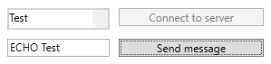

Server:

</td><td>Output as expected</td></tr><tr class="even"><td>2</td><td>Pass</td><td>
Client:

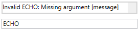

Server:

</td><td>Output as expected</td></tr><tr class="odd"><td>3</td><td>Pass</td><td>
Client:

Server:

</td><td>
The test did not result in the expected output.

Instead, the data validation caught and corrected for the mistake which is a better outcome
</td></tr><tr class="even"><td>4</td><td>Fail</td><td>
Sender (127.0.0.1:62839):

Recipient (127.0.0.1:63008):

Server:

</td><td>Due to the lack of an infinite receive loop on the client, the recipient does not receive the message until they next communicate with the server. This will need to be addressed in a later iteration</td></tr><tr class="odd"><td>5</td><td>Pass</td><td>
Client: 

Server:

</td><td>Output as expected</td></tr><tr class="even"><td>6</td><td>Pass</td><td>
Client:

Server:

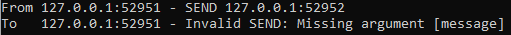
</td><td>Output as expected</td></tr><tr class="odd"><td>7</td><td>Pass</td><td>
Client:

Server:

</td><td>Output as expected</td></tr><tr class="even"><td>8</td><td>Pass</td><td>
Client:

Server:

</td><td>
The test did not result in the expected output.

Instead, the data validation caught and corrected for the mistake which is a better outcome
</td></tr><tr class="odd"><td>9</td><td>Pass</td><td>
Client:

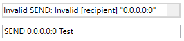

Server:

</td><td>Output as expected</td></tr><tr class="even"><td>10</td><td>Fail</td><td>(Program hung, had to be killed)</td><td>Trying to process a blank message caused the program to hang.</td></tr><tr class="odd"><td>11</td><td>Pass</td><td>
Client:

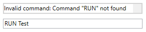

Server:

</td><td>Output as expected</td></tr><tr class="even"><td>12</td><td>Pass</td><td>
Client:

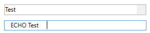

Server:

</td><td>Output as expected</td></tr><tr class="odd"><td>13</td><td>Fail</td><td>
Client:

Server:

</td><td>When splitting the string on space characters, the recipient parameter was replaced by an empty string.</td></tr><tr class="even"><td>14</td><td>Fail</td><td>
Client:

Server Part 1:

Server Part 2:

</td><td>
The first 2048 bytes were processed correctly. The remainder was processed as in independent command, so caused a command not found error.

the 2nd message suffered the same timing issue as test 4
</td></tr><tr class="odd"><td>15</td><td>Fail</td><td>(Program hung, had to be killed)</td><td>The attempt to send a message to the server failed because of no connection.</td></tr><tr class="even"><td>16</td><td>Fail</td><td>(Program hung, had to be killed)</td><td>The attempt to send a message to the server failed because of no connection.</td></tr><tr class="odd"><td>17</td><td>Pass</td><td>
Expected output

</td><td>Output as expected</td></tr><tr class="even"><td>18</td><td>Fail</td><td>(Program hung, had to be killed)</td><td>Attempting to connect to the server twice caused an error because both connections were trying to use the same socket.</td></tr></tbody></table>

#### Addressing failed tests

Test 4

This test not producing the expected output was expected as the lack of a receive loop was identified in *3.1.3.7* *SEND command handling*. I will aim to implement a receive loop in the next iterations as this is what is needed to fix this error.

Tests 16

The failure of this test was expected. The errors that caused its failure stemmed from the client and server not communicating their status with each other. To fix this a heartbeat could be implemented between the client and server so if either party does not get the expected reply, they know that the other party is not online.

Test 17

This test was addressed by adding a Boolean that disabled and enabled the “Connect to server” button depending on if the client is already connected to the server. This Boolean was bound to the state of the button in the UI using Caliburn.Micro naming conventions.

| ID  | Status | Actual Output           | Comments                                           |
|-----|--------|-------------------------|----------------------------------------------------|
| 17  | Pass   | The button was disabled | The user cannot try to connect to the server twice |

Test 15

This test was addressed in a very similar manner to test 17 by controlling the state of the “Send” button so that the user cannot send a message if they are not connected to the server. As with the connect button, this is bound to the state of the corresponding button in the UI using Caliburn.Micro naming conventions.

| ID  | Status | Actual Output           | Comments                                                                           |
|-----|--------|-------------------------|------------------------------------------------------------------------------------|
| 15  | Pass   | The button was disabled | The user cannot try to send a message because they are not connected to the server |

Test 14

Lastly, this test failed because the buffer that the server reads messages to has a length of 2048 bytes. This meant that only the first 2048 bytes of the transmission were read. To fix this error, set the MaxLength property in the TextBox that the message is read from to 1000 so 2048 bytes would not be exceeded.

<table><colgroup><col style="width: 4%" /><col style="width: 8%" /><col style="width: 45%" /><col style="width: 41%" /></colgroup><thead><tr class="header"><th>ID</th><th>Status</th><th>Actual Output</th><th>Comments</th></tr></thead><tbody><tr class="odd"><td>14</td><td>Pass</td><td>
Client

Server

</td><td>The length of the limited message did not cause an error</td></tr></tbody></table>

### Evaluation

| ID  | Requirement                                                             |
|-----|-------------------------------------------------------------------------|
| 1   | Client sockets connect to the server at the start-up of the program     |
| 2   | Client socket tells the server it is closing before the app is closed   |
| 3   | The socket sends heartbeats to the server to show that it is still open |
| 9   | Users can type out a message and send it with a “Send” button           |
| 10  | Users can type out a message and send it with the ENTER key             |
| 22  | The server can accept incoming client connections                       |
| 23  | Each connected client is handled by a separate thread                   |

This iteration achieved the aim of creating a client-server prototype. The client connects to the server (success criterion 1) and the server can accept clients (success criterion 22). Another feature that was successfully implemented was creating a separate thread for each client connection in the server (success criterion 23). I also can send messages to the server using the “Send” button (success criterion 9) in the UI and by the ENTER key bound to the “Send” button’s functionality (success criterion 10).

However, two of the targeted success criteria were not achieved. I was unable to have the client socket send a heartbeat (success criterion 3) to prove to the server that it is open. This is because I am yet to implement any infinite loops on the client-side – which are needed for a recurring message to be sent.

The other criterion I did not achieve was 2. I was unable to implement this because I am yet to investigate how WPF handles the window shutdown routine. If I am to implement this feature, I will need to intercept the window shutdown routine and send one final message from the client to the server. However, if the heartbeat is sufficiently frequent, I may be able to forgo the closure message and rely on the end of the heartbeats.

| ID  | Requirement                                   |
|-----|-----------------------------------------------|
| 26  | Messages are routed to the intended recipient |

Since some basic commands were implemented (SEND, ECHO), an extra success criterion was implemented: I made the server read and route messages to their intended recipient (success criterion 26). This is currently a part of text-based protocol handling so this criterion will have to be redone when I transition to a markup- or object-based protocol in a later iteration.

Since I have implemented the basics of the networking in this iteration, I think that for the next iteration I will focus on improving the protocol by making it object-based.

## Iteration 2

### Plan

| ID  | Requirement                                              |
|-----|----------------------------------------------------------|
| 4   | Users must log in to their account to access the program |
| 24  | The server authorises logins against its database        |

In this iteration, I plan to add the login system (success criteria 4 and 24). This is because if I want to progress further with the development of client-to-client messaging, I need a more solid connection between a client and their identity. The best way to implement this is by bringing forward the development of the login system. To satisfy the UI design requests made by the stakeholders, I will design this login system following feedback from the stakeholder about the interface designs shown in the design section of the writeup.

As mentioned at the end of the last iteration, I will also transition the text-based protocol to object-based so that validation and ease of processing are improved. However, I do not know whether JObjects or XML objects will be used so I will need to investigate and experiment with those options during the development.

### Shared

#### Application layer networking protocol changes

**Overview**

In this iteration, I successfully transitioned the program’s application layer networking protocol from text-based to object-based. This was done in response to the discussion in *2.1* *Problem Decomposition* as well as the practical findings of *3.1.3.7* *SEND command handling* in iteration 1. The benefits of the object-based protocols include the following:

1.  Fewer errors caused by the protocol’s reliance on positional arguments and syntax

    -   The incorrect placement of a SPACE character previously caused errors

2.  Simpler message handling

    -   Subtype polymorphism allows me to perform actions on all message objects irrespective of their intended purpose

    -   Access to the contents of a message is much easier through the attributes of an object compared to the components of a string

3.  Better extensibility

    -   New message types can be quickly created by inheriting from a shared message class base

Class diagram

Implementation

During the design of the class diagram that matched and extended the functionality of the text-based protocol, I quickly realised that custom objects would be best to implement the protocol – rather than JObject or XML objects as I previously thought and had suggested in 3.2

Iteration 2Plan.

To implement the new protocol, I first made an abstract base message class called MessageBase which can be seen in the class diagram above and then the several derived message classes that inherit from this base. Each of these derived classes corresponds to one action or request. For example, when the client sends a MessageEcho object to the server the contents of the object will be echoed back to the client; this class was made especially for debugging and allows me to test the sockets’ connection (just like its text-based equivalent seen in *3.1.3.6* *ECHO command handling*).

For some parts of the program, I only partially transitioned to the object-based protocol. These parts will be fully transitioned in future iterations as I don’t deem them a priority now. To accommodate for this partial transition, the MessageBase class has StringToBinary and BinaryToString that allow it to act as a messenger for the text-based protocol albeit wrapped in the object-based protocol.

#### Serialisation and deserialisation

Figure 27. MessengerAppShared.MesssageBase.Serialise and MessengerAppShared.MessageBase.Deserialise

These methods from MessageBase facilitate the object-based protocol as only binary can be transmitted across the program’s sockets.

The serialisation method works by taking in an object of unknown type, then creating a byte array stream to which the object’s binary representation is written. This stream is then converted into a normal byte array and returned. The deserialisation process is just the reverse of this: taking the byte array stream in and returning the object of an unknown type.

I chose to make these methods static as if they were regular methods, the methods would be serialising or deserialising the object that they are a part of. This self-referencing during the deconstruction or construction is impossible, the situation would be like having a language’s sole compiler written in the language that it is there to compile. Making the method static and passing the object/binary as arguments solved this problem by detaching the method from the object they are acting on.

To improve these methods and act on the findings found in *3.1.5.2* *Testing results*, in future iterations I may implement a size restriction check that the byte arrays do not exceed the 2048-byte size of the buffer used by the sockets. I may also do validation checks on the type of the object as if the object is not one of the derived classes of MessageBase the program will not be able to understand it properly.

### Server

#### Handling an inbound message

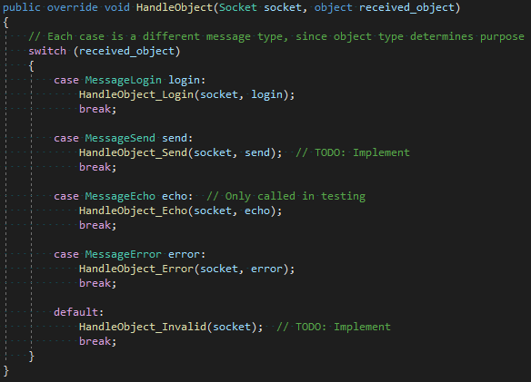

Figure 28. MessengerAppServer.ServerSocket.HandleObject

This function is called after the socket receives an object. Its purpose is to call the object’s corresponding handling routine. This is achieved through a switch-case block that switches on the object’s type. I chose this as it is the most succinct conditional for this scenario, the alternative is many if-statements containing very similar conditions that add unnecessary repetition. A benefit of this function is that it allows me to in future implement actions easily as all I need to do is add another case to pass on to that action’s handler.

In the situation that the object received by the socket does not match any of the cases, the default case will be reached. This currently has no functionality. I plan to have the HandleObject_Invalid function send an error message back to whoever sent the message so that know that their message was not properly handled.

Another case that currently doesn’t have functionality is the MessageSend case. This will be implemented in the next iteration when I move to develop the messaging, as in this current iteration I have been working on the login system (hence HandleObject_Login being finished). The steps in HandleObject_Send will be to determine the recipient; send the message to the recipient; send confirmation to the sender.

The purpose of the MessageEcho class was mentioned above in *3.2.2.2* *Serialisation and deserialisation*. Despite it only being for debugging, it will remain in the final program since, if it is not called, it will not affect the client and still allow testing in the future.

#### Login procedure

Figure 29. MessengerAppServer.ServerSocket.HandleObject_Login

This method is triggered by the received object handler explained in the section above. The method compares the username and password provided by the user to all the stored usernames and passwords in the AccountCredentials.csv file. When a match is found, an appropriate message is returned to the user as a pop-up box.

On the client’s side, the response has no functionality other than telling the user that their credentials were found. In subsequent iterations, I will make it so that a successful response progresses the user onto the messaging screen to satisfy success criterion 4 – the aim of this iteration.

On the server’s side, the dictionary that contains the relations between clients and identities is unchanged from the previous iteration. Now that the user account framework is in place, I will alter the identities to be usernames rather an IP addresses. This will then set up the lookup table for when encryption is implemented as public keys can be added here alongside usernames (to satisfy success criterion 21).

#### CSV handling

Figure 30. MessengerAppServer.CSVHandler

This class handles reading data from AccountCredentials.csv by the server. When called it reads the file and transforms each record into an Account object. The Account class has attributes corresponding to each header in the CSV (Username, Password) and no methods, it merely exists to hold data. The list of Account objects is then returned to the program so that it can be searched as seen above in the *3.2.3.2* *Login procedure*.

Currently, there are no restrictions on allowed usernames and passwords since there is no way to create an account (all the test records in AccountCredentials.csv are from manual input). When I do implement an account creation system, I need to consider the following standardised usernames as raised in *1.5.1* *Stakeholder*. To define the rules for the usernames and passwords I will use the grammar below.

<table><colgroup><col style="width: 100%" /></colgroup><thead><tr class="header"><th>Username and password grammar (EBNF)</th></tr></thead><tbody><tr class="odd"><td>
upper ::= [A-Z]

lower ::= [a-z]

digit ::= [0-9]

special ::= "$" | "#" | "@" | "!" | "%" | "^" | "&amp;" | "*"

character ::= [A-Z] | [a-z] | [0-9] | special

first_name ::= upper { lower }

last_name ::= upper { lower | "-" upper }

username ::= first_name [ "_" last_name ]

password ::= character { character }
</td></tr></tbody></table>

As all login attempts are processed by the server by checking the supplied credentials against those in AccountCredentials.csv, success criterion 24 has been completed as planned for this iteration.

### Client

#### Login request

Figure 31. MessengerAppClient.LoginViewModel.LoginButton

This function is called when the user clicks the “Log in” button on the login dialogue (as seen *in* *3.2.4.2* *Login screen* ). The contents of the username and password field are used to create a new MessageLogin object. This object is then sent to the server and the server’s response is received. The UI fields are also cleared.

In future iterations, I plan to add data validation to ensure that UsernameInput and PasswordInput are not empty when this function is called. Currently, zero-length strings do not cause errors, although they may cause issues once hashing and encryption are introduced.

Another change that needs to be implemented is the move away from the one-to-one send and receive messages between the client and server. In the last iteration, this was the cause of the timing issues seen in test ID 4 in *3.1.5.2* *Testing results*: it caused a queue of transmissions to build upon the server’s socket that only dequeued when the client sent a message. I plan to fix this by implementing an infinite receiving loop on the client giving a one-to-many relation instead.

When a response is received from the server, the client shows a pop-up box to the user containing the response. This is fine for testing, although for the program to be functional and success criterion 4 to be satisfied the client should do something different: if the response is for a valid login, pass the user onto the messaging screen; if the response is for an invalid login, continue showing the login screen (as already mentioned in *3.2.3.2* *Login procedure*).

#### Login screen 

<table><colgroup><col style="width: 50%" /><col style="width: 50%" /></colgroup><thead><tr class="header"><th rowspan="2">

Figure 32. Client login screen
</th><th>

Figure 33. Unsuccessful login attempt
</th></tr><tr class="odd"><th>

Figure 34. Successful login attempt for user "test"
</th></tr></thead><tbody></tbody></table>

When the user runs the program, they are shown the login screen above. After filling out the fields they can click the “Log in” button (defined above in 3.2.4.1 Login request) to attempt to log into the server. If the server finds a matching pair of credentials in their CSV, the client is shown the successful login attempt message. If the server cannot find a matching pair of credentials, the client is shown the unsuccessful login attempt message (Figure 33). The user can then close these pop-up boxes and they are shown the login screen again.

In this iteration, I planned to have the login screen progress onto the messaging screen from Iteration 1. However, due to unforeseen difficulties with maintaining state while destroying one window and making another I was unable to implement that feature. I have ideas on how to solve this problem – such as making both “windows” be contained in the same windows so all I need to do is switch the window’s contents – that I will investigate in future iterations.

Because users cannot access the program after a successful login, success criterion 4 has not been met. Although, the login validation is already in place all that needs to be added to satisfy the criterion is the screen transfer.

### Testing

#### Testing plan

In this iteration’s testing, I will mainly carry out black-box tests of all the possible input scenarios from the user on the client login screen. However, I will also include some white-box style tests that have been made to test certain validation checks and validation in the program. Specific tests for the transition from the text-based to the object-based protocol will not be outlined as they will be covered in the tests for all the different types of login requests.

<table><colgroup><col style="width: 5%" /><col style="width: 26%" /><col style="width: 26%" /><col style="width: 41%" /></colgroup><thead><tr class="header"><th>ID</th><th>Testing</th><th>Input Data</th><th>Expected Output</th></tr></thead><tbody><tr class="odd"><td>1.0</td><td>The “Log in” button</td><td>Click the “Log in” button</td><td>Send a login request to the server, then the user is passed to messaging screen</td></tr><tr class="even"><td>1.1</td><td>The “Sign up” button</td><td>Click the “Sign up” button</td><td>Send a sign-up request to the server, then the user is passed to messaging screen</td></tr><tr class="odd"><td>2.0</td><td>Valid credentials</td><td>
U: test

P: test
</td><td>The client is told login was successful</td></tr><tr class="even"><td>2.1</td><td>Invalid username</td><td>
U: Testing123

P: test
</td><td>The client is told login was unsuccessful</td></tr><tr class="odd"><td>2.2</td><td>Invalid password</td><td>
U: test

P: Testing123
</td><td>The client is told login was unsuccessful</td></tr><tr class="even"><td>2.3</td><td>Invalid credentials</td><td>
U: Testing123

P: Testing123
</td><td>The client is told login was unsuccessful</td></tr><tr class="odd"><td>2.4</td><td>Blank username</td><td>
U:

P: test
</td><td>The client is prevented from submitting a login request</td></tr><tr class="even"><td>2.5</td><td>Blank password</td><td>
U: test

P:
</td><td>The client is prevented from submitting a login request</td></tr><tr class="odd"><td>2.6</td><td>Blank credentials</td><td>
U:

P:
</td><td>The client is prevented from submitting a login request</td></tr><tr class="even"><td>2.7</td><td>Mix two accounts’ credentials</td><td>
U: test

P: password123
</td><td>The client is told login was unsuccessful</td></tr></tbody></table>

#### Testing results

<table><colgroup><col style="width: 5%" /><col style="width: 8%" /><col style="width: 46%" /><col style="width: 39%" /></colgroup><thead><tr class="header"><th>ID</th><th>Status</th><th>Actual Output</th><th>Comments</th></tr></thead><tbody><tr class="odd"><td>1.0</td><td>Partial</td><td>
Server:

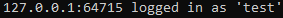

Client:

</td><td>The request successfully reached the server and was processed as expected. However, when the response reached the client, the user was not passed to the messaging screen as this functionality has not yet been implemented</td></tr><tr class="even"><td>1.1</td><td>Fail</td><td>
Server:

[nothing]

Client:

</td><td>A request was never made to the server and the user was shown an “under construction” placeholder. This is because the signup functionality has not yet been implemented</td></tr><tr class="odd"><td>2.0</td><td>Pass</td><td>
Server:

Client:

</td><td>Output is as expected</td></tr><tr class="even"><td>2.1</td><td>Pass</td><td>
Server:

Client:

</td><td>Output is as expected</td></tr><tr class="odd"><td>2.2</td><td>Pass</td><td>
Server:

Client:

</td><td>Output is as expected</td></tr><tr class="even"><td>2.3</td><td>Pass</td><td>
Server:

Client:

</td><td>Output is as expected</td></tr><tr class="odd"><td>2.4</td><td>Partial</td><td>
Server:

Client:

</td><td>
The login request was processed as expected.

But the user is not stopped from sending a login request with an empty field. This is because data validation has not been implemented yet.
</td></tr><tr class="even"><td>2.5</td><td>Partial</td><td>
Server:

Client:

</td><td>
The login request was processed as expected.

But the user is not stopped from sending a login request with an empty field. This is because data validation has not been implemented yet
</td></tr><tr class="odd"><td>2.6</td><td>Partial</td><td>
Server:

Client:

</td><td>
The login request was processed as expected.

But the user is not stopped from sending a login request with empty fields. This is because data validation has not been implemented yet
</td></tr><tr class="even"><td>2.7</td><td>Pass</td><td>
Server:

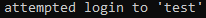

Client:

</td><td>Output as expected</td></tr></tbody></table>

#### Addressing failed tests

Test 1.0 only partially failed. The request, processing and response sent to the client were what was expected. However, when the client received the response, it should have passed the user onto the messaging screen. This has not been implemented yet so did not happen. This issue is discussed in the sections above and I plan to correct it by making both the login and messaging windows into screens that occupy the same window so state information can be more easily transferred between the two. I was unable to implement this during this iteration so this problem will be the focus of my next iteration.

Test 1.1 failed as this functionality has not been implemented. I do not plan to implement this soon as there are more important features to add first and some features which, if added after the sign-up code, would require the sign-up code to be modified.

Tests 2.4, 2.5 and 2.6 all partially failed as the user was allowed to send login requests to the server will one or both the fields being empty. Even though this did not cause errors in the program, it was not what the tests expected. And when encryption and hashing are implemented, the zero-length strings may cause errors. Therefore, in the next iteration, I will add data validation so that the user can only send a login request when both fields are populated. I will aim to add this data validation in the next iteration.

### Evaluation

| ID  | Requirement                                              |
|-----|----------------------------------------------------------|
| 4   | Users must log in to their account to access the program |
| 24  | The server authorises logins against its database        |

All logins are checked by the server against the AccountCredentials.csv file to check whether an account with those credentials exists. This is what is required by success criterion 24 so that has successfully been met.

Success criterion 4 has only been partially completed as when a user makes a login request, the request is handled as planned by the server and the client is told if the login was successful or not. Although, the client does not then pass the user onto the messaging screen if the login was a success. I have outlined what needs to be done to correct this in the iteration’s analysis above. Making these corrections to allow navigation will be the aim of the next iteration.

## Iteration 3

### Plan

#### Success criteria targets

| ID  | Requirement                                                           |
|-----|-----------------------------------------------------------------------|
| 2   | Client socket tells the server it is closing before the app is closed |
| 4   | Users must log in to their account to access the program              |
| 6   | Users are not allowed to try to log in if the socket cannot connect   |

In this iteration, navigation will be the focus. Implementing success criterion 4 began in the previous iteration but the unfinished navigation prevented me from finishing it.

Opening and closing the app are both parts of the navigation process and validation. As such, criteria 2 and 6 will be targeted to enable reliable opening and closing for the user. Criterion 2 was previously targeted (iteration 1) but failed to be completed as it required dealing with WPF’s window management: the focus of this iteration.

By fixing the issues I have been postponing regarding navigation and connecting the program’s halves (login screen and messaging screen) I hope to be able to complete these criteria and allow progress to be made on others that rely on the user being able to move between different screens.

#### Current issues faced

I am currently facing two issues preventing me from progressing with the navigation.

1.  How to close one window (login page) and open another window (home page)

2.  How to pass information between windows (a socket with a connection to the server)

These issues are dependent on each other as for the shown window to change the thread of execution must be transferred, and for state to be transferred there must be multiple windows active.

During the development of the previous iteration, I tried to solve issue 1 using WPF’s built-in methods for handling windows: Window.Close(), Window.Show() and Window.Hide(). However, using this approach I was unable to get the program’s thread of execution to transfer from the first window to the second (issue 2), so the attempt failed. Although, what I learned from the attempt was that it would be easier to house both the screens within the same window because then I wouldn’t have to transfer the thread of execution. Instead, I will just need to change the View and ViewModel that is loaded in one window and keep the thread of execution processing the active ViewModel.

#### How I plan on solving the issues

One of the ways that WPF allows multiple Views to be displayed in the same window is by having each View be a UserControl rather than a Window. Therefore, I will redefine the issues to reflect this new approach.

1.  How to close one UserControl and open another UserControl

2.  How to pass information between UserControls

To solve the first issue, I will use the Screen and Screen Conductor patterns to control the lifecycle of my Views and ViewModels. Screens are units of the UI that have their own activation and deactivation logic, and Screen Conductors are interfaces that control which Screens are being shown by enforcing their activation and deactivation logic. The package I am using for UI binding, Caliburn.Micro, has this pattern applied through their Screen and Conductor interfaces that are implemented in Screen and Conductor classes respectively (the Conductor class is, in fact, a child class of Screen). I will be using these classes to inherit from for my ViewModels.

To solve the second issue, I will use the Event Aggregator pattern. This pattern allows messages to be published by one object (publisher) and listened to by another object (subscriber). This allows the transfer of information between objects as I publish information from one ViewModel and listen for it with another ViewModel. An implementation of the Event Aggregator pattern also comes from the Caliburn.Micro with its EventAggregator interface. I will implement this interface in the ViewModels which require any external information for their logic.

### Conductors and Screens

So that each of my Views can occupy the same Window and be controlled by a Conductor, I changed each of the Views from being a Window to a UserControl. Then, I made each of the Views’ corresponding ViewModels inherit from the Screen class so they can have activation and deactivation logic.

To control these Screens, I made three Conductor ViewModels. One for the login stage, one for the messaging stage and one to activate and deactivate the other two Conductors between the stages of the program. This means that through a top-down approach I can control the changing of Screens within the login system, the transition to the messaging system, and then control the Screens within the messaging system or vice versa.

A pattern that needed to be implemented alongside Conductors was dependency injection. DI is where objects are injected into another object which requires them. This was needed in my case as the Conductors needed access to the Screens they acted on. The pattern was implemented starting at the bootstrapper where an IoC container is made to handle the injecting of objects. This bootstrapper then loads ShellViewModel which is injected with the Conductors for login and messaging. When each of the Conductors is instantiated, they are injected with the Screens they control. The Conductors then takes the screens that have been injected into them and add them to a Screen Collection. This allows the Conductor to control which Screen is the active screen. In the case of the ShellViewModel Conductor, it allows control over which Conductor is the active Conductor.

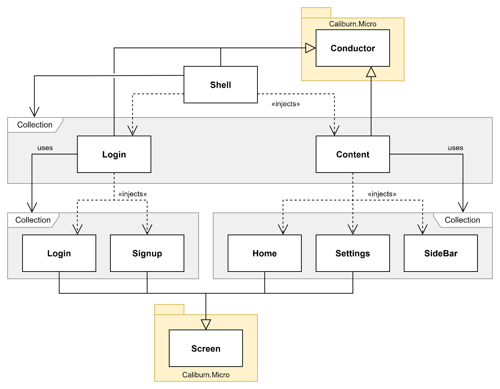

Figure 35. Class diagram of Screen and Conductor relationships for all current ViewModels

Because I transitioned from having each of my Views being a Window to being a UserControl, they can all be displayed in the same Window. This Window is called ShellView and is the View for ShellViewModel (the root object in the diagram above). ShellViewModel is the entry point of the program and is the Conductor for the other Conductors so allows the top-down approach for my handling of navigation. When I want to implement activation and deactivation logic for the program (e.g., connecting the socket at start-up and disconnecting the socket at exit) it will be done in this class.

#### Example Conductor: ShellViewModel

Figure 36. Class diagram of ShellViewModel

Since all the Conductors have similar inheritance, constructors, and Screen handling logic, they all approximately fit the class diagram above. Therefore, I will only explain the first Conductor: ShellViewModel.

Figure 37. ShellViewModel constructor

ShellViewModel inherits from the Conductor class. The specific Conductor inherited from supports Screen Collections and only one active Screen. I choose these modes as all the ViewModels that this Conductor controls are Screens (through inheritance, see Figure 35). Secondly, only a single Screen will be displayed at a time so OneActive was chosen, rather than AllActive which can display multiple Screens.

A LoginConductorViewModel and ContentConductorViewModel were injected into the class during the constructor. This is an application of the dependency injection which was explained in the section above. In each Conductor, the Screens in the Screen Collection that the Conductor controls are injected and made attributes. The other object that is injected into the class is an Event Aggregator interface implementation. This is used to handle the messages that the Screens publish to tell the Conductor to change the displayed Screen. The Event Aggregator will be explained in more detail in its dedicated section 3.3.3below.

#### Example Screen: SignupViewModel

Figure 38. Class diagram of SignupViewModel

Like Conductors, since all the Screens have similar inheritance, constructors, and message publishing logic, they all approximately fit the class diagram above. Therefore, I will only explain one of the Screens: SignupViewModel. Once more complex program logic is added to the Screens, they will begin to diverge from one another, so the details I explain with be the common features that will remain.

Figure 39. SignupViewModel

SignupViewModel inherits from Screen. This provides the class with the necessary methods for being activated and deactivated.

Figure 40. SignupView's design

Like in ShellViewModel, SignupViewModel implements the Event Aggregator interface to enable the class to publish messages that tell the Conductor to change the displayed Screen. The navigation message for SignupViewModel is published when the “Back” button is pressed as can be seen in Figure 39.

### Event Aggregator

After putting in place the Screens and Conductors to solve issue 1, an Event Aggregator was needed to handle the communications between all the objects to solve issue 2.

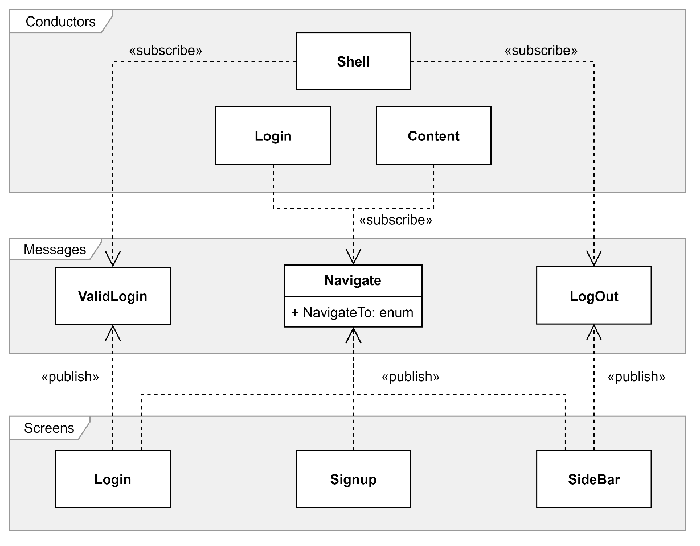

Figure 41. Class diagram of which messages each object publishes and subscribes to through IEventAggregator

The first implementation of the EventAggregator interface (IEventAggregator) is with the ShellViewModel. The messages that this object subscribes to are ValidLoginMessage and LogOutMessage, these tell the Conductor that the user wants to go to the messaging screen or login screen respectively.

Subscribed to by both the stage-specific Conductors is NavigateMessage. This message has an attribute that specifies its destination so that the Conductors know which Screen in their Screen Collections to activate.

An important ViewModel in the messaging part of the program is SideBarViewModel. This ViewModel will always be shown on the screen as it is where the navigation buttons are so there is no activation or deactivation logic. The ViewModel does still publish messages despite it not being a Screen or Conductor.

When I add more functionality to the program, the number of messages and/or the complexity of the messages will increase as more information will need to be transferred between the components of the UI. However, the framework is not in place to facilitate this.

### Testing

#### Testing plan

In this iteration’s testing, I will solely carry out UI testing. This is because to implement the navigation without having to consider how the new program flow will interact with the pre-existing routines for starting the login screen and messaging screen, I disconnected the logic from these parts of the program. Secondly, there will be no testing of the server in this iteration as there have been no changes to the server code since the last iteration and since the logic was disconnected from the program there is currently no connection to the server from the client.

| ID  | Testing                    | Input Data                | Expected Output                       |
|-----|----------------------------|---------------------------|---------------------------------------|
| 1.0 | The “Log in” button        | Click “Log in”            | Send the user to messaging screen     |
| 1.1 | The “Signup” button        | Click “Signup”            | Send the user to the signup screen    |
| 1.2 | The “Back to login” button | Click “Back to log in”    | Send user back to login screen        |
| 2.0 | The “Home” button          | Click “Home”              | Send the user to the home screen      |
| 2.1 | “Settings” button          | Click “Settings”          | Send the user to the settings screen  |
| 2.2 | The “Log out” button       | Click “Log out”           | Send user back to login screen        |
| 3.0 | Login screen scaling       | Resizing the login screen | All buttons and fields remain visible |
| 3.1 | Home screen scaling        | Resizing the home screen  | All buttons and fields remain visible |

#### Testing results

| ID  | Status | Actual Output                                                               | Comments                                                                                                              |
|-----|--------|-----------------------------------------------------------------------------|-----------------------------------------------------------------------------------------------------------------------|
| 1.0 | Pass   |   | Output as expected                                                                                                    |
| 1.1 | Fail   |  | The “Signup” button in SignupView was disabled so it could not be pressed to test if the navigation link was working  |
| 1.2 | Pass   |  | Output as expected                                                                                                    |
| 2.0 | Pass   |  | Output as expected                                                                                                    |
| 2.1 | Pass   |  | Output as expected                                                                                                    |
| 2.2 | Pass   |  | Output as expected                                                                                                    |
| 3.0 | Fail   |   | All the buttons and fields were eventually lost from being compacted too close to each other in too small of a window |
| 3.1 | Fail   |  | All the buttons and fields were eventually lost from being compacted too close to each other in too small of a window |

#### Addressing Failed Tests

Test 1.1 failed because the button which was being tested had been disabled. This was done during development as even once the logic from the program was reconnected, there would be no signup functionality. Therefore, I chose to keep this button disabled until further notice.

Tests 3.0 and 3.1 both failed due to buttons and fields being lost when the ShellView Window was resized too small. This can be prevented using two methods. First, I can make the Window have a minimum height and width to stop the user from making the Window a size in which components begin to be lost. However, test 3.0 saw the “Signup” button being lost as soon as the height was decreased from the initial value seen in the screenshots from the previous tests. The second, and more future-proof approach would be to make the components respond more dynamically to the resizing Windows. This could be done by moving the position or size of the components or by reducing the number of components when the Window space gets too small. I will consider both options during the next iteration.

### Evaluation

| ID  | Requirement                                                           |
|-----|-----------------------------------------------------------------------|
| 2   | Client socket tells the server it is closing before the app is closed |
| 4   | Users must log in to their account to access the program              |
| 6   | Users are not allowed to try to log in if the socket cannot connect   |

When the user provides a valid username and password, they can progress through to the messaging program. This completes success criterion 4 by implementing the navigation portion of the criterion while the previous iteration completed the authorisation portion of the criterion.

The opening and closing routines for the program have been extended to include waiting for a server connection and sending a disconnection notice, respectively. These extra validation steps satisfy criteria 2 and 6, completing the remaining targets for this iteration.

Now that the login system is complete (except for the signup process, which is not a priority), I will move on to reconnecting the logic for the program so that the client can connect to the server again. Then, I will focus on the client-client messaging in the next iteration.

## Iteration 4

### Plan

| ID  | Requirement                                             |
|-----|---------------------------------------------------------|
| 11  | Users can see a list of contacts                        |
| 12  | Users can click on a contact to message with them       |
| 15  | Messages are encrypted with the recipient's public key  |
| 16  | Messages are decrypted with the recipient's private key |
| 17  | Messages are signed with the sender’s private key       |
| 18  | Signatures are checked with the sender’s public key     |
| 19  | Messages cannot be read while in the server             |
| 20  | Key pairs can be generated                              |
| 21  | Public keys can be accessed by anyone                   |

For this iteration, developing the messaging further will be the priority. The changes that I plan to make are to firstly reconnect and update the logic on the client program and then implement encryption. To achieve the first aim, I will need to improve the server program’s client identification system for the signed-in users. This will allow me to make a contact system that the client-client messaging will be based upon.

Criteria 11 and 12 are being targeted for this iteration so that choosing a client to send a message to is easier. This is in comparison to previous iterations where users had to type out the username of the recipient for each message.

The rest of the targeted criteria (15 through to 21) enable end-to-end encryption, message integrity and user authenticity. These will be the final layers to be added to the messaging app once the rest of the processes are complete and reliable.

### Encryption

A static model called EncryptionModel has been made in the client to house the solution’s encryption logic. This was chosen because it centralises all the encryption processes for code consistency and having the model in the client codebase detaches the encryption logic from the server – an important idea in end-to-end encryption.

<table><colgroup><col style="width: 49%" /><col style="width: 50%" /></colgroup><thead><tr class="header"><th>

Figure 42. EncryptionModel.RSAEncrypt
</th><th>

Figure 43. EncryptionModel.RSADecrypt
</th></tr></thead><tbody></tbody></table>

These methods handle the encryption and decryption processes for the model. They both have strings for their inputs but immediately convert the inputs to binary arrays. This is because the cryptographic service provider only deals with binary arrays for its encrypt and decrypt methods. As a result, the returned binary must be converted to a string. The encoding chosen for the encrypted string was base 64, I chose this because it produces standard characters (A-Z, a-z, 0-9, +/=) that can be easily printed and stored by most character encoding.

Figure 44. EncryptionModel.RSAKeyGen

This method initialises a new RSA cryptographic service provider and extracts the generated key. This key is then returned as an XML string to be stored or used. The method was used to generate the encryption keys for storage in the user credentials CSV, and the encryption/decryption of messages. However, the method had to be used in isolation since the rest of the functionality to create a new user does not yet exist.

### Client

#### Sending a message

This method is a modification of the already existing SendMessage method that is triggered when the client presses the “Send” button in the user interface or presses the “Enter” key to send the specified message to the specified recipient user.

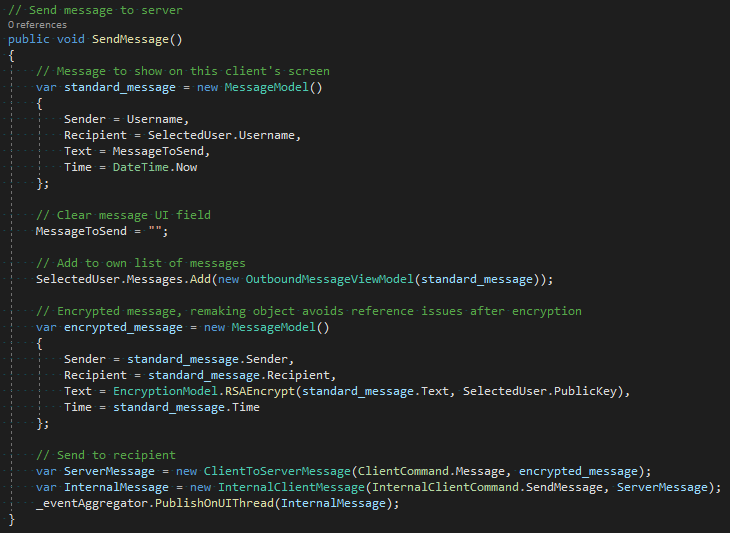

Figure 45. HomeViewModel.SendMessage

The only modification to this method is that after the normal message object is created and displayed in the conversation for the sender’s UI another message object is created. This object is identical to the original object with the only difference being that the text has been passed through the encryption model’s encryption function. Because the encryption function returns a base 64 string there is no need for the data type of the encryption message text to be different than a standard message.

The recipient’s public key used to encrypt the message is stored in the selected user property that is bound to the selected user of the combo box that displays all online users to the client. This property is updated every time a new user is selected from the combo box so is up to date with the user to whom the sender wants to send the message.

#### Receiving a message

This message is called when the infinite receive thread in the client receives a message. The thread publishes the message, and the content conductor’s message handling routine is triggered. This routine calls the method below.

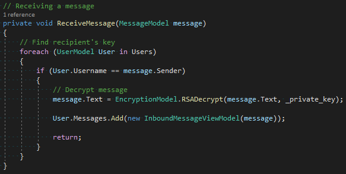

Figure 46. HomeViewModel.ReceiveMessage

This method takes the received message and finds the sender in the list of online users that the client has. Once the sender is found, the client uses its private key to decrypt the message and add it to the list of messages from that user. When the message is added to the list the UI is updated because the list is a bindable collection that updates the UI whenever changes are made.

As with the added encryption functionality in the sending routine, this process has minimal changes from the previous iteration and still deals with the same data types (MessageModel and string).

### Testing

#### Testing plan

| ID  | Testing                                                 | Input Data                           | Expected Output                                          |
|-----|---------------------------------------------------------|--------------------------------------|----------------------------------------------------------|
| 1.0 | Sending a message to another user                       | Pressing the “Send” button           | The message is sent to the recipient user                |
| 1.1 | Receiving a message from another user                   | Receiving a message                  | The message’s text is displayed in the conversation view |
| 1.2 | Messages are encrypted with the recipient's public key  | Send a message                       | The send message’s text is encrypted                     |
| 1.3 | Messages are decrypted with the recipient's private key | Receive a message                    | The received message can be decrypted                    |
| 2.0 | Users can see a list of contacts                        | Messaging screen is open             | Combo box populated with usernames of other users        |
| 2.1 | Users can click on a contact to message with them       | Click a user from a list of contacts | User is stored as the selected user                      |

#### Testing results

<table><colgroup><col style="width: 6%" /><col style="width: 9%" /><col style="width: 47%" /><col style="width: 37%" /></colgroup><thead><tr class="header"><th>ID</th><th>Status</th><th>Actual Output</th><th>Comments</th></tr></thead><tbody><tr class="odd"><td>1.0</td><td>Pass</td><td>
Alice – Sender

</td><td>
Output as expected

The message was sent from Alice to Bob successfully
</td></tr><tr class="even"><td>1.1</td><td>Pass</td><td>
Bob – Recipient

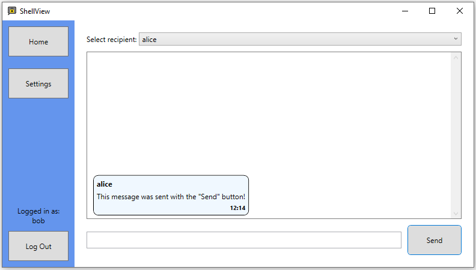
</td><td>
Output as expected

The message was sent from Alice to Bob successfully
</td></tr><tr class="odd"><td>1.2</td><td>Pass</td><td></td><td>
Output as expected

The message text was encrypted and converted to base 64 successfully
</td></tr><tr class="even"><td>1.3</td><td>Pass</td><td></td><td>
Output as expected

The message text was converted from base 64 and decrypted successfully
</td></tr><tr class="odd"><td>11</td><td>Pass</td><td></td><td>
Output as expected

The combo box was populated with the names of online users successfully
</td></tr><tr class="even"><td>2.1</td><td>Pass</td><td></td><td>
Output as expected

The selected user caused the conversation view to show their conversation successfully
</td></tr></tbody></table>

### Evaluation

| ID  | Requirement                                             |
|-----|---------------------------------------------------------|
| 11  | Users can see a list of contacts                        |
| 12  | Users can click on a contact to message with them       |
| 15  | Messages are encrypted with the recipient's public key  |
| 16  | Messages are decrypted with the recipient's private key |
| 17  | Messages are signed with the sender’s private key       |
| 18  | Signatures are checked with the sender’s public key     |
| 19  | Messages cannot be read while in the server             |
| 20  | Key pairs can be generated                              |
| 21  | Public keys can be accessed by anyone                   |

In the messaging screen interface, there is a combo box with all the online users that the client can select a recipient from. This satisfies criteria 11 and 12.

When sending and receiving messages, the text is encrypted and decrypted with the recipient’s public and private keys, respectively. This satisfies criteria 15, 16 and 19.

Digital signatures were not implemented in this iteration despite being a target. This was due to time constraints limiting the number of features I could include. Therefore, criteria 17 and 18 were not satisfied.

The server can generate pairs of RSA keys that are stored as XML in AccountCredentials.csv for any user to request access to. This satisfies criteria 20 and 21. However, the generation function is not used in the current build of the program as the functionality to create an account (where the function would be called) has not been implemented yet.

This will be the final iteration of the program because I have now satisfied the most important criteria and have a working solution.

# Evaluation

## Post-Development Testing

### Functionality

#### Testing plan

| ID  | Criterion                                                                         | Input                                               | Expected Output                                             |
|-----|-----------------------------------------------------------------------------------|-----------------------------------------------------|-------------------------------------------------------------|
| 1   | Client sockets connect to the server at the start-up of the program               | Open client program                                 | Connection made with the server program                     |
| 2   | Client socket tells the server it is closing before the app is closed             | Close client program                                | Disconnect message sent to the server                       |
| 3   | The socket sends heartbeats to the server to show that it is still open           | The client program is open                          | Heartbeat messages are sent regularly from client to server |
| 4   | Users must log in to their account to access the program                          | Open client program                                 | The user is shown the login screen first                    |
| 5   | New users can create an account                                                   | Press the “Sign up” button                          | Request sent to the server to create a new account          |
| 6   | Users are not allowed to try to log in if the socket cannot connect               | Open client program                                 | The user is not shown the login screen                      |
| 7   | Usernames must be unique                                                          | Enter an already used username on the signup screen | The user is told that this username is already in use       |
| 8   | Password must be of a minimum strength (upper, lower, digits, special characters) | Enter a weak password on the signup screen          | The user is told that this password is too weak             |
| 9   | Users can type out a message and send it with a "Send" button                     | Press the “Send” button                             | The message is sent from one user to another                |
| 10  | Users can type out a message and send it with the ENTER key                       | Press the “Enter” key                               | The message is sent from one user to another                |
| 11  | Users can see a list of contacts                                                  | Messaging screen is open                            | Combo box populated with usernames of other users           |
| 12  | Users can click on a contact to message with them                                 | Click a user from a list of contacts                | User is stored as the selected user                         |
| 13  | Users can see past conversations with a contact                                   | Open a conversation view with another user          | Historic messages with that user are shown                  |
| 14  | Users can be added to contacts by searching their username                        | Username is entered into the search field           | Specified user is added to contacts list                    |
| 15  | Messages are encrypted with the recipient's public key                            | Send a message                                      | The send message’s text is encrypted                        |
| 16  | Messages are decrypted with the recipient's private key                           | Receive a message                                   | The received message can be decrypted                       |
| 17  | Messages are signed with the sender's private key                                 | Send a message                                      | Send message is signed                                      |
| 18  | Signatures are checked with the sender's public key                               | Receive a message                                   | The received message can be verified                        |
| 19  | Messages cannot be read while in the server                                       | Send a message                                      | The message is encrypted whilst passing through the server  |
| 20  | Key pairs can be generated                                                        | Create a new account                                | A pair of encryption keys                                   |
| 21  | Public keys can be accessed by anyone                                             | Request a user’s public key                         | Their public key is provided                                |
| 22  | The server can accept incoming client connections                                 | The client tries to connect to the server           | The server accepts the connection                           |
| 23  | Each connected client is handled by a separate thread                             | The client connects to the server                   | Connection is handled on a separate thread                  |
| 24  | The server authorises logins against its database                                 | The login request is sent to the server             | Server checks credentials against the database              |
| 25  | The server can create new accounts                                                | A new account request is sent to the server         | The new account is created in the database                  |
| 26  | Messages are routed to the intended recipient                                     | Send a message                                      | The message is received by the intended client              |
| 27  | Messages are held in the server if the recipient is not connected                 | Send a message to an offline user                   | The message is held on the server                           |
| 28  | Undelivered messages are sent the next time the recipient connects                | Offline user comes online                           | Messages held in the server are sent to this user           |

#### Testing results

<table><colgroup><col style="width: 4%" /><col style="width: 8%" /><col style="width: 47%" /><col style="width: 39%" /></colgroup><thead><tr class="header"><th>ID</th><th>Status</th><th>Actual Output</th><th>Comments</th></tr></thead><tbody><tr class="odd"><td>1</td><td>Pass</td><td></td><td>Output as expected</td></tr><tr class="even"><td>2</td><td>Pass</td><td></td><td>Output as expected</td></tr><tr class="odd"><td>3</td><td>Fail</td><td>Not implemented</td><td>Client to server heartbeat messages was not implemented in the solution</td></tr><tr class="even"><td>4</td><td>Pass</td><td>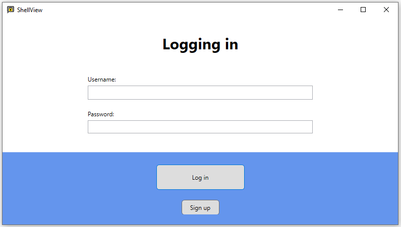</td><td>Output as expected</td></tr><tr class="odd"><td>5</td><td>Partial</td><td></td><td>The interface to create an account was implemented but the functionality to request a new account was not, so the test partially failed</td></tr><tr class="even"><td>6</td><td>Pass</td><td></td><td>Output as expected</td></tr><tr class="odd"><td>7</td><td>Fail</td><td></td><td>There are no checks on the length or availability of the username, so the test failed</td></tr><tr class="even"><td>8</td><td>Fail</td><td></td><td>There are no checks on the length or strength of the password, so the test failed</td></tr><tr class="odd"><td>9</td><td>Pass</td><td>
Alice – Sender

Bob – Recipient

</td><td>Output as expected</td></tr><tr class="even"><td>10</td><td>Pass</td><td>
Alice – Sender

Bob – Recipient

</td><td>Output as expected</td></tr><tr class="odd"><td>11</td><td>Pass</td><td></td><td>Output as expected</td></tr><tr class="even"><td>12</td><td>Pass</td><td></td><td>Output as expected</td></tr><tr class="odd"><td>13</td><td>Fail</td><td>
Alice

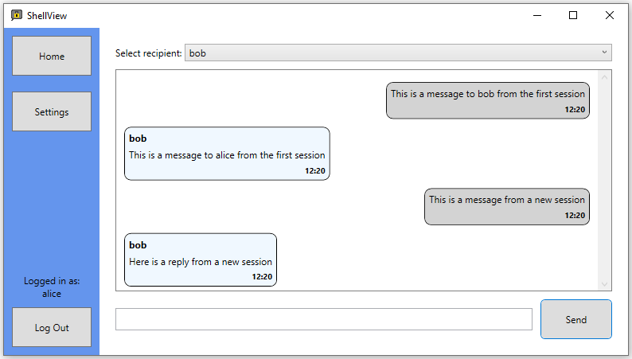

Bob

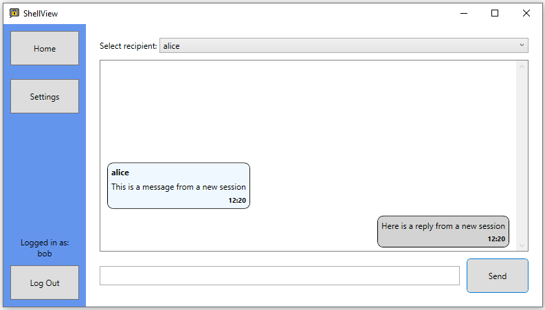
</td><td>
Alice and Bob had two messaging sessions between which Bob closed his client, but Alice did not.

Alice can still see the old messages as well as new ones, but Bob can only see the new messages.

This fails the test as Bob should be able to see both sets of messages.
</td></tr><tr class="even"><td>14</td><td>Partial</td><td>Not implemented</td><td>
Users cannot be added to a contacts list via a username search as the criterion wanted.

Instead, all users have a shared contacts list that contains all online users and dynamically updates.

This fails the specified test but the functionality the test is there to prove still exists, just in a different implementation.
</td></tr><tr class="odd"><td>15</td><td>Pass</td><td>

</td><td>Output as expected</td></tr><tr class="even"><td>16</td><td>Pass</td><td>

</td><td>Output as expected</td></tr><tr class="odd"><td>17</td><td>Fail</td><td>Not implemented</td><td>Signatures were not implemented so clients cannot sign outbound messages</td></tr><tr class="even"><td>18</td><td>Fail</td><td>Not implemented</td><td>Signatures were not implemented so clients cannot verify inbound messages</td></tr><tr class="odd"><td>19</td><td>Pass</td><td></td><td>Output as expected</td></tr><tr class="even"><td>20</td><td>Partial</td><td>
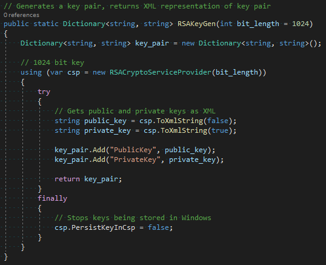

</td><td>
The encryption model class has the functionality to generate key pairs.

This method was used in isolation to populate the PublicKey and PrivateKey fields of the manually added users’ credentials.

Although, the rest of the program is yet to use this method as creating user accounts was not implemented.
</td></tr><tr class="odd"><td>21</td><td>Pass</td><td></td><td>Output as expected</td></tr><tr class="even"><td>22</td><td>Pass</td><td></td><td>Output as expected</td></tr><tr class="odd"><td>23</td><td>Pass</td><td></td><td>Output as expected</td></tr><tr class="even"><td>24</td><td>Pass</td><td></td><td>Output as expected</td></tr><tr class="odd"><td>25</td><td>Fail</td><td>Not implemented</td><td>Creating new user accounts was not implemented</td></tr><tr class="even"><td>26</td><td>Pass</td><td></td><td>Output as expected</td></tr><tr class="odd"><td>27</td><td>Fail</td><td>Not implemented</td><td>Historic messages were not implemented</td></tr><tr class="even"><td>28</td><td>Fail</td><td>Not implemented</td><td>Historic messages were not implemented</td></tr></tbody></table>

### Robustness

#### Testing plan

| ID  | Testing                                       | Input                                            | Expected Output                      |
|-----|-----------------------------------------------|--------------------------------------------------|--------------------------------------|
| 1   | Opening the client when the server is offline | Open the client program                          | The client is not allowed to open    |
| 2   | Closing the server when clients are online    | Close the client program                         | The clients are closed               |
| 3   | Empty username field                          | Login request with a blank username              | The login response is “unsuccessful” |
| 4   | Empty password field                          | Login request with a blank password              | The login response is “unsuccessful” |
| 5   | A login input field longer than the buffer    | Login request with field bigger than 2048 bytes  | The login response is “unsuccessful” |
| 6   | Foreign characters in the input fields        | A string of non-Latin characters                 | The login response is “unsuccessful” |
| 7   | Sending a message longer than the buffer      | A message with text bigger than 2048 bytes       | The message sent to the recipient    |
| 8   | Sending an empty message                      | A message with its text of length zero           | The message sent to the recipient    |
| 9   | Foreign characters in the message field       | A string of non-Latin characters                 | The message is sent to the recipient |
| 10  | Sending a message to an offline client        | Send a message to an offline user                | The message is not sent              |
| 11  | Sending a message with no recipient           | Send a message without a selected recipient user | The message is not sent              |

#### Testing results

<table><colgroup><col style="width: 4%" /><col style="width: 8%" /><col style="width: 47%" /><col style="width: 39%" /></colgroup><thead><tr class="header"><th>ID</th><th>Status</th><th>Actual Output</th><th>Comments</th></tr></thead><tbody><tr class="odd"><td>1</td><td>Pass</td><td></td><td>
Output as expected

The client does not open. Instead, a pop-up is shown, and the program closes when OK is clicked
</td></tr><tr class="even"><td>2</td><td>Pass</td><td>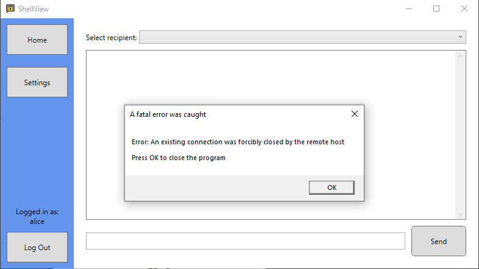</td><td>
Output as expected

A pop-up is triggered on all clients in which the program closes when OK is clicked
</td></tr><tr class="odd"><td>3</td><td>Pass</td><td></td><td>
Output as expected

The login is processed normally, and no errors are thrown
</td></tr><tr class="even"><td>4</td><td>Pass</td><td></td><td>
Output as expected

The login is processed normally, and no errors are thrown
</td></tr><tr class="odd"><td>5</td><td>Fail</td><td></td><td>
Since the stream only accepts the first 2048 bytes, not all that message’s data is transmitted in one.

This incomplete transmission causes an error that forces the server to end its connection with that client
</td></tr><tr class="even"><td>6</td><td>Pass</td><td>
Client View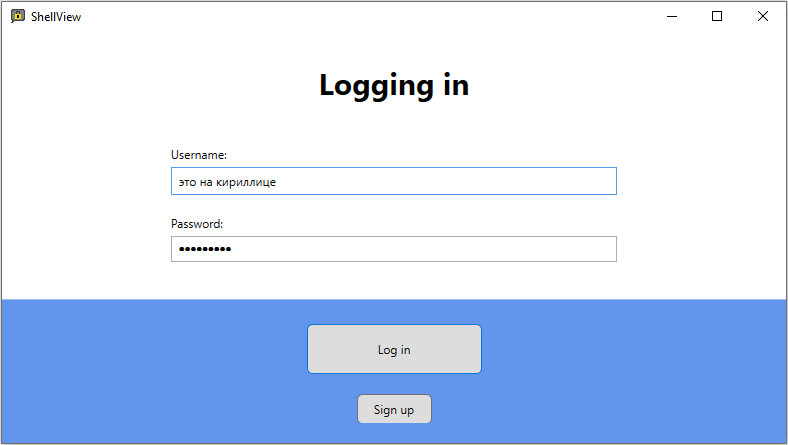

Server View
</td><td>
The login is processed normally, and no errors are thrown.

However, the output to the server console does not support the foreign script.
</td></tr><tr class="odd"><td>7</td><td>Fail</td><td></td><td>
Since the stream only accepts the first 2048 bytes, not all that message’s data is transmitted in one.

This incomplete transmission causes an error that forces the server to end its connection with that client
</td></tr><tr class="even"><td>8</td><td>Fail</td><td></td><td>
The client program crashed while trying to encrypt a string of length zero.

Validation to ensure that the input length is not zero would prevent this error.
</td></tr><tr class="odd"><td>9</td><td>Pass</td><td>
Alice - Sender

Bob - Recipient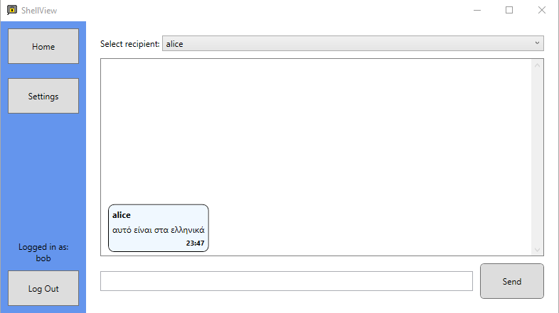
</td><td>
Output as expected

The script is encrypted and decrypted without issue and displayed properly on both sender and recipient programs.
</td></tr><tr class="even"><td>10</td><td>Fail</td><td>
Sender Client

Server
</td><td>
The sender client sends the message to the server. The server then tries and fails to send the message to the offline recipient client.

This causes an error in the server that closes the connection with the sender client.
</td></tr><tr class="odd"><td>11</td><td>Fail</td><td></td><td>The client crashes when it tries to fetch the encryption key of a recipient that does not exist</td></tr></tbody></table>

### Usability Features

#### Testing Plan

| ID  | Feature                           | Input                                                                    | Expected Output                                                                                    |
|-----|-----------------------------------|--------------------------------------------------------------------------|----------------------------------------------------------------------------------------------------|
| 1   | Send button mapped to “Enter” key | Press the enter key while on the messaging screen                        | The text in the message field is sent to the selected recipient                                    |
| 2.0 | Descriptive input fields          | The login/signup screen is open                                          | Fields are descriptively labelled to tell the user what their purpose is                           |
| 2.1 | Descriptive input fields          | Failed login attempt                                                     | The username and password fields are cleared then highlighted to tell the user the login failed    |
| 2.2 | Descriptive input fields          | Failed signup attempt                                                    | The username or password fields are cleared then labelled with the requirements that are missing   |
| 3   | Pop-up error dialogues            | An error is thrown by the program                                        | The error does not crash the program and instead shows the user a pop-up with appropriate actions. |
| 4.0 | Intuitive navigation              | Click the button for going from the login screen to the signup screen    | The user is shown the signup screen                                                                |
| 4.1 | Intuitive navigation              | Click the button for going from the login screen to the messaging screen | The user is shown the messaging screen                                                             |
| 4.2 | Intuitive navigation              | Click the button for going from the messaging screen to the login screen | The user is shown the login screen                                                                 |
| 5.0 | Conversation view                 | Send a message                                                           | The message appears on the right-hand side                                                         |
| 5.1 | Conversation view                 | Receive a message                                                        | The message appears on the left-hand side                                                          |
| 6.0 | Window resizing                   | Resize login screen                                                      | Controls are preserved and usable                                                                  |
| 6.1 | Window resizing                   | Resize messaging screen                                                  | Controls are preserved and usable                                                                  |

#### Testing Results

<table><colgroup><col style="width: 6%" /><col style="width: 9%" /><col style="width: 44%" /><col style="width: 39%" /></colgroup><thead><tr class="header"><th>ID</th><th>Status</th><th>Actual Output</th><th>Comments</th></tr></thead><tbody><tr class="odd"><td>1</td><td>Pass</td><td></td><td>Output as expected</td></tr><tr class="even"><td>2.0</td><td>Pass</td><td></td><td>Output as expected</td></tr><tr class="odd"><td>2.1</td><td>Partial</td><td></td><td>The username and password fields are cleared but no feedback is given to the user to say the login failed.</td></tr><tr class="even"><td>2.2</td><td>Fail</td><td></td><td>The user cannot send a sign-up request so text cannot be entered into the GUI fields to test if they are descriptive.</td></tr><tr class="odd"><td>3</td><td>Pass</td><td>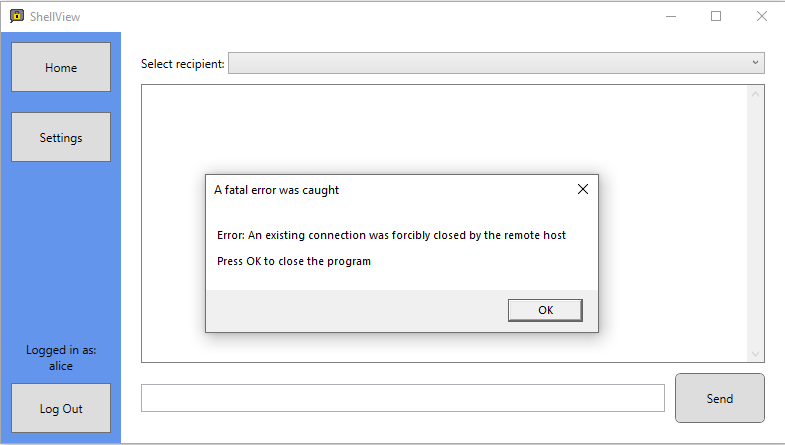</td><td>
Output as expected.

Error thrown was caused by server closing while clients are still logged in.
</td></tr><tr class="even"><td>4.0</td><td>Pass</td><td></td><td>Output as expected</td></tr><tr class="odd"><td>4.1</td><td>Pass</td><td></td><td>Output as expected</td></tr><tr class="even"><td>4.2</td><td>Pass</td><td></td><td>Output as expected</td></tr><tr class="odd"><td>5.0</td><td>Pass</td><td></td><td>Output as expected</td></tr><tr class="even"><td>5.1</td><td>Pass</td><td></td><td>Output as expected</td></tr><tr class="odd"><td>6.0</td><td>Fail</td><td>
Horizontal resizing

Vertical resizing

</td><td>
Horizontal resizing

The buttons were lost so the user could not reasonably use the program anymore, meaning the test failed.

Vertical resizing

The buttons and input fields were lost so the user could not reasonably use the program anymore, meaning the test failed.
</td></tr><tr class="even"><td>6.1</td><td>Partial</td><td>
Horizontal resizing

Vertical resizing

</td><td>
Horizontal resizing

The buttons and conversation remained visual so the user could still use the program, meaning the test passed.

Vertical resizing

The buttons and conversation were lost so the user could not reasonably use the program anymore, meaning the test failed.

Since the horizontal resizing passed and the vertical resizing failed, overall, the test was a partial success.
</td></tr></tbody></table>

## Success Criteria

### Evaluation

The results of the success criteria’s functionality tests above have identified which tests passed, partially passed, or failed. By extension, this identified which success criteria were fully met, partially met, or unmet, respectively.

Networking (IDs 1, 2, 3, 6, 22, 23 & 26)

This group consists of the criteria that make up the networking of the solution. Six of the seven tests passed for this group meaning most of the criteria in this group were fully met. Some of the functionality that this group provided for the solution was connecting to the server and communicating with other clients.

The test that failed in this group was ID 3. The corresponding criterion that was not met was the heartbeat between the server and client.

Login (IDs 4 & 24)

This group consists of the criteria that make up the login process of the solution. Both the tests passed for this group meaning that both the success criteria were fully met. The functionality that these criteria implemented into the solution were making the user log into the program when it starts and checking login requests again the server’s database.

User Interaction (IDs 9, 10, 11, 12 & 14)

This group consists of the criteria that make up how the user interacts with the solution. Four of the five tests passed for this group meaning most of the criteria in this group were fully met. Some of the functionality that this group provided for the solution was having the user choose the recipient from a list of clients and being able to send a message with the “Enter” button.

The test that partially failed in this group was ID 14. The corresponding criterion that was only partially met was that users can be added to the contacts list by searching their username.

Encryption (IDs 15, 16, 17, 18, 19, 20 & 21)

This group consists of the criteria that make up the encryption processes in the solution. Four of the seven tests passed for this group meaning that approximately half of the success criteria in this group were fully met. Some of the functionality that these success criteria implemented into the solution were encryption and decryption of client-to-client messages.

The test that partially failed in this group was ID 20. The corresponding criterion that was only partially met was that keys pairs can be generated.

The two tests that failed in this group were IDs 17 and 18. The corresponding criterion that was unmet were messages being signed and message signatures being verified.

Historic messages (IDs 13, 27 & 28)

This group consists of the criteria that make up the historic message handling and viewing in the solution. None of the tests passed for this group meaning that all the success criteria in this group were unmet. The functionality that this group planned to implement was the server holding onto messages for users when they are offline and sending held messages to users when they log in.

The tests that failed in this group were IDs 13, 27 and 28. The corresponding criteria that were unmet were storing messages sent to offline users and sending messages to users when they come online.

Signup (IDs 5, 7, 8 & 25)

This group consists of the criteria that allow users to create new accounts instead of logging in. One test in this group partially passed with the other three failing meaning that most of the success criteria in this group were unmet. Some of the functionality that these success criteria were supposed to implement was the checks on the availability of new usernames and the checks on the strength requirements of new passwords.

The test that partially passed was ID 5, this was because the functionality to pass the test exists in the program, it is just unreachable. Therefore, the corresponding success criterion was only partially met.

### Further Development

Historic Messages (criteria 13, 27 & 28)

The criteria for being able to message other users when they are offline and continue old conversations were unable to be implemented in the project. This was because it would require a rehaul of the processes that describe how the server handles messages, and how the client program opens, which I did not have time for.

If offline messages are to be addressed in any further development, the client would need to send all inbound messages to a buffer in the server, like bouncers in IRC. This buffer would then check to see if the recipient is online or offline. If the recipient is online the message would be sent right away to the recipient and if the recipient is offline the message would be stored in a database. Then, the necessary changes to the client program would be that when the user logs in a request would be sent to the server for the contents of the offline messages database in their name. These messages would then populate the conversations with the appropriate user to fill in the time when they were offline.

If allowing users to continue old conversations is to be addressed in any future development, the server would need to store all messages between users in their encrypted form (encryption at rest). Then, when users log into the program, they will be sent all their stored messages so that they can decrypt and populate the conversations with the appropriate users.

Signup (criteria 5, 7, 8 & 24)

The criteria for being able to create a new user account was unable to be implemented in the project. These criteria were decided to not be prioritised as accounts could still be created manually by editing the credentials CSV file.

If giving the client the ability to create a new account is to be addressed in any further development, the client interface would need to be changed. The fields and buttons necessary are already implemented however they are currently disabled. Another change on the client side would be to have validation on the input fields to ensure that the username has not already been used and that the password is strong enough; the details for the input validation was defined in the design section of this writeup.

A change that would need to be done to the server program would be the enabling of the RSA key generation methods. There would also need to be a method that writes the new credentials to the credentials CSV file. Once the account has been created, the user should be automatically logged-into the account using the username and password they provided; this should never be unsuccessful so needs no input from the client. Then once the account is created and the client is logged into that account there should be no differences in functionality or process compared to if the client had logged into an existing account.

## Usability Features

### Evaluation

Send button mapped to “Enter” key

This usability feature was successfully implemented because the user was able to press both the “Send” button and press the “Enter” key to send a message. This functionality was tested in test ID 1.

Descriptive input fields

This usability feature was only partially implemented. Labelling fields with that data they are for was successfully implemented in all screens of the program (test ID 2.0). However, labelling fields with what went wrong after an unsuccessful login attempt failed to be implemented. This can be seen in tests 2.1 and 2.2 where no feedback was given to the user. A partial pass of test 2.1 was because the input fields were cleared after an unsuccessful login attempt which was one of the desired features of the descriptive input fields (the other being labels).

Pop-up error dialogue

Having pop-up error dialogues was successfully implemented in the program. This can be seen in test 3 where a pop-up appeared after the server closed while the client was still connected. These pop-ups allowed the user to see that a fatal error had occurred and what caused it, compared to the program freezing or crashing unexpectedly which is not helpful for the user experience of the program.

Intuitive navigation

Being able to intuitively navigate around the program was successfully implemented. This was done with large buttons that were clearly labelled and functional. This can be seen in tests 4.0, 4.1 & 4.2 where the client is allowed to move between the login, signup, and messaging screens without issue. The implementation of this usability feature was by using the event aggregator design pattern so in the future the navigation will be extensible.

Conversation view

Having the messages between two users housed in a conversation view was successfully implemented. This was chosen because it mirrors industry standards for text conversations and was implemented using polymorphic XAML binding. The evidence for the passed testing for this feature can be seen in tests 5.0 and 5.1.

Window resizing

This usability feature failed to be implemented successfully because resizing the windows in the client program led to some input fields and buttons being hidden. For this feature to be successfully implemented, all components of the UI necessary for the user to effectively use the program had to remain on the screen at a reasonable size. The evidence of the components being hidden can be seen in tests 6.0 and 6.1. Test 6.1 had a partial pass because the vertical resizing of the messaging screen was usable; however, one dimension in one of the three screens is not sufficient for the feature to be said to be partially implemented.

### Further Development

Descriptive input fields

If this feature is to be addressed in further development, the client program would require input validation on most of the login fields. The validation that would need to be implemented is defined in the design section of this writeup and includes rules for the availability of the username and the strength of the password. If these validation rules were to be broken the interface should show a small label possibly in red that tells the user what changes they need to make to satisfy the validation.

This validation checking could also be done on the server-side so that in the details of the login response there could be a list of all the validation criteria that the supplied username and password failed. Then this list would have to be bound to the client interface in the same labels as the first method to inform the user.

Window resizing

If this usability feature is to be addressed in any further development of the program, the client program would need to be designed with limits in mind. These limits would need to be calculated using the number and size of the UI controls of the screen. For example, if the sum of the minimum widths of the buttons and fields on a screen is 200 pixels, then the window must have a minimum width of 200 pixels. This will prevent any components from being hidden from the user.

Adaptively moving controls up and down so that space can be made for other controls is another feature that could be implemented in further development to ensure that the windows are resizable. This would work by wrapping certain parts of the screen in WPF wrap panes that already have the functionality to adaptably resize. This would still require minimum widths and heights but would give the UI a move readable layout even when the width is too small for all the components to fit on the same line.

## Maintenance Issues and Limitations

Hardcoded server IP

A major limitation of the solution is that clients connect to the server using a hardcoded IP address (the loopback interface). This static address limits the usage of the solution as it means the server cannot be moved onto another network or port. Having the IP address be chosen at the time of first running the server was the plan for the development. However, since the program was only tested on the same machine in a LAN, addressing this limitation was not a priority.

Protocol Security

A current limitation of the solution is the security of the custom network protocol used. There is trust being held between the client and server that should not be there. I had planned to eliminate this trust by having the client sign all messages using a digital signature, this would verify the sender and contents of the messages. Since this was not implemented, anybody can impersonate any other user leading to the possibility of extremely easy man-in-the-middle attacks.

Key security

A maintenance issue of the solution is that encryption keys will need to be changed regularly to ensure that messages are secure. This needs to be done as if a private key has been exposed, the conversation between two clients is compromised. This will not be fixed unless the encryption key is changed so regular changing of encryption keys decreases the damage that can be caused by an exposed private key. Implementing this alongside historic messages will be difficult as the older messages may be encrypted with an older key; to fix this problem all old messages would need to be re-encrypted with the new key whenever a new keypair is issued.

Changing standards

An issue that may arise in the maintenance of the solution is that of changing encryption standards. Since encryption is a constantly evolving field, it is reasonable to suggest that in a few years the processes used in this system may be deprecated or deemed insecure.

An example of this would be that using the SHA-1 hashing algorithm to store password hashes was industry and government practice from 1995 to 2005 yet now those passwords would be insecure despite using what was previously thought to be a secure process. SHA-1 was first deprecated in 2011 and has since fallen out of use due to attacks on the algorithm being practical.

To protect this solution from changing encryption standards, the encryption protocol would have to be re-written for a new algorithm if RSA is deemed insecure.

## Future Development

Dealing with hardcoded server IP

As addressed above, there is a limitation with the current solution since the IP and port of the server program is hardcoded into the client program. This means that the server must be on the same machine and port every time it is run. To address this limitation in the future development of the solution, the start-up process of the server program could be modified to allow the user who is turning on the server to enter an integer value for the port number that the server should bind to. The necessary changes on the client program would be to have a pop-up screen open before the client is shown the login screen that requires them to enter the IP and port of the server. Having these features in place would allow the server to be run on any machine or port and dynamically have the clients point at wherever they want. Including this feature also opens the possibility to have multiple server programs running to service different sets of clients simultaneously.

Dealing with protocol security

As mentioned above, there is another limitation with the current solution since the custom networking protocol relies on trust between the server and the client. The possibility for any user to pretend to be any other user means that man-in-the-middle attacks are a big threat to the system. For this issue to be addressed in future development, digital signatures would have to be implemented. This would involve using the sender hashing the contents of the message and encrypting the hash with their private key that only they have. Then, when the recipient receives the message, they can decrypt the hash using the sender’s public key that everyone must view the message digest. If the digest is the same as a digest calculated by the recipient, the message and by extension sender can be trusted. This would solve the issue of trust between parties because all parties must prove their identity and can be verified by both the recipient and server.

Group messaging

A potential improvement to the program would be the addition of group messaging. This was identified in the analysis part of this writeup as a feature that the stakeholders would want to use, however, the scope of the project meant that it was not able to be implemented. In future development, implementing this would require messages to be sent simultaneously to all other members in a group and if messages are to be stored for historic messaging each message would need to be stored for each user on the server. This would take a long time to implement as it would require the redesign of most of the methods in the server since they currently only handle one recipient. There would also need to be a significant redesign of the client program interface as the user would need to be able to create new groups and join existing groups.

Wide Area Networks

Currently, the solution is limited to the machine it is running on. This is down to the IP address of the server being on the loopback interface. In the future development of the program, if the program wants to be run on a LAN or WAN the functionality must be implemented to use a real port on the host machine. This would require the server program’s installation to have administrator rights as it would need to access one of the ports from the firewall. Then, on the client machine like with the methods of addressing the hardcoded server IP address, there would need to be an input form that pops up when the client opens that prompts the user to input the address and port of the server. One thing that would first need to be considered before implementing this feature in future development is the security of the program as a whole, there would need to be more rigorous security testing done on both the protocol and the server program to ensure that the host machine will not be put at risk by running this solution.

# References

|     |     |
|-----|-----|
|     |     |
|     |     |
|     |     |
|     |     |

\[1\] J. Schwartz, “Messaging Apps: Average Usage Time Around the World,” SimilarWeb, 30 June 2016. \[Online\]. Available: www.similarweb.com/corp/blog/messaging-apps/. \[Accessed 18 April 2021\].\[2\] C. Corberly, “Discord has surpassed 250 million registered users,” TechSpot, 13 May 2019. \[Online\]. Available: www.techspot.com/news/80064-discord-has-surpassed-250-million-registered-users.html. \[Accessed 12 February 2021\].\[3\] A. Gelhausen, “IRC Networks - Top 10 in the annual comparison,” Netsplit, 2005. \[Online\]. Available: netsplit.de/networks/top10.php?year=2005. \[Accessed 19 February 2021\].\[4\] A. Gelhausen, “IRC Network QuakeNet,” Netsplit, \[Online\]. Available: netsplit.de/networks/QuakeNet/. \[Accessed 19 February 2021\].\[5\] Collaborative, “.NET Core 3.1 - Supported OS Versions,” 15 October 2019. \[Online\]. Available: github.com/dotnet/core/blob/main/release-notes/3.1/3.1-supported-os.md. \[Accessed 18 March 2021\].

# Appendix

## List of Appendices

[6.1 LaTeX Source Code 128][]

[6.2 Client Source Code 129][]

[6.2.1 Content/Messages/ 129][]

[6.2.2 Content/Models/ 130][]

[6.2.3 Content/ViewModels/ 133][]

[6.2.4 Content/Views/ 143][]

[6.2.5 Login/Messages/ 151][]

[6.2.6 Login/ViewModels/ 152][]

[6.2.7 Login/Views/ 155][]

[6.2.8 Shell/Messages/ 158][]

[6.2.9 Shell/Models/ 159][]

[6.2.10 Shell/ViewModels/ 160][]

[6.2.11 Shell/Views/ 164][]

[6.2.12 Bootstrapper.cs 165][]

[6.3 Server Source Code 166][]

[6.3.1 AccountCredentials.csv 166][]

[6.3.2 CSVHelper.cs 168][]

[6.3.3 Program.cs 170][]

[6.3.4 ServerSocket.cs 171][]

[6.4 Shared Source Code 176][]

[6.4.1 Messages/ 176][]

[6.4.2 Models/ 178][]

[6.4.3 Protocol.cs 180][]

[6.4.4 SocketBase.cs 181][]

## LaTeX Source Code

1.  \\documentclass{article}

2.  \\usepackage{amsmath}

3.  \\usepackage{algorithm}

4.  \\usepackage\[noend\]{algpseudocode}

5.  

6.  \\begin{document}

7.  \\begin{algorithm}

8.  \\caption{Creating a new user account - Client Side}

9.  \\begin{algorithmic}\[1\]

10. 

11. \\Procedure{GetValidCredentials}{}

12. % Loop until valid

13. \\Repeat

14. % Getting username and password

15. \\State $valid \\gets true$

16. \\State $username \\gets \\textbf{input}$ \\Comment{Fetched from UI}

17. \\State $password \\gets \\textbf{input}$

18. 

19. % Checking for valid username

20. \\If {$\\textrm{invalid } username$}

21. \\State $\\textbf{output} \\textrm{ \`\`Invalid username\`\`}$

22. \\State $valid \\gets false$

23. \\Else

24. \\State $username \\gets username + \`\`\\#\`\` + discriminator$

25. \\EndIf

26. 

27. % Checking for valid password

28. \\If {$\\textrm{invalid } password$}

29. \\State $\\textbf{output} \\textrm{ \`\`Invalid password\`\`}$

30. \\State $valid \\gets false$

31. \\EndIf

32. \\Until{$valid$}

33. 

34. % Return credentials

35. \\State $\\textbf{return } username \\textrm{ and } password$

36. \\EndProcedure

37. 

38. % Blank line

39. \\State

40. 

41. \\Procedure{CreateAccount}{}

42. \\State $username, \\, password \\gets \\textsc{GetValidCredentials}$

43. \\State $public\\\_key,\\,private\\\_key \\gets \\textsc{RSA\\\_KeyGen}$

44. \\State $derived\\\_key \\gets$ \\textsc{KDF(input=$password$)}

45. \\State $encrypted\\\_private\\\_key \\gets$ \\textsc{AES(text=$private\\\_key$, key=$derived\\\_key$)}

46. \\State $password\\\_hash \\gets$ \\textsc{MD5(input=$password$)}

47. \\State \\textbf{send} $username\\textrm{ and } password$ to server

48. \\State \\textbf{send} $public\\\_key\\textrm{ and }encrypted\\\_private\\\_key$ to server

49. \\EndProcedure

50. 

51. \\end{algorithmic}

52. \\end{algorithm}

53. \\end{document}

## Client Source Code

### Content/Messages/

#### ContentNavMessage.cs

namespace MessengerAppClient.Content.Messages

{

public sealed class ContentNavMessage

{

public ContentPage NavigateTo;

public ContentNavMessage(ContentPage navigateTo)

{

NavigateTo = navigateTo;

}

}

public enum ContentPage

{

Home,

Settings

}

}

### Content/Models/

#### EncryptionModel.cs

using System;

using System.Collections.Generic;

using System.Security.Cryptography;

using System.Text;

namespace MessengerAppClient.Content.Models

{

public class EncryptionModel

{

// Allows encoding scheme to be changed centrally

private static readonly Encoding \_encoding = Encoding.UTF8;

// Input plaintext string and XML key, output Base64 string

public static string RSAEncrypt(string data, string key_info)

{

// Input string -> binary

byte\[\] plaintext = \_encoding.GetBytes(data);

byte\[\] encrypted;

using (var csp = new RSACryptoServiceProvider())

{

try

{

// Imports contents of key information

csp.FromXmlString(key_info);

// Encrypts the data and pads

encrypted = csp.Encrypt(plaintext, false);

}

finally

{

// Stops keys being stored in Windows

csp.PersistKeyInCsp = false;

}

}

// Return Base64 string

return Convert.ToBase64String(encrypted);

}

// Input Base64 string and XML key, output plaintext string

public static string RSADecrypt(string data, string key_info)

{

// Input Base64 -> binary

byte\[\] encrypted = Convert.FromBase64String(data);

byte\[\] plaintext;

using (var csp = new RSACryptoServiceProvider())

{

try

{

// Imports contents of key information

csp.FromXmlString(key_info);

// Decrypts the data

plaintext = csp.Decrypt(encrypted, false);

}

finally

{

// Stops keys being stored in Windows

csp.PersistKeyInCsp = false;

}

}

// Return binary to string

return \_encoding.GetString(plaintext);

}

// Generates a key pair, returns XML representation of key pair

public static Dictionary\<string, string> RSAKeyGen(int bit_length = 1024)

{

Dictionary\<string, string> key_pair = new Dictionary\<string, string>();

// 1024 bit key

using (var csp = new RSACryptoServiceProvider(bit_length))

{

try

{

// Gets public and private keys as XML

string public_key = csp.ToXmlString(false);

string private_key = csp.ToXmlString(true);

key_pair.Add("PublicKey", public_key);

key_pair.Add("PrivateKey", private_key);

return key_pair;

}

finally

{

// Stops keys being stored in Windows

csp.PersistKeyInCsp = false;

}

}

}

}

}

#### UserModel.cs

using Caliburn.Micro;

using MessengerAppClient.Content.ViewModels;

namespace MessengerAppClient.Content.Models

{

public class UserModel

{

public string Username { get; set; }

public string PublicKey { get; set; }

public BindableCollection\<BaseMessageViewModel> Messages { get; set; }

}

}

### Content/ViewModels/

#### BaseMessageViewModel.cs

using MessengerAppShared.Models;

namespace MessengerAppClient.Content.ViewModels

{

public class BaseMessageViewModel

{

private readonly MessageModel \_message;

public string Sender => \_message.Sender;

public string Recipient => \_message.Recipient;

public string Text => \_message.Text;

public string Time => \_message.Time.ToShortTimeString();

public BaseMessageViewModel(MessageModel message)

{

\_message = message;

}

}

}

#### ContentConductorViewModel.cs

using Caliburn.Micro;

using MessengerAppClient.Content.Messages;

namespace MessengerAppClient.Content.ViewModels

{

public class ContentConductorViewModel : Conductor\<Screen>.Collection.OneActive,

IHandle\<ContentNavMessage>

{

private readonly IEventAggregator \_eventAggregator;

private readonly HomeViewModel \_homeViewModel;

private readonly SettingsViewModel \_settingsViewModel;

public SideBarViewModel SideBar { get; }

public ContentConductorViewModel(

IEventAggregator eventAggregator,

SideBarViewModel sideBarViewModel,

HomeViewModel homeViewModel,

SettingsViewModel settingsViewModel)

{

\_eventAggregator = eventAggregator;

SideBar = sideBarViewModel;

\_homeViewModel = homeViewModel;

\_settingsViewModel = settingsViewModel;

}

// When instantiated, begin listening to EventAggregator and show HomeViewModel

protected override void OnActivate()

{

base.OnActivate();

\_eventAggregator.Subscribe(this);

ActivateItem(\_homeViewModel);

}

// When deleted, stop listening to EventAggregator

protected override void OnDeactivate(bool close)

{

base.OnDeactivate(close);

\_eventAggregator.Unsubscribe(this);

}

// Determine which Screen to show using attribute of message

public void Handle(ContentNavMessage message)

{

switch (message.NavigateTo)

{

case ContentPage.Home:

ActivateItem(\_homeViewModel);

break;

case ContentPage.Settings:

ActivateItem(\_settingsViewModel);

break;

}

}

}

}

#### HomeViewModel.cs

using Caliburn.Micro;

using MessengerAppClient.Content.Models;

using MessengerAppClient.Shell.Messages;

using MessengerAppShared.Messages;

using MessengerAppShared.Models;

using System;

using System.Collections.Generic;

namespace MessengerAppClient.Content.ViewModels

{

public class HomeViewModel : Screen,

IHandle\<InternalClientMessage>

{

// Event Aggregator instance

private readonly IEventAggregator \_eventAggregator;

public HomeViewModel(IEventAggregator eventAggregator)

{

\_eventAggregator = eventAggregator;

}

// Collection of currently logged in users

private BindableCollection\<UserModel> \_users = new BindableCollection\<UserModel>();

public BindableCollection\<UserModel> Users

{

get { return \_users; }

set

{

\_users = value;

NotifyOfPropertyChange(() => Users);

NotifyOfPropertyChange(() => SelectedUser);

}

}

// User that is selected in the combo box

private UserModel \_selectedUser;

public UserModel SelectedUser

{

get { return \_selectedUser; }

set

{

\_selectedUser = value;

NotifyOfPropertyChange(() => SelectedUser);

}

}

// Fields to input and display messages

private string \_messageToSend;

public string MessageToSend

{

get { return \_messageToSend; }

set

{

\_messageToSend = value;

NotifyOfPropertyChange(() => MessageToSend);

}

}

// Store keys for encryption

private string \_private_key;

// Holds user's username

private string \_username;

public string Username

{

get { return \_username; }

set

{

\_username = value;

NotifyOfPropertyChange(() => Username);

}

}

// Send message to server

public void SendMessage()

{

// Message to show on this client's screen

var standard_message = new MessageModel()

{

Sender = Username,

Recipient = SelectedUser.Username,

Text = MessageToSend,

Time = DateTime.Now

};

// Clear message UI field

MessageToSend = "";

// Add to own list of messages

SelectedUser.Messages.Add(new OutboundMessageViewModel(standard_message));

// Encrypted message, remaking object avoids reference issues after encryption

var encrypted_message = new MessageModel()

{

Sender = standard_message.Sender,

Recipient = standard_message.Recipient,

Text = EncryptionModel.RSAEncrypt(standard_message.Text, SelectedUser.PublicKey),

Time = standard_message.Time

};

// Send to recipient

var ServerMessage = new ClientToServerMessage(ClientCommand.Message, encrypted_message);

var InternalMessage = new InternalClientMessage(InternalClientCommand.SendMessage, ServerMessage);

\_eventAggregator.PublishOnUIThread(InternalMessage);

}

// Receiving a message

private void ReceiveMessage(MessageModel message)

{

// Find recipient's key

foreach (UserModel User in Users)

{

if (User.Username == message.Sender)

{

// Decrypt message

message.Text = EncryptionModel.RSADecrypt(message.Text, \_private_key);

User.Messages.Add(new InboundMessageViewModel(message));

return;

}

}

}

// Receive list of clients from server and add to combo box

private void ReceiveClientList(List\<AccountModel> credentials_list)

{

Users.Clear();

foreach (AccountModel credentials in credentials_list)

{

//Stops self being in list

if (credentials.Username != Username)

{

AddClient(credentials);

}

}

}

// Update combo box to remove a user

private void RemoveClient(string username)

{

// Error from deleting element in Users while iterating through Users

try

{

foreach (UserModel user in Users)

{

if (user.Username == username)

{

Users.Remove(user);

}

}

}

catch { }

}

// Update combo box to add a user

private void AddClient(AccountModel credentials)

{

// Stops self being in list

if (credentials.Username != Username)

{

var new_user = new UserModel()

{

Username = credentials.Username,

PublicKey = credentials.PublicKey,

Messages = new BindableCollection\<BaseMessageViewModel>()

};

Users.Add(new_user);

}

}

// Store the credentials received from the server

private void SetLoginDetails(AccountModel credentials)

{

Username = credentials.Username;

\_private_key = credentials.PrivateKey;

foreach (UserModel user in Users)

{

// Remove connections to self from user list

if (user.Username == Username)

{

Users.Remove(user);

}

}

}

// Handle internal

public void Handle(InternalClientMessage message)

{

// Switch on the Command enum in the message

switch (message.Command)

{

case InternalClientCommand.LoginDetails:

SetLoginDetails((AccountModel)message.Data);

break;

case InternalClientCommand.ClientConnect:

AddClient((AccountModel)message.Data);

break;

case InternalClientCommand.ClientDisconnect:

RemoveClient((string)message.Data);

break;

case InternalClientCommand.ReceiveClientList:

ReceiveClientList((List\<AccountModel>)message.Data);

break;

case InternalClientCommand.ReceiveMessage:

ReceiveMessage((MessageModel)message.Data);

break;

case InternalClientCommand.LogOut:

break;

}

}

// When screen opened, begin listening to EventAggregator

protected override void OnActivate()

{

base.OnActivate();

\_eventAggregator.Subscribe(this);

}

// When screen closed, stop listening to EventAggregator

protected override void OnDeactivate(bool close)

{

base.OnDeactivate(close);

\_eventAggregator.Unsubscribe(this);

}

}

}

#### InboundMessageViewModel.cs

using MessengerAppShared.Models;

namespace MessengerAppClient.Content.ViewModels

{

public class InboundMessageViewModel : BaseMessageViewModel

{

public InboundMessageViewModel(MessageModel message) : base(message)

{

}

}

}

#### OutboundMessageViewModel.cs

using MessengerAppShared.Models;

namespace MessengerAppClient.Content.ViewModels

{

public class OutboundMessageViewModel : BaseMessageViewModel

{

public OutboundMessageViewModel(MessageModel message) : base(message)

{

}

}

}

#### SettingsViewModel.cs

using Caliburn.Micro;

namespace MessengerAppClient.Content.ViewModels

{

public class SettingsViewModel : Screen

{

private readonly IEventAggregator \_eventAggregator;

public SettingsViewModel(IEventAggregator eventAggregator)

{

\_eventAggregator = eventAggregator;

}

}

}

#### SideBarViewModel.cs

using Caliburn.Micro;

using MessengerAppClient.Content.Messages;

using MessengerAppClient.Shell.Messages;

using MessengerAppShared.Models;

namespace MessengerAppClient.Content.ViewModels

{

public class SideBarViewModel : Screen, IHandle\<InternalClientMessage>

{

private readonly IEventAggregator \_eventAggregator;

private string \_username;

public string Username

{

get { return \_username; }

set

{

\_username = value;

NotifyOfPropertyChange(() => Username);

}

}

public SideBarViewModel(IEventAggregator eventAggregator)

{

\_eventAggregator = eventAggregator;

\_eventAggregator.Subscribe(this);

}

// Tells Conductor to navigate to HomeViewModel

public void NavigateHome()

{

var InternalMessage = new ContentNavMessage(ContentPage.Home);

\_eventAggregator.PublishOnUIThread(InternalMessage);

}

// Tells Conductor to navigate to SettingsViewModel

public void NavigateSettings()

{

var InternalMessage = new ContentNavMessage(ContentPage.Settings);

\_eventAggregator.PublishOnUIThread(InternalMessage);

}

// Tells Conductor to navigate to LoginViewModel

public void NavigateLogOut()

{

var InternalMessage = new InternalClientMessage(InternalClientCommand.LogOut);

\_eventAggregator.PublishOnUIThread(InternalMessage);

}

// Handle internal

public void Handle(InternalClientMessage message)

{

// Switch on the Command enum in the message

switch (message.Command)

{

case InternalClientCommand.LoginDetails:

var credentials = (AccountModel)message.Data;

Username = credentials.Username;

break;

}

}

}

}

### Content/Views/

#### BaseMessageView.xaml

\<UserControl x:Class="MessengerAppClient.Content.Views.BaseMessageView"

xmlns="http://schemas.microsoft.com/winfx/2006/xaml/presentation"

xmlns:x="http://schemas.microsoft.com/winfx/2006/xaml"

xmlns:mc="http://schemas.openxmlformats.org/markup-compatibility/2006"

xmlns:d="http://schemas.microsoft.com/expression/blend/2008"

xmlns:local="clr-namespace:MessengerAppClient.Content.Views"

mc:Ignorable="d">

\</UserControl>

#### ContentConductorView.xaml

\<UserControl x:Class="MessengerAppClient.Content.Views.ContentConductorView"

xmlns="http://schemas.microsoft.com/winfx/2006/xaml/presentation"

xmlns:x="http://schemas.microsoft.com/winfx/2006/xaml"

xmlns:mc="http://schemas.openxmlformats.org/markup-compatibility/2006"

xmlns:d="http://schemas.microsoft.com/expression/blend/2008"

xmlns:local="clr-namespace:MessengerAppClient.Content.Views"

mc:Ignorable="d"

d:DesignHeight="450" d:DesignWidth="800">

\<Grid>

\<Grid.ColumnDefinitions>

\<ColumnDefinition Width="Auto"/>

\<ColumnDefinition Width="\*"/>

\</Grid.ColumnDefinitions>

\<ContentControl Grid.Column="0" x:Name="SideBar"/>

\<ContentControl Grid.Column="1" x:Name="ActiveItem"/>

\</Grid>

\</UserControl>

#### HomeView.xaml

\<UserControl x:Class="MessengerAppClient.Content.Views.HomeView"

xmlns="http://schemas.microsoft.com/winfx/2006/xaml/presentation"

xmlns:x="http://schemas.microsoft.com/winfx/2006/xaml"

xmlns:mc="http://schemas.openxmlformats.org/markup-compatibility/2006"

xmlns:d="http://schemas.microsoft.com/expression/blend/2008"

xmlns:local="clr-namespace:MessengerAppClient.Content.Views"

xmlns:viewmodels="clr-namespace:MessengerAppClient.Content.ViewModels"

mc:Ignorable="d"

d:DesignHeight="450" d:DesignWidth="800">

\<Grid>

\<Grid.ColumnDefinitions>

\<ColumnDefinition Width="20"/>

\<ColumnDefinition Width="\*"/>

\<ColumnDefinition Width="20"/>

\</Grid.ColumnDefinitions>

\<Grid.RowDefinitions>

\<RowDefinition Height="20"/>

\<RowDefinition Height="auto"/>

\<RowDefinition Height="\*"/>

\<RowDefinition Height="60"/>

\<RowDefinition Height="20"/>

\</Grid.RowDefinitions>

\<!-- Select recipient combo box -->

\<DockPanel Grid.Row="1" Grid.Column="1" Margin="0,0,0,10" Grid.ColumnSpan="1">

\<TextBlock Text="Select recipient: " VerticalAlignment="Center"/>

\<ComboBox x:Name="Users" SelectedItem="{Binding SelectedUser}">

\<ComboBox.ItemTemplate>

\<DataTemplate>

\<TextBlock Text="{Binding Username}"/>

\</DataTemplate>

\</ComboBox.ItemTemplate>

\</ComboBox>

\</DockPanel>

\<!-- Message output area -->

\<Border Grid.Row="2" Grid.Column="1" BorderBrush="Gray" BorderThickness="1">

\<ScrollViewer>

\<ItemsControl ItemsSource="{Binding SelectedUser.Messages}">

\<ItemsControl.Resources>

\<!-- Inbound messages -->

\<DataTemplate DataType="{x:Type viewmodels:InboundMessageViewModel}">

\<local:InboundMessageView DataContext="{Binding}"/>

\</DataTemplate>

\<!-- Outbound messages -->

\<DataTemplate DataType="{x:Type viewmodels:OutboundMessageViewModel}">

\<local:OutboundMessageView DataContext="{Binding}"/>

\</DataTemplate>

\<!-- Unknown/default messages -->

\<DataTemplate DataType="{x:Type viewmodels:BaseMessageViewModel}">

\<local:BaseMessageView DataContext="{Binding}"/>

\</DataTemplate>

\</ItemsControl.Resources>

\<ItemsControl.ItemsPanel>

\<ItemsPanelTemplate>

\<StackPanel VerticalAlignment="Bottom" Margin="10,0"/>

\</ItemsPanelTemplate>

\</ItemsControl.ItemsPanel>

\</ItemsControl>

\</ScrollViewer>

\</Border>

\<!-- Message input box and send button -->

\<Grid Grid.Row="3" Grid.Column="1">

\<Grid.ColumnDefinitions>

\<ColumnDefinition Width="\*"/>

\<ColumnDefinition Width="100"/>

\</Grid.ColumnDefinitions>

\<TextBox Grid.Column="0" x:Name="MessageToSend" Margin="0,10,0,0"

VerticalAlignment="Center" Padding="5"

Text="Type your message here..."/>

\<Button Grid.Column="1" x:Name="SendMessage" Margin="10,10,0,0"

Content="Send" IsDefault="True"/>

\</Grid>

\</Grid>

\</UserControl>

#### InboundMessageView.xaml

\<UserControl x:Class="MessengerAppClient.Content.Views.InboundMessageView"

xmlns="http://schemas.microsoft.com/winfx/2006/xaml/presentation"

xmlns:x="http://schemas.microsoft.com/winfx/2006/xaml"

xmlns:mc="http://schemas.openxmlformats.org/markup-compatibility/2006"

xmlns:d="http://schemas.microsoft.com/expression/blend/2008"

xmlns:local="clr-namespace:MessengerAppClient.Content.Views"

mc:Ignorable="d">

\<UserControl.Resources>

\

\</UserControl.Resources>

\<DockPanel LastChildFill="True" Margin="0,5">

\<Border Background="AliceBlue" BorderBrush="Black" BorderThickness="1" CornerRadius="8" DockPanel.Dock="Left">

\<StackPanel Margin="0,2.5">

\<!-- Sender name -->

\<TextBlock FontWeight="Bold"

Text="{Binding Sender}" />

\<!-- Message -->

\<TextBlock TextWrapping="Wrap"

Text="{Binding Text, FallbackValue='Lorem ipsum dolor sit amet'}"/>

\<!-- Time -->

\<TextBlock HorizontalAlignment="Right" FontSize="10"

Text="{Binding Time, FallbackValue='00:00'}" FontWeight="Bold"/>

\</StackPanel>

\</Border>

\<Canvas DockPanel.Dock="Right"/>

\</DockPanel>

\</UserControl>

#### OutboundMessageView.xaml

\<UserControl x:Class="MessengerAppClient.Content.Views.OutboundMessageView"

xmlns="http://schemas.microsoft.com/winfx/2006/xaml/presentation"

xmlns:x="http://schemas.microsoft.com/winfx/2006/xaml"

xmlns:mc="http://schemas.openxmlformats.org/markup-compatibility/2006"

xmlns:d="http://schemas.microsoft.com/expression/blend/2008"

xmlns:local="clr-namespace:MessengerAppClient.Content.Views"

mc:Ignorable="d">

\<UserControl.Resources>

\

\</UserControl.Resources>

\<DockPanel LastChildFill="True" Margin="0,5">

\<Border Background="LightGray" BorderBrush="Black" BorderThickness="1" CornerRadius="8" DockPanel.Dock="Right">

\<StackPanel Margin="0,2.5">

\<!-- Message -->

\<TextBlock TextWrapping="Wrap"

Text="{Binding Text, FallbackValue='Lorem ipsum dolor sit amet'}"/>

\<!-- Time -->

\<TextBlock HorizontalAlignment="Right" FontSize="10"

Text="{Binding Time, FallbackValue='00:00'}" FontWeight="Bold"/>

\</StackPanel>

\</Border>

\<Canvas DockPanel.Dock="Left"/>

\</DockPanel>

\</UserControl>

#### SettingsView.xaml

\<UserControl x:Class="MessengerAppClient.Content.Views.SettingsView"

xmlns="http://schemas.microsoft.com/winfx/2006/xaml/presentation"

xmlns:x="http://schemas.microsoft.com/winfx/2006/xaml"

xmlns:mc="http://schemas.openxmlformats.org/markup-compatibility/2006"

xmlns:d="http://schemas.microsoft.com/expression/blend/2008"

xmlns:local="clr-namespace:MessengerAppClient.Content.Views"

mc:Ignorable="d"

d:DesignHeight="450" d:DesignWidth="800">

\<Grid>

\<TextBlock Text="Settings" HorizontalAlignment="Center" VerticalAlignment="Center"/>

\</Grid>

\</UserControl>

#### SideBarView.xaml

\<UserControl x:Class="MessengerAppClient.Content.Views.SideBarView"

xmlns="http://schemas.microsoft.com/winfx/2006/xaml/presentation"

xmlns:x="http://schemas.microsoft.com/winfx/2006/xaml"

xmlns:mc="http://schemas.openxmlformats.org/markup-compatibility/2006"

xmlns:d="http://schemas.microsoft.com/expression/blend/2008"

xmlns:local="clr-namespace:MessengerAppClient.Content.Views"

mc:Ignorable="d"

d:DesignHeight="450" d:DesignWidth="120">

\<!-- Style gives all buttons set dimensions -->

\<UserControl.Resources>

\

\</UserControl.Resources>

\<Grid Background="{DynamicResource AccentColour}">

\<Grid.RowDefinitions>

\<RowDefinition Height="\*"/>

\<RowDefinition Height="Auto"/>

\</Grid.RowDefinitions>

\<Grid.ColumnDefinitions>

\<ColumnDefinition Width="120"/>

\</Grid.ColumnDefinitions>

\<!-- Home and Settings buttons -->

\<StackPanel Grid.Row="0">

\<Button x:Name="NavigateHome" Content="Home"/>

\<Button x:Name="NavigateSettings" Content="Settings"/>

\</StackPanel>

\<!-- Username and Log Out button -->

\<StackPanel Grid.Row="1">

\<TextBlock Text="Logged in as:" TextAlignment="Center"/>

\<TextBlock x:Name="Username" TextAlignment="Center"/>

\<Button x:Name="NavigateLogOut" Content="Log Out"/>

\</StackPanel>

\</Grid>

\</UserControl>

### Login/Messages/

#### LoginNavMessage.cs

namespace MessengerAppClient.Login.Messages

{

public sealed class LoginNavMessage

{

public LoginPage NavigateTo;

public LoginNavMessage(LoginPage navigateTo)

{

NavigateTo = navigateTo;

}

}

public enum LoginPage

{

Login,

Signup

}

}

### Login/ViewModels/

#### LoginConductorViewModel.cs

using Caliburn.Micro;

using MessengerAppClient.Login.Messages;

namespace MessengerAppClient.Login.ViewModels

{

public class LoginConductorViewModel : Conductor\<Screen>.Collection.OneActive,

IHandle\<LoginNavMessage>

{

private readonly IEventAggregator \_eventAggregator;

private readonly LoginViewModel \_loginViewModel;

private readonly SignupViewModel \_signupViewModel;

public LoginConductorViewModel(

IEventAggregator eventAggregator,

LoginViewModel loginViewModel,

SignupViewModel signupViewModel)

{

\_eventAggregator = eventAggregator;

\_loginViewModel = loginViewModel;

\_signupViewModel = signupViewModel;

}

// When instantiated, begin listening to EventAggregator and show LoginViewModel

protected override void OnActivate()

{

base.OnActivate();

\_eventAggregator.Subscribe(this);

ActivateItem(\_loginViewModel);

}

// When deleted, stop listening to EventAggregator

protected override void OnDeactivate(bool close)

{

base.OnDeactivate(close);

\_eventAggregator.Unsubscribe(this);

}

// Determine which Screen to show using attribute of message

public void Handle(LoginNavMessage message)

{

switch (message.NavigateTo)

{

case LoginPage.Login:

ActivateItem(\_loginViewModel);

break;

case LoginPage.Signup:

ActivateItem(\_signupViewModel);

break;

default:

break;

}

}

}

}

#### LoginViewModel.cs

using Caliburn.Micro;

using MessengerAppClient.Login.Messages;

using MessengerAppClient.Shell.Messages;

using MessengerAppShared.Messages;

using System.Collections.Generic;

namespace MessengerAppClient.Login.ViewModels

{

public class LoginViewModel : Screen

{

private readonly IEventAggregator \_eventAggregator;

// GUI input fields

private string \_usernameInput;

private string \_passwordInput;

public string UsernameInput

{

get { return \_usernameInput; }

set

{

\_usernameInput = value;

NotifyOfPropertyChange(() => UsernameInput);

}

}

public string PasswordInput

{

get { return \_passwordInput; }

set

{

\_passwordInput = value;

NotifyOfPropertyChange(() => PasswordInput);

}

}

// When programs first starts up, create server connection

public LoginViewModel(IEventAggregator eventAggregator)

{

\_eventAggregator = eventAggregator;

}

// Send login request when "login" button pressed

public void LoginButton()

{

// Gets credentials from GUI fields

var Credentials = new Dictionary\<string, string>()

{

{"Username", UsernameInput },

{"Password", PasswordInput }

};

// Sends the login request to server

var ServerMessage = new ClientToServerMessage(ClientCommand.Login, Credentials);

var InternalMessage = new InternalClientMessage(InternalClientCommand.SendMessage, ServerMessage);

\_eventAggregator.PublishOnUIThread(InternalMessage);

// Clear the two input fields

UsernameInput = "";

PasswordInput = "";

}

public void SignupButton()

{

// Tell Conductor to navigate to the SignupViewModel

\_eventAggregator.PublishOnUIThread(new LoginNavMessage(LoginPage.Signup));

}

}

}

#### SignupViewModel.cs

using Caliburn.Micro;

using MessengerAppClient.Login.Messages;

namespace MessengerAppClient.Login.ViewModels

{

public class SignupViewModel : Screen

{

private readonly IEventAggregator \_eventAggregator;

public SignupViewModel(IEventAggregator eventAggregator)

{

\_eventAggregator = eventAggregator;

}

public void BackToLoginButton()

{

// Tells Conductor to navigate back to LoginViewModel

var InternalMessage = new LoginNavMessage(LoginPage.Login);

\_eventAggregator.PublishOnUIThread(InternalMessage);

}

}

}

### Login/Views/

#### LoginConductorView.xaml

\<UserControl x:Class="MessengerAppClient.Login.Views.LoginConductorView"

xmlns="http://schemas.microsoft.com/winfx/2006/xaml/presentation"

xmlns:x="http://schemas.microsoft.com/winfx/2006/xaml"

xmlns:mc="http://schemas.openxmlformats.org/markup-compatibility/2006"

xmlns:d="http://schemas.microsoft.com/expression/blend/2008"

xmlns:local="clr-namespace:MessengerAppClient.Login.Views"

mc:Ignorable="d"

d:DesignHeight="450" d:DesignWidth="800">

\<Grid>

\<ContentControl x:Name="ActiveItem"/>

\</Grid>

\</UserControl>

#### LoginView.xaml

\<UserControl x:Class="MessengerAppClient.Login.Views.LoginView"

xmlns="http://schemas.microsoft.com/winfx/2006/xaml/presentation"

xmlns:x="http://schemas.microsoft.com/winfx/2006/xaml"

xmlns:mc="http://schemas.openxmlformats.org/markup-compatibility/2006"

xmlns:d="http://schemas.microsoft.com/expression/blend/2008"

xmlns:local="clr-namespace:MessengerAppClient.Login.Views"

mc:Ignorable="d"

d:DesignHeight="450" d:DesignWidth="800">

\<Grid>

\<Grid.ColumnDefinitions>

\<ColumnDefinition Width="20"/>

\<ColumnDefinition Width="\*"/>

\<ColumnDefinition Width="3\*"/>

\<ColumnDefinition Width="\*"/>

\<ColumnDefinition Width="20"/>

\</Grid.ColumnDefinitions>

\<Grid.RowDefinitions>

\<RowDefinition Height="20"/>

\<RowDefinition Height="\*"/>

\<RowDefinition Height="3\*"/>

\<RowDefinition Height="2\*"/>

\<RowDefinition Height="20" />

\</Grid.RowDefinitions>

\<!-- Header banner text -->

\<TextBlock Grid.Row="1" Grid.Column="2" Text="Logging in"

HorizontalAlignment="Center" VerticalAlignment="Center"

FontSize="30" FontWeight="Bold"/>

\<StackPanel Grid.Row="2" Grid.Column="2" VerticalAlignment="Center">

\<!-- Username field -->

\<StackPanel Margin="0,0,0,5">

\<TextBlock Text="Username:" Margin="0,5"/>

\<TextBox x:Name="UsernameInput" Padding="5"/>

\</StackPanel>

\<!-- Password field -->

\<StackPanel Margin="0,10">

\<TextBlock Text="Password:" Margin="0,5"/>

\<TextBox x:Name="PasswordInput" Padding="5"

FontFamily="{StaticResource PasswordFont}"/>

\</StackPanel>

\</StackPanel>

\<!-- Coloured background behind buttons -->

\<Rectangle Grid.ColumnSpan="5" Grid.RowSpan="2"

Grid.Column="0" Grid.Row="3" Fill="{DynamicResource AccentColour}"/>

\<!-- Login and signup button -->

\<StackPanel Grid.Row="3" Grid.Column="2">

\<Button Margin="0,25,0,20" Width="175" Height="50"

x:Name="LoginButton" Content="Log in" IsDefault="True"/>

\<Button Width="75" Height="30"

x:Name="SignupButton" Content="Sign up"/>

\</StackPanel>

\</Grid>

\</UserControl>

#### SignupView.xaml

\<UserControl x:Class="MessengerAppClient.Login.Views.SignupView"

xmlns="http://schemas.microsoft.com/winfx/2006/xaml/presentation"

xmlns:x="http://schemas.microsoft.com/winfx/2006/xaml"

xmlns:mc="http://schemas.openxmlformats.org/markup-compatibility/2006"

xmlns:d="http://schemas.microsoft.com/expression/blend/2008"

xmlns:local="clr-namespace:MessengerAppClient.Login.Views"

mc:Ignorable="d"

d:DesignHeight="450" d:DesignWidth="800">

\<Grid>

\<Grid.ColumnDefinitions>

\<ColumnDefinition Width="20"/>

\<ColumnDefinition Width="\*"/>

\<ColumnDefinition Width="3\*"/>

\<ColumnDefinition Width="\*"/>

\<ColumnDefinition Width="20"/>

\</Grid.ColumnDefinitions>

\<Grid.RowDefinitions>

\<RowDefinition Height="20"/>

\<RowDefinition Height="\*"/>

\<RowDefinition Height="3\*"/>

\<RowDefinition Height="2\*"/>

\<RowDefinition Height="20" />

\</Grid.RowDefinitions>

\<!-- Header banner text -->

\<TextBlock Grid.Row="1" Grid.Column="2" Text="Creating an account"

HorizontalAlignment="Center" VerticalAlignment="Center"

FontSize="30" FontWeight="Bold"/>

\<StackPanel Grid.Row="2" Grid.Column="2" VerticalAlignment="Center">

\<!-- Username field -->

\<StackPanel Margin="0,0,0,5">

\<TextBlock Text="Username:" Margin="0,5"/>

\<TextBox x:Name="UsernameInput" IsEnabled="False" Padding="5"/>

\</StackPanel>

\<!-- Password field -->

\<StackPanel Margin="0,10">

\<TextBlock Text="Password:" Margin="0,5"/>

\<TextBox x:Name="PasswordInput" IsEnabled="False" Padding="5"

FontFamily="{StaticResource PasswordFont}"/>

\</StackPanel>

\</StackPanel>

\<!-- Coloured background behind buttons -->

\<Rectangle Grid.ColumnSpan="5" Grid.RowSpan="2"

Grid.Column="0" Grid.Row="3" Fill="{DynamicResource AccentColour}"/>

\<!-- Login and signup button -->

\<StackPanel Grid.Row="3" Grid.Column="2">

\<Button Margin="0,25,0,20" Width="175" Height="50"

x:Name="SignupButton" Content="Sign up" IsDefault="True" IsEnabled="False"/>

\<Button Width="75" Height="30"

x:Name="BackToLoginButton" Content="Back"/>

\</StackPanel>

\</Grid>

\</UserControl>

### Shell/Messages/

#### InternalClientMessage.cs

namespace MessengerAppClient.Shell.Messages

{

public sealed class InternalClientMessage

{

public InternalClientCommand Command;

public object Data;

public InternalClientMessage(InternalClientCommand command_in, object data_in = null)

{

Command = command_in;

Data = data_in;

}

}

public enum InternalClientCommand

{

Connect,

Disconnect,

LogOut,

ValidLogin,

SendMessage,

ClientConnect,

ClientDisconnect,

ReceiveClientList,

LoginDetails,

ReceiveMessage

}

}

### Shell/Models/

#### SocketHandler.cs

using MessengerAppShared;

using System;

using System.Collections.Generic;

using System.Net.Sockets;

namespace MessengerAppClient.Shell.Models

{

public class SocketHandler : SocketBase

{

// List of currently connected users

public List\<string> ConnectedUsers = new List\<string>();

// Connect to server

public void Connect()

{

// Connects to the server

Socket.Connect(EndPoint);

}

// Send object to server

public void SendToServer(object message)

{

// Serialises object into binary

byte\[\] serialised = Protocol.Serialise(message);

// Sends data {buffer, offset, size, flags}

Socket.Send(serialised, 0, serialised.Length, SocketFlags.None);

}

// Begins a receive loop with a specified callback

public void ReceiveLoop(Action\<IAsyncResult> Callback)

{

Socket.BeginReceive(

Buffer, // Buffer

0, // Offset

Buffer.Length, // Size

SocketFlags.None, // Flags

new AsyncCallback(Callback), // Callback

Socket // State

);

}

}

}

### Shell/ViewModels/

#### ShellViewModel.cs

using Caliburn.Micro;

using MessengerAppClient.Content.ViewModels;

using MessengerAppClient.Login.ViewModels;

using MessengerAppClient.Shell.Messages;

using MessengerAppClient.Shell.Models;

using MessengerAppShared;

using MessengerAppShared.Messages;

using System;

using System.Threading;

using System.Windows;

namespace MessengerAppClient.Shell.ViewModels

{

public class ShellViewModel : Conductor\<Screen>.Collection.OneActive,

IHandle\<InternalClientMessage>, IHandle\<ServerToClientMessage>

{

// Socket for networking

private SocketHandler \_socketHandler;

// Handle prevents program from closing before necessary routines finish

private AutoResetEvent \_shutdownWaitHandle = new AutoResetEvent(false);

// Event Aggregator instance

private readonly IEventAggregator \_eventAggregator;

// Screen Collection

private readonly LoginConductorViewModel \_loginConductorViewModel;

private readonly ContentConductorViewModel \_contentConductorViewModel;

// Constructor

public ShellViewModel(

IEventAggregator eventAggregator,

LoginConductorViewModel loginConductorViewModel,

ContentConductorViewModel contentConductorViewModel)

{

// Dependency injection

\_eventAggregator = eventAggregator;

\_loginConductorViewModel = loginConductorViewModel;

\_contentConductorViewModel = contentConductorViewModel;

// Creating server connection

\_socketHandler = new SocketHandler();

// Try connect to server, if fail close program

try

{

\_socketHandler.Connect();

}

catch(Exception exception)

{

// Shut down program, report server disabled error to Windows

FatalError(exception, 1341);

}

// Begin receiving from server

\_socketHandler.ReceiveLoop(ReceiveLoopCallback);

}

// Ends the receive; publish message; calls ReceiveLoop to start again

private void ReceiveLoopCallback(IAsyncResult asyncResult)

{

try

{

// Gets object that was received

object received_object = Protocol.GetObject(asyncResult, \_socketHandler.Buffer);

// Publishes message that a new SocketServerMessage has been received

\_eventAggregator.PublishOnUIThread((ServerToClientMessage)received_object);

// Continues infinite receive loop

\_socketHandler.ReceiveLoop(ReceiveLoopCallback);

}

catch (Exception exception)

{

// Shut down program, report unknown network error to Windows

FatalError(exception, 59);

}

}

// Tell server about disconnect

private void DisconnectRoutine()

{

// Directly sends disconnect notice to server

var ServerMessage = new ClientToServerMessage(ClientCommand.Disconnect);

\_socketHandler.SendToServer(ServerMessage);

// Close socket

\_socketHandler.Disconnect();

\_shutdownWaitHandle.Set();

}

// Tell server about log out and change screen

private void LogOutRoutine()

{

// Sends log out notice to server

var ServerMessage = new ClientToServerMessage(ClientCommand.LogOut);

var InternalMessage = new InternalClientMessage(InternalClientCommand.SendMessage, ServerMessage);

\_eventAggregator.PublishOnUIThread(InternalMessage);

// Goes back to login screen

ActivateItem(\_loginConductorViewModel);

}

// Handle internal

public void Handle(InternalClientMessage message)

{

// Switch on the Command enum in the message

switch (message.Command)

{

case InternalClientCommand.Connect:

\_socketHandler.Connect();

break;

case InternalClientCommand.Disconnect:

DisconnectRoutine();

break;

case InternalClientCommand.LogOut:

LogOutRoutine();

break;

case InternalClientCommand.ValidLogin:

ValidLoginRoutine(message.Data);

break;

case InternalClientCommand.SendMessage:

\_socketHandler.SendToServer(message.Data);

break;

}

}

// Handle from server

public void Handle(ServerToClientMessage message)

{

InternalClientMessage InternalMessage;

switch (message.Command)

{

case ServerCommand.LoginResult:

LoginResultRoutine(message.Data);

break;

case ServerCommand.ClientConnect:

InternalMessage = new InternalClientMessage(InternalClientCommand.ClientConnect, message.Data);

\_eventAggregator.PublishOnUIThread(InternalMessage);

break;

case ServerCommand.ClientDisconnect:

InternalMessage = new InternalClientMessage(InternalClientCommand.ClientDisconnect, message.Data);

\_eventAggregator.PublishOnUIThread(InternalMessage);

break;

case ServerCommand.SendClientsList:

InternalMessage = new InternalClientMessage(InternalClientCommand.ReceiveClientList, message.Data);

\_eventAggregator.PublishOnUIThread(InternalMessage);

break;

case ServerCommand.Message:

InternalMessage = new InternalClientMessage(InternalClientCommand.ReceiveMessage, message.Data);

\_eventAggregator.PublishOnUIThread(InternalMessage);

break;

}

}

// Pass control to content Conductor and publish login details

private void ValidLoginRoutine(object details_object)

{

// Pass control over to content Conductor from login Conductor

ActivateItem(\_contentConductorViewModel);

var InternalMessage = new InternalClientMessage(InternalClientCommand.LoginDetails, details_object);

\_eventAggregator.PublishOnUIThread(InternalMessage);

}

// Determine if login attempt was success

private void LoginResultRoutine(object data)

{

// When login is invalid, data is false

if (data is false)

{

return;

}

// Notify of valid login

var InternalMessage = new InternalClientMessage(InternalClientCommand.ValidLogin, data);

\_eventAggregator.PublishOnUIThread(InternalMessage);

}

// When the \[X\] button is pressed, disconnect socket first

public override void CanClose(Action\<bool> callback)

{

try

{

// Send log out notice to server

var InternalMessage = new InternalClientMessage(InternalClientCommand.Disconnect);

\_eventAggregator.PublishOnUIThread(InternalMessage);

// Pause closing until handle is set by completing the send to the server

\_shutdownWaitHandle.WaitOne();

}

catch { }

// Closes the window

base.CanClose(callback);

}

// When a fatal error is thrown, close program

private void FatalError(Exception exception, int error_code=0)

{

MessageBox.Show($"Error: {exception.Message}\\n\\nPress OK to close the program", "A fatal error was caught");

// Close window

TryClose();

// Close program

Environment.Exit(1341);

}

// When window opened, begin listening to EventAggregator and show LoginConductorViewModel

protected override void OnActivate()

{

base.OnActivate();

\_eventAggregator.Subscribe(this);

ActivateItem(\_loginConductorViewModel);

}

// When window closed, stop listening to EventAggregator

protected override void OnDeactivate(bool close)

{

base.OnDeactivate(close);

\_eventAggregator.Unsubscribe(this);

}

}

}

### Shell/Views/

#### ShellView.xaml

\<Window x:Class="MessengerAppClient.Shell.Views.ShellView"

xmlns="http://schemas.microsoft.com/winfx/2006/xaml/presentation"

xmlns:x="http://schemas.microsoft.com/winfx/2006/xaml"

xmlns:d="http://schemas.microsoft.com/expression/blend/2008"

xmlns:mc="http://schemas.openxmlformats.org/markup-compatibility/2006"

xmlns:local="clr-namespace:MessengerAppClient.Shell.Views"

mc:Ignorable="d" WindowStartupLocation="CenterScreen"

Title="ShellView" Height="450" Width="800">

\<!-- Style gives all buttons rounded corners -->

\<Window.Resources>

\

\</Style.Resources>

\</Style>

\<SolidColorBrush x:Key="AccentColour">#FF6495ED\</SolidColorBrush>

\</Window.Resources>

\<Grid>

\<ContentControl x:Name="ActiveItem"/>

\</Grid>

\</Window>

### Bootstrapper.cs

using Autofac;

using Caliburn.Micro.Autofac;

using MessengerAppClient.Content.ViewModels;

using MessengerAppClient.Login.ViewModels;

using MessengerAppClient.Shell.Models;

using MessengerAppClient.Shell.ViewModels;

using System.Windows;

namespace MessengerAppClient

{

public class Bootstrapper : AutofacBootstrapper\<ShellViewModel>

{

public Bootstrapper()

{

Initialize();

}

protected override void ConfigureContainer(ContainerBuilder builder)

{

// An IoC container is created and used to facilitate the dependency injection

// ViewModel which is loaded by the bootstrapper

builder.RegisterType\<ShellViewModel>().SingleInstance();

builder.RegisterType\<SocketHandler>().SingleInstance();

// ViewModels for the Login

builder.RegisterType\<LoginConductorViewModel>().SingleInstance();

builder.RegisterType\<LoginViewModel>().SingleInstance();

builder.RegisterType\<SignupViewModel>().SingleInstance();

// ViewModels for the Messaging

builder.RegisterType\<ContentConductorViewModel>().SingleInstance();

builder.RegisterType\<HomeViewModel>().SingleInstance();

builder.RegisterType\<SettingsViewModel>().SingleInstance();

builder.RegisterType\<SideBarViewModel>().SingleInstance();

}

protected override void ConfigureBootstrapper()

{

base.ConfigureBootstrapper();

EnforceNamespaceConvention = false;

}

protected override void OnStartup(object sender, StartupEventArgs e)

{

// Note:

// DisplayRootViewFor\<T> was changed in CaliburnMicro>=v4.0 so v3.2.0 is used instead

// See caliburnmicro.com/documentation/bootstrapper

DisplayRootViewFor\<ShellViewModel>();

}

}

}

## Server Source Code

### AccountCredentials.csv

| Username | Password | PublicKey                                                                                                                                                                                                                                                 | PrivateKey                                                                                                                                                                                                                                                                                                                                                                                                                                                                                                                                                                                                                                                                                                                                                                                                                                                                                                                                                            |
|----------|----------|-----------------------------------------------------------------------------------------------------------------------------------------------------------------------------------------------------------------------------------------------------------|-----------------------------------------------------------------------------------------------------------------------------------------------------------------------------------------------------------------------------------------------------------------------------------------------------------------------------------------------------------------------------------------------------------------------------------------------------------------------------------------------------------------------------------------------------------------------------------------------------------------------------------------------------------------------------------------------------------------------------------------------------------------------------------------------------------------------------------------------------------------------------------------------------------------------------------------------------------------------|
| alice    | alice    | \<RSAKeyValue>\<Modulus>sGswQnHrIOp6GaOzx3KJm6d1qf/glKORbcqwy5DkMga5Itdsq2njZ4G7kj+MAEqrEu0WjdBvWYjZK2qd/nwItj8jZthAQeHWwYkRCjx5SQiJ6D//eYdvN7A6EsZZCSD7JLMjG4HeHkaujIso3I8h3a3sqvtJHqqsnBl9AJs2UOU=\</Modulus>\<Exponent>AQAB\</Exponent>\</RSAKeyValue> | \<RSAKeyValue>\<Modulus>sGswQnHrIOp6GaOzx3KJm6d1qf/glKORbcqwy5DkMga5Itdsq2njZ4G7kj+MAEqrEu0WjdBvWYjZK2qd/nwItj8jZthAQeHWwYkRCjx5SQiJ6D//eYdvN7A6EsZZCSD7JLMjG4HeHkaujIso3I8h3a3sqvtJHqqsnBl9AJs2UOU=\</Modulus>\<Exponent>AQAB\</Exponent>\
11JQuV9PZF/pvQ9IOXUY3e2zUTbl51qVKUo/OGVepIg11hZCo+jDuWtZAEqmTVnRGYutcVw6izsuH7oiv1gdHw==\
\<Q>0b9mLUZYvy+cgx20pUk/6JJ+bQWDytoesEaMMKhd2ZT3Js9lZoZKY5H/5Wk7OiFH45rNUep2ew7sPxicEyJNew==\</Q>\<DP>szr5ptQHKe4MiirmW610/YaW9MtVo7Zq4uvCpBb9KMeYyJPO9NET2ovYkb2RoGFbBICX5vx2Xt7sDczKj6uw0Q==\</DP>\<DQ>KwlRpsKDXR8gxwpmUW+5LDg6tpXmF84vc83V3/n737QgDheJ38J4Kvv+/Ixd+axwerP9ouwvyUojkUK0a3yjVw==\</DQ>\<InverseQ>d1665Vmgs+N71/zc5/9mo73eczJ4BtUw1c6U0G+twAFI+7m6JsdgGr7UL5Ioxuy5RfqHgGXjyu69NnKOmX5yNg==\</InverseQ>\<D>oq6VWBBYtIfEhHQyyk7Smli35kXwwOB8sPPiSDWaWI9elcR1jzQb4Uz+vQQgg/xW+SLsU2XL6JKLQMAWZZ/XHz/rm4V9/Rw7721t7u1p/zfGYSgTyjvks8J1Yzuivk7JxS2mSR3vqsXnhCqlTv9lR6eDet+LTbPyqpKJghQrQVk=\</D>\</RSAKeyValue> |
| bob      | bob      | \<RSAKeyValue>\<Modulus>wC85TczJdeRuvhdfTHfffTgbpPGw+Bn5UP7gMZMXA33JApI6fGC7g1zMLvxX4feyf+kacZS8eXkpdgrhTiXdOMAhCjsIuBLiVDgNTkG7zNebD2UcamvGKtM08RQgN3B+CrZjiHqGYo9PLo4pHN/olaLNE7fSETtoYpIpdbm0Sj0=\</Modulus>\<Exponent>AQAB\</Exponent>\</RSAKeyValue> | \<RSAKeyValue>\<Modulus>wC85TczJdeRuvhdfTHfffTgbpPGw+Bn5UP7gMZMXA33JApI6fGC7g1zMLvxX4feyf+kacZS8eXkpdgrhTiXdOMAhCjsIuBLiVDgNTkG7zNebD2UcamvGKtM08RQgN3B+CrZjiHqGYo9PLo4pHN/olaLNE7fSETtoYpIpdbm0Sj0=\</Modulus>\<Exponent>AQAB\</Exponent>\
4dBAyfP03lgZvT5/SSttY1Vsc5UG+XuL1eELHj2ENC5YETa4uL91xaW9LsWNYm+wBtPP+QE2/wHlrxSCQKYHpw==\
\<Q>2eAf7bzr4FydvqU1XaUtwUzAFZQtG807S9xlLyMJ4f3HHHs4F6L4j3xNOKatvITSmHXztR5Sagx5Wpnyg+Abew==\</Q>\<DP>jwT7Q+2DVZ+vDbEbpRggPB3KhpoIxNJ/CoNyK0EDDpmbpatm63w392q1m337wjDC6FAXFLq0PmbRNkZjCNcfWQ==\</DP>\<DQ>ML/9ZOyIusL+aNH+ht2Wx1GtCScGkNnzEp5V5Z4pb++gxbasbl2A0Fo3zR0+cpglpwd9aGFIf4IbBTK9GNTkUQ==\</DQ>\<InverseQ>f/hrPd3bx+LouUVtJZUy/1I2dsvXihIA449KhJkWP9GlnBx8hi88YF3gzaCWQhH8G10PTGlSKtBqVbXfGpgyfg==\</InverseQ>\<D>ZLZaqVKwIH/dKPDGmCQZkl1c30tpGhtCdBedFV2nqcS5GgfXbmai3Ww79EN5KonLmQxnNy5itqWv/JQnDfT5wGMrRyn1VnpejMxuYHi22AyaMQhipA8fFqdhoLKGrhEO7QdtSbV3sfzquw8x3Hxpa61jmwX58QNi+IcFLrNNxGE=\</D>\</RSAKeyValue> |
| charlie  | charlie  | \<RSAKeyValue>\<Modulus>ta6w5TeekMTePLPI/FTbqZM0MWE6RCyZBQSQySBU5f67035057LemDWfmv56ucjBrNGIGGg2pzVc+SciGSPg1LmGbKxWTuEDFK3tPmIBlUZoRZIELH3mw+d9fhOPshU9rrlOpKS48eQ1ByA4lr86n5C8Moq/IW+e7QzlVznh99U=\</Modulus>\<Exponent>AQAB\</Exponent>\</RSAKeyValue> | \<RSAKeyValue>\<Modulus>ta6w5TeekMTePLPI/FTbqZM0MWE6RCyZBQSQySBU5f67035057LemDWfmv56ucjBrNGIGGg2pzVc+SciGSPg1LmGbKxWTuEDFK3tPmIBlUZoRZIELH3mw+d9fhOPshU9rrlOpKS48eQ1ByA4lr86n5C8Moq/IW+e7QzlVznh99U=\</Modulus>\<Exponent>AQAB\</Exponent>\
0uizS6QP85sw38lUwuiXd9Fyg0Vo3gtnEpHRX7qzUAxczoAL5gj4N+l3/FGna2CeXWEh80DoVYW5CvXPgPv5nw==\
\<Q>3IZiVBhUNb+3+7A97KZVXzBuhscmNDQKEXT8JQltCU4JZJlmpj1S1hzRz9CQfNTd3aib6VpCbXBbcnffyQUCCw==\</Q>\<DP>GzC21Lyc9dn/DgrFq68Sv/a3nabYIzAzJJi59m56aYp+eHzXi9uCLKsjtdrNC7HUGNPJ7bNjgIsR1RDlpIpXnw==\</DP>\<DQ>mRlnDJEzbXljxwXth+1WmdZq9YEvYdC7KLF6GFB59ZrK5J+nZ0RtzR6G/2sB1NiIC8pyK8ixE3+MzWSx5cJnTw==\</DQ>\<InverseQ>gyR+cIMjXXTgBh7cZd1o6uEWi+RH9iIRrcv8fJzwUvcaSIUKhmxdi1QxKvBZVjNbr8RJjxbxM9U3ZhG0HoRKQA==\</InverseQ>\<D>NKWljxaZ9VuHBtIWSMCSUsZcVn7VMpI12VVkW1PqJie15+h6GfYkOLk5QeHCUHnTXa/uHxx70eJNyclEQUK7UIxZDRmStIh5zBEVAckZHqQBaNpZr51VhE8t4qXOabGngAmb+qNI/f2M18I5JUxrqbyYlOUteLq5xt90Dg8eBBU=\</D>\</RSAKeyValue> |
| dave     | dave     | \<RSAKeyValue>\<Modulus>m3OfcMIrG+2lgEAfVcEMISxfasB96hg3LXdFnK1kUfeSEMaD7L76K9IMqw0E4Xy1oRgIHbpP83gCbUQ8+DHQOqdMuIcn06g5KCEoy5BnCVEXJpnYrgUnTPRc7AHc7HaNCoGPA+VrkzAQYw/zTh+hlyV+5n8Ch9cgMLRyHXAbxN0=\</Modulus>\<Exponent>AQAB\</Exponent>\</RSAKeyValue> | \<RSAKeyValue>\<Modulus>m3OfcMIrG+2lgEAfVcEMISxfasB96hg3LXdFnK1kUfeSEMaD7L76K9IMqw0E4Xy1oRgIHbpP83gCbUQ8+DHQOqdMuIcn06g5KCEoy5BnCVEXJpnYrgUnTPRc7AHc7HaNCoGPA+VrkzAQYw/zTh+hlyV+5n8Ch9cgMLRyHXAbxN0=\</Modulus>\<Exponent>AQAB\</Exponent>\
w/qtTgxWREugZuPj96paCs4YnYzcaCAY+rVPyBOnLKNHHBxlWlaZuaEU/ZOkfD7S7KmuN64UBQQfV0acCw23vw==\
\<Q>yw94mmmEWvnoZvBg109p27Yq2oh643L1nn/Yy0CW+n8sQ5QKIklmoRgAmwmBKOpImx+bMtiUSFxzGXG5FW/KYw==\</Q>\<DP>Cw7wDIFhtMTXrjaZvHXeUtHCTdGO9kkpX6wvbki9nCUydAGeLnTIg9L1DkHwfBpHaJdCf13RP182LYSMdYs2nQ==\</DP>\<DQ>QYZwiINcLm9OS0luNoxtwHR8R6Ca5yKFl+vxbUUecx7ujbALxRyifYFdUKo0f5t6anQ8hJ/W2bLbgW5tJzm3uQ==\</DQ>\<InverseQ>Hga7bb1DZoJcP8OSVfxYevkAImIVr45MU5cKkijAVaJpG4h4pv45KwafqdfRKq/4dvdzyrkgExX7Uv/haDu40w==\</InverseQ>\<D>bM/IQTOI3WnBuT4pMOuKRAY9XAoVmTEOHoModP1iBYYX9ioe2i7sCpRjTbA1RGj48iRSOgzaPgA5IqbrTof/ypdSsjLnPPypG1NHDXSDul1ZKCfQBfqs6+D+umu6vNjWMagBlzyrksJG8/CenILtpwnDwIpAEz7mpC+f8bjZfLk=\</D>\</RSAKeyValue> |
| eve      | eve      | \<RSAKeyValue>\<Modulus>riGQ9FfFFxgQq4EkKrJUKoMNRC4X4e3pmSYD/l9BEr7BW754bheDojbkFmtYhH9o8Wq5CCjNbhVuGF9jbtTxFLVyX3Tt2Mko2QLWufaoFwwU4Ylt8nMZKQtQktVbyXa0Vm6y2IGLEJgO66GIKRSWomJp0i0sEzaMs2r7VIEXvzU=\</Modulus>\<Exponent>AQAB\</Exponent>\</RSAKeyValue> | \<RSAKeyValue>\<Modulus>riGQ9FfFFxgQq4EkKrJUKoMNRC4X4e3pmSYD/l9BEr7BW754bheDojbkFmtYhH9o8Wq5CCjNbhVuGF9jbtTxFLVyX3Tt2Mko2QLWufaoFwwU4Ylt8nMZKQtQktVbyXa0Vm6y2IGLEJgO66GIKRSWomJp0i0sEzaMs2r7VIEXvzU=\</Modulus>\<Exponent>AQAB\</Exponent>\
1J4UYhOFBgQEKTji1K0o6K/jsI+Bvc0ufokHIsLpzYWKwSHtpJuBSdHtU8o3/CgrQtEWDxTy+EO6n8w4KXk51w==\
\<Q>0akts2/xfhEs0x5VYsuA1HXOe7iohjt1DpH7+uMfLlVNiYABJAPIX1w3GigaOuxatl0zhPo13PiVI9eK6Zcl0w==\</Q>\<DP>HbKe4jwbvoVdF2zssgwlxKqcwRKqapp4PhBhwMc85QocIXHdwbo+ytLZtXRvcXci48hUrnKcpXTAYoWh6pkWLQ==\</DP>\<DQ>j1SL5Ka7vkZ5kV6kWuTqjtR2s4f61cFh9fMBA3QvhdpVJpH2tatMWTzOgrg1rmCUZyVyKg9vsT/TnWwmECj/dw==\</DQ>\<InverseQ>voBbm/+AyyP1/IaxzBdwrrZXEATI3NYxqY1R5Rwzp0loLH0jcktTMgH8QhMauZ0c6eguXDsNs8W1urpZAv02jA==\</InverseQ>\<D>ClHa8WAyQggfFMr2hcFD07EonB3PNIiRC46BNhYXGTFM7E8BfCTQnFB8fAeom1Ghuo0EokMoyZljiPY+QldEYkjH2VnKSECnxZF9BQd7nBLNghUXJCIF7KNqMTZGAz5EnYEtr2xSLNwDXkrkWnOOPnjOGm5YlFtoFD/apLfMoBE=\</D>\</RSAKeyValue> |
| frank    | frank    | \<RSAKeyValue>\<Modulus>pEdsKu+Hm5o/tBfYj4vUe3PK6ppjGWLGTBEMovlsLre7eRCuiQ3mglNqTKeAYS8s8hv+S4fgbS7AqqDSEu0CgF34RtoTT64h4dDHl7NJZYaZGBAcy1ev6OdkyTF/8wvpLK+rXaqtYYUc9qvupGMKk+0mjKVlVVN1VJVcoBrOG4k=\</Modulus>\<Exponent>AQAB\</Exponent>\</RSAKeyValue> | \<RSAKeyValue>\<Modulus>pEdsKu+Hm5o/tBfYj4vUe3PK6ppjGWLGTBEMovlsLre7eRCuiQ3mglNqTKeAYS8s8hv+S4fgbS7AqqDSEu0CgF34RtoTT64h4dDHl7NJZYaZGBAcy1ev6OdkyTF/8wvpLK+rXaqtYYUc9qvupGMKk+0mjKVlVVN1VJVcoBrOG4k=\</Modulus>\<Exponent>AQAB\</Exponent>\
wVrpA70wgDeEDHoBrxTy+vu6My5UeaI7LT0PEE1p/4D2KIi+pkUqctExUEp5z59pekNsiBKMotN59rMy9vSYdw==\
\<Q>2YDn9TzxQR0LW0/6OL3xhL0uyKwR/xlSrvTc8AeIZUkT3mUYXHw34CW4RcCqVps5nInRvU7lmZrWVMktVrPr/w==\</Q>\<DP>G45VPw8rZlqDGzQYIVee+V3+v2SO7XbNcDkPeIdP3/YFHum+IfwhfJOLr6GtkoVpht8tDId4O4xgCWSoksFxKQ==\</DP>\<DQ>drkbZEzAr7cn5M7yGZjsxXTynYz3QdTTwjZchxTFievq0YFDW/BeG5bbUA/LqvyN5PmBqCDxyPewuJUbj3Ekhw==\</DQ>\<InverseQ>Tk7n9g5NTP6AXo0gmjPce3YRm8h58wW5jj+HiVn55JpvK/vG3V+J010DOArJcE2nxWcZYn+Mic+NomiOda1wqg==\</InverseQ>\<D>hbZ4rY3fg+COH2kVZOl8nqtGK6RUKxKBsuJhtblsu63i0wyn83gz+jopGJFx5ih+3eW5GwNSwau/OGLD+pGdaU4oOS5pzz6idIRugEOghi7xhIBp9i6fGAfKc82UYeilaBGOii7d4Q6ReC8ryHI3EqF1eVyfbVSN6oizFVtGUG0=\</D>\</RSAKeyValue> |

### CSVHelper.cs

using CsvHelper;

using MessengerAppShared.Models;

using System.Collections.Generic;

using System.Globalization;

using System.IO;

using System.Linq;

namespace MessengerAppServer

{

// Object that interfaces with the CSV file

public static class CSVHandler

{

// Returns objects for all users in CSV

public static IEnumerable\<AccountModel> GetAllAccounts()

{

// Opens the CSV file from resources

StringReader stringReader = new StringReader(Properties.Resources.AccountCredentials);

// Reads the contents from the stream reader

CsvReader csvReader = new CsvReader(stringReader, CultureInfo.CurrentCulture);

// Gets all the records from the contents

IEnumerable\<AccountModel> accounts = csvReader.GetRecords\<AccountModel>();

return accounts;

}

// Returns account with username and public key for specified username

public static AccountModel GetUserPublicCredentials(string username)

{

var account_full = GetAccount(username);

var account_public = new AccountModel()

{

Username = account_full.Username,

PublicKey = account_full.PublicKey

};

return account_public;

}

// Returns account with username, public key and private key for specified username

public static AccountModel GetUserPrivateCredentials(string username)

{

var account_full = GetAccount(username);

var account_private = new AccountModel()

{

Username = account_full.Username,

PublicKey = account_full.PublicKey,

PrivateKey = account_full.PrivateKey

};

return account_private;

}

// Get account from CSV with specified name

private static AccountModel GetAccount(string username)

{

// Query to get the account of the user with specified username

var user_account = (from account in GetAllAccounts()

where account.Username == username

select account).FirstOrDefault();

return user_account;

}

// Gets the public credentials (username, public key) of several users

public static List\<AccountModel> GetMutiPublicCredentials(List\<string> users)

{

var all_credentials = new List\<AccountModel>();

foreach (var username in users)

{

all_credentials.Add(GetUserPublicCredentials(username));

}

return all_credentials;

}

}

}

### Program.cs

using System;

namespace MessengerAppServer

{

public class Program

{

public static void Main()

{

// Sets the title of the console's window

Console.Title = "MessengerApp Server";

// Creates a new server socket and starts it running

ServerSocket serverSocket = new ServerSocket();

serverSocket.Start();

// User presses enter to close the server

\_ = Console.ReadLine();

serverSocket.Stop();

}

}

}

### ServerSocket.cs

using MessengerAppShared;

using MessengerAppShared.Messages;

using MessengerAppShared.Models;

using System;

using System.Collections.Generic;

using System.Linq;

using System.Net.Sockets;

namespace MessengerAppServer

{

public class ServerSocket : SocketBase

{

// For not logged in users

private List\<Socket> NotAuthedUsers = new List\<Socket>();

// For logged in users \<username, socket>

private Dictionary\<string, Socket> AuthedUsers = new Dictionary\<string, Socket>();

private Dictionary\<Socket, string> AuthedUsersReverse = new Dictionary\<Socket, string>();

// Maximum length of the connection queue for new clients

private const int BACKLOG = 5;

// Start socket listening on a port, begins accept client loop

public void Start()

{

PrintMessage("Starting server...");

// Socket binds to a port on the computer

Socket.Bind(EndPoint);

// Socket starts listening for data from the port

// BACKLOG is the maximum length of the connection queue

Socket.Listen(BACKLOG);

PrintMessage("Server started");

// Start of infinite accepting clients loop

Socket.BeginAccept(new AsyncCallback(AcceptCallback), null);

}

// Disconnect socket to end server

public void Stop()

{

PrintMessage("Stopping server...");

// Try used in case errors are thrown

try

{

Disconnect();

}

catch (Exception e)

{

PrintMessage("Error: " + e.Message);

}

PrintMessage("Server stopped");

}

// Accepts incoming client connection

private void AcceptCallback(IAsyncResult asyncResult)

{

// Creates a socket for the new client to handle the connection

Socket clientSocket = Socket.EndAccept(asyncResult);

// Add user to list of not signed in users

AddUser(clientSocket);

// Starts listening for data from the new client

ReceiveObject(clientSocket);

// Starts accepting the next client (continues infinite loop)

Socket.BeginAccept(new AsyncCallback(AcceptCallback), null);

}

// Starts receive of data from client

private void ReceiveObject(Socket socket)

{

// Starts reading data into Buffer array, starting at index 0 for a max of Buffer.Length bytes (2048)

socket.BeginReceive(Buffer, 0, Buffer.Length, SocketFlags.None, new AsyncCallback(ReceiveObjectCallback), socket);

}

// Finishes receive of data from client, then starts loop again

private void ReceiveObjectCallback(IAsyncResult asyncResult)

{

try

{

// Recreates socket to handle connection

Socket socketHandler = (Socket)asyncResult.AsyncState;

// Deserialises object from binary

object received_object = Protocol.GetObject(asyncResult, Buffer);

// Handles the object, gets exit code

int exit_code = Handle(socketHandler, (ClientToServerMessage)received_object);

// An exit code of 1 means the client is disconnecting

if (exit_code == 1)

{

// Remove client from dictionaries and close socket

RemoveUser(socketHandler);

return;

}

// Continues infinite receive loop

ReceiveObject(socketHandler);

}

catch (Exception e)

{

PrintMessage($"Error: {e.Message}");

PrintMessage($"Action: Ending conversation with culprit client");

}

}

// Moves user from not authorised status to authorised

private void MakeUserAuthed(string username, Socket socket)

{

// Move to dictionaries of authorised users

NotAuthedUsers.Remove(socket);

AuthedUsers.Add(username, socket);

AuthedUsersReverse.Add(socket, username);

PrintMessage($"{socket.RemoteEndPoint} logged in as '{username}'");

}

// Sends all connected users the new user

private void TellClientUserConnect(string username)

{

var credentials = CSVHandler.GetUserPublicCredentials(username);

// For each connected and authorised client

foreach (Socket connectedSocket in AuthedUsers.Values)

{

// Send new username

var ClientMessage = new ServerToClientMessage(ServerCommand.ClientConnect, credentials);

SendToClient(ClientMessage, connectedSocket);

}

PrintMessage($"Updated clients' about new user");

}

// Sends all connected users the disconnected user

private void TellClientUserDisconnect(string username)

{

// For each connected and authorised client

foreach (Socket connectedSocket in AuthedUsers.Values)

{

// Send disconnected username

var ClientMessage = new ServerToClientMessage(ServerCommand.ClientDisconnect, username);

SendToClient(ClientMessage, connectedSocket);

}

PrintMessage($"Updated clients' about disconnected user");

}

private void SendClientList(Socket client_socket)

{

// List of online users' usernames

var online_clients = AuthedUsers.Keys.ToList();

// List of credentials of online users

var client_credentials = CSVHandler.GetMutiPublicCredentials(online_clients);

var ClientMessage = new ServerToClientMessage(ServerCommand.SendClientsList, client_credentials);

SendToClient(ClientMessage, client_socket);

PrintMessage($"Sent {AuthedUsersReverse\[client_socket\]} list of clients' credentials");

}

// Adds a user who is not logged in

private void AddUser(Socket socket)

{

// Add user to list of not signed in users

NotAuthedUsers.Add(socket);

PrintMessage($"{socket.RemoteEndPoint} connected");

}

// Move user from authed to not authed

private void MakeUserNotAuthed(Socket socket)

{

// Gets username

string username = AuthedUsersReverse\[socket\];

// Removes from dictionaries

AuthedUsers.Remove(username);

AuthedUsersReverse.Remove(socket);

// Move to dictionaries of authorised users

NotAuthedUsers.Add(socket);

PrintMessage($"{socket.RemoteEndPoint} logged out of '{username}'");

}

// Removes a client

private void RemoveUser(Socket socket)

{

// Remove client from list (not authed) or dictionaries (authed)

if (!NotAuthedUsers.Remove(socket))

{

// Gets username

string username = AuthedUsersReverse\[socket\];

// Removes from dictionaries

AuthedUsers.Remove(username);

AuthedUsersReverse.Remove(socket);

}

// Closes connection with socket

socket.Disconnect(false);

PrintMessage($"{socket.RemoteEndPoint} disconnected");

}

// Delegates received message to relevant routine

private int Handle(Socket socket, ClientToServerMessage message)

{

switch (message.Command)

{

case ClientCommand.Disconnect:

RemoveUser(socket);

return 1;

case ClientCommand.LogOut:

TellClientUserDisconnect(AuthedUsersReverse\[socket\]);

MakeUserNotAuthed(socket);

break;

case ClientCommand.Login:

VerifyLogin(socket, (Dictionary\<string, string>)message.Data);

break;

case ClientCommand.Message:

ProcessMessage((MessageModel)message.Data);

break;

}

return 0;

}

// Routes the message to intended recipient

private void ProcessMessage(MessageModel data)

{

PrintMessage($"Received message from {data.Sender} to {data.Recipient}");

// Get the socket from the dictionary using the username in the Recipient field

var recipient_socket = AuthedUsers\[data.Recipient\];

// Message for client telling them of the new message

var client_message = new ServerToClientMessage(ServerCommand.Message, data);

// Routes message to recipient

SendToClient(client_message, recipient_socket);

PrintMessage($"Sent message to {data.Recipient}");

}

// Checks if username and password are in CSV of credentials

private bool CheckCredentials(string username, string password)

{

// Gets all the credentials from the CSV

IEnumerable\<AccountModel> accounts = CSVHandler.GetAllAccounts();

// Compares the username and password against all of those in the CSV

foreach (AccountModel account in accounts)

{

// If there is a match who is not already logged in, set login flag and break loop

if (account.Username == username && account.Password == password && !AuthedUsers.ContainsKey(username))

{

return true;

}

}

// If not found

return false;

}

// Processes a login request

private void VerifyLogin(Socket socket, Dictionary\<string, string> attempted_credentials)

{

// Checks CSV for credentials pair

if (CheckCredentials(attempted_credentials\["Username"\], attempted_credentials\["Password"\]))

{

ValidLogin(socket, attempted_credentials);

}

else

{

// Object to be returned to user, false signifies failed attempt

var response = new ServerToClientMessage(ServerCommand.LoginResult, false);

// Sends the result to client

SendToClient(response, socket);

PrintMessage($"{socket.RemoteEndPoint} attempted login to '{attempted_credentials\["Username"\]}'");

}

}

// Tells the user of valid login and sends credentials

private void ValidLogin(Socket socket, Dictionary\<string, string> attempted_credentials)

{

// Object to be returned to user

var response = new ServerToClientMessage(ServerCommand.LoginResult);

// Gets the user's full credentials from the CSV

var real_credentials = CSVHandler.GetUserPrivateCredentials(attempted_credentials\["Username"\]);

// Returning not false means valid

response.Data = real_credentials;

// Sends the result to client

SendToClient(response, socket);

// Move to dictionaries of authorised users

MakeUserAuthed(real_credentials.Username, socket);

// Send client list of connected clients

SendClientList(socket);

// Tells other clients about the new login

TellClientUserConnect(real_credentials.Username);

}

// Send object to client

public void SendToClient(object message, Socket client_socket)

{

// Serialises object into binary

byte\[\] serialised = Protocol.Serialise(message);

// Sends data {buffer, offset, size, flags}

client_socket.Send(serialised, 0, serialised.Length, SocketFlags.None);

}

// Output messages to the server console with time-stamp

private static void PrintMessage(string message)

{

string time = DateTime.Now.ToString("HH:mm ss.fff");

Console.WriteLine($"\[{time}\] {message}");

}

}

}

## Shared Source Code

### Messages/

#### ClientToServerMessage.cs

using System;

namespace MessengerAppShared.Messages

{

// (-> Server) General message to server

\[Serializable\]

public sealed class ClientToServerMessage

{

public ClientCommand Command;

public object Data;

public ClientToServerMessage(ClientCommand command_in, object object_in = null)

{

Command = command_in;

Data = object_in;

}

}

\[Serializable\]

public enum ClientCommand

{

Disconnect,

LogOut,

Login,

Message

}

}

#### ServerToClientMessage.cs

using System;

namespace MessengerAppShared.Messages

{

// (-> Client) General message to client

\[Serializable\]

public sealed class ServerToClientMessage

{

public ServerCommand Command;

public object Data;

public ServerToClientMessage(ServerCommand command_in, object object_in = null)

{

Command = command_in;

Data = object_in;

}

}

\[Serializable\]

public enum ServerCommand

{

LoginResult,

ClientConnect,

ClientDisconnect,

SendClientsList,

Message

}

}

### Models/

#### Account.cs

using System;

namespace MessengerAppShared.Models

{

// Object for each record in credentials CSV

\[Serializable\]

public class AccountModel

{

public string Username { get; set; }

public string Password { get; set; }

public string PublicKey { get; set; }

public string PrivateKey { get; set; }

}

}

#### MessagesModel.cs

using System;

namespace MessengerAppShared.Models

{

// Object for client to client messages

\[Serializable\]

public class MessageModel

{

public string Sender { get; set; }

public string Recipient { get; set; }

public string Text { get; set; }

public DateTime Time { get; set; }

}

}

### Protocol.cs

using System;

using System.IO;

using System.Net.Sockets;

using System.Runtime.Serialization.Formatters.Binary;

namespace MessengerAppShared

{

public static class Protocol

{

public static byte\[\] Serialise(object data)

{

// Creates stream to handle data

using (MemoryStream memory_stream = new MemoryStream())

{

// Binary formatter traverses object converting it all to binary

BinaryFormatter binary_formatter = new BinaryFormatter();

// Object is serialised into the stream of binary

binary_formatter.Serialize(memory_stream, data);

return memory_stream.ToArray();

}

}

public static object Deserialise(byte\[\] data)

{

// Binary array converted into a Stream

using (MemoryStream memory_stream = new MemoryStream(data))

{

// Creates formatter to handle Stream

BinaryFormatter binary_formatter = new BinaryFormatter();

// Stream is deserialised into an object

object deserialised_object = binary_formatter.Deserialize(memory_stream);

return deserialised_object;

}

}

// Extracts and deserialises an object from an AsyncResult

public static object GetObject(IAsyncResult asyncResult, byte\[\] buffer)

{

// Recreates socket to handle connection

Socket socketHandler = (Socket)asyncResult.AsyncState;

// Reads data to buffer, gets the number of bytes received

int received_binary = socketHandler.EndReceive(asyncResult);

// Creates array to hold the data received

byte\[\] dataBuffer = new byte\[received_binary\];

// Copy received bytes to actual binary array

Array.Copy(buffer, dataBuffer, received_binary);

// Deserialises object from binary

return Deserialise(dataBuffer);

}

}

}

### SocketBase.cs

using System.Net;

using System.Net.Sockets;

namespace MessengerAppShared

{

public abstract class SocketBase

{

protected IPEndPoint EndPoint;

protected Socket Socket;

// Buffer to hold read in data, maximum of 2048 bytes

public byte\[\] Buffer = new byte\[4096\];

// Constructor creates socket

public SocketBase(int port = 31416)

{

// Endpoint on local interface (not open Internet)

EndPoint = new IPEndPoint(IPAddress.Loopback, port);

// New TCP socket

Socket = new Socket(EndPoint.AddressFamily, SocketType.Stream, ProtocolType.Tcp);

}

// Close and dispose of socket

public void Disconnect()

{

// Disables sending and receiving from the socket

Socket.Shutdown(SocketShutdown.Both);

// Closes the socket and releases all its resources

Socket.Close();

}

}

}

  [1 Analysis 4]: #analysis
  [1.1 Problem Identification 4]: #problem-identification
  [1.1.1 Problem and Proposed Solutions 4]: #problem-and-proposed-solutions
  [1.1.2 Computational Methods 5]: #computational-methods
  [1.2 Stakeholders 6]: #_Toc96979635
  [1.2.1 Stakeholder Identification 6]: #stakeholder-identification
  [1.2.2 Interview with Ethan S 7]: #interview-with-ethan-s
  [1.2.3 General Stakeholder Survey 9]: #general-stakeholder-survey
  [1.3 Research 14]: #research
  [1.3.1 Discord 14]: #discord
  [1.3.2 Internet Relay Chat (IRC) 17]: #internet-relay-chat-irc
  [1.3.3 Telegram 19]: #telegram
  [1.3.4 WhatsApp 20]: #whatsapp
  [1.4 Solution Scope 21]: #solution-scope
  [1.4.1 Essential Features 21]: #essential-features
  [1.4.2 Identifying Limitations 22]: #identifying-limitations
  [1.5 Requirements 23]: #requirements
  [1.5.1 Stakeholder 23]: #stakeholder
  [1.5.2 Hardware 24]: #hardware
  [1.5.3 Software 24]: #software
  [1.6 Success Criteria 25]: #success-criteria
  [2 Design 27]: #design
  [2.1 Problem Decomposition 27]: #problem-decomposition
  [2.1.1 Networking 27]: #networking
  [2.1.2 Encryption 29]: #encryption
  [2.1.3 Interface 30]: #interface
  [2.1.4 Accounts 31]: #accounts
  [2.2 Solution Structure 32]: #solution-structure
  [2.3 Algorithms 33]: #_Toc96979659
  [2.3.1 Logging In 33]: #logging-in
  [2.3.2 Signing Up 34]: #signing-up
  [2.3.3 Validation and Keys 35]: #validation-and-keys
  [2.3.4 Sending a message 37]: #sending-a-message
  [2.3.5 Receiving a message 38]: #receiving-a-message
  [2.4 Usability Features 39]: #usability-features
  [2.5 Internal Structures 40]: #internal-structures
  [2.5.1 Variables 40]: #variables
  [2.5.2 Data Structures 41]: #data-structures
  [2.5.3 Class Diagrams 42]: #class-diagrams
  [2.5.4 Validation 44]: #validation
  [2.6 Data 45]: #data
  [2.6.1 Log In Test Data 45]: #log-in-test-data
  [2.6.2 Sign Up Test Data 46]: #sign-up-test-data
  [2.6.3 Message Test Data 47]: #message-test-data
  [2.6.4 Further Data 48]: #further-data
  [2.7 Interface Design 49]: #interface-design
  [2.7.1 Conversation View 49]: #conversation-view
  [2.7.2 Login View 51]: #login-view
  [2.7.3 Signup view 52]: #signup-view
  [3 Development 53]: #development
  [3.1 Iteration 1 53]: #iteration-1
  [3.1.1 Plan 53]: #plan
  [3.1.2 Shared 54]: #shared
  [3.1.3 Server 58]: #server
  [3.1.4 Client 66]: #client
  [3.1.5 Testing 69]: #testing
  [3.1.6 Evaluation 73]: #evaluation
  [3.2 Iteration 2 74]: #iteration-2
  [3.2.1 Plan 74]: #plan-1
  [3.2.2 Shared 75]: #shared-1
  [3.2.3 Server 77]: #server-1
  [3.2.4 Client 80]: #client-1
  [3.2.5 Testing 82]: #testing-1
  [3.2.6 Evaluation 86]: #evaluation-1
  [3.3 Iteration 3 87]: #iteration-3
  [3.3.1 Plan 87]: #plan-2
  [3.3.2 Conductors and Screens 89]: #conductors-and-screens
  [3.3.3 Event Aggregator 92]: #event-aggregator
  [3.3.4 Testing 93]: #testing-2
  [3.3.5 Evaluation 97]: #evaluation-2
  [3.4 Iteration 4 98]: #iteration-4
  [3.4.1 Plan 98]: #plan-3
  [3.4.2 Encryption 99]: #encryption-1
  [3.4.3 Client 100]: #client-2
  [3.4.4 Testing 102]: #testing-3
  [3.4.5 Evaluation 104]: #evaluation-3
  [4 Evaluation 105]: #evaluation-4
  [4.1 Post-Development Testing 105]: #post-development-testing
  [4.1.1 Functionality 105]: #functionality
  [4.1.2 Robustness 112]: #robustness
  [4.1.3 Usability Features 116]: #usability-features-1
  [4.2 Success Criteria 120]: #success-criteria-1
  [4.2.1 Evaluation 120]: #evaluation-5
  [4.2.2 Further Development 121]: #further-development
  [4.3 Usability Features 122]: #usability-features-2
  [4.3.1 Evaluation 122]: #evaluation-6
  [4.3.2 Further Development 123]: #further-development-1
  [4.4 Maintenance Issues and Limitations 124]: #maintenance-issues-and-limitations
  [4.5 Future Development 125]: #future-development
  [5 References 126]: #_Toc96979720
  [6 Appendix 127]: #appendix
  [WeeChat.org]: https://weechat.org/about/screenshots/
  [6.1 LaTeX Source Code 128]: #latex-source-code
  [6.2 Client Source Code 129]: #client-source-code
  [6.2.1 Content/Messages/ 129]: #contentmessages
  [6.2.2 Content/Models/ 130]: #contentmodels
  [6.2.3 Content/ViewModels/ 133]: #contentviewmodels
  [6.2.4 Content/Views/ 143]: #contentviews
  [6.2.5 Login/Messages/ 151]: #loginmessages
  [6.2.6 Login/ViewModels/ 152]: #loginviewmodels
  [6.2.7 Login/Views/ 155]: #loginviews
  [6.2.8 Shell/Messages/ 158]: #shellmessages
  [6.2.9 Shell/Models/ 159]: #shellmodels
  [6.2.10 Shell/ViewModels/ 160]: #shellviewmodels
  [6.2.11 Shell/Views/ 164]: #shellviews
  [6.2.12 Bootstrapper.cs 165]: #bootstrapper.cs
  [6.3 Server Source Code 166]: #server-source-code
  [6.3.1 AccountCredentials.csv 166]: #accountcredentials.csv
  [6.3.2 CSVHelper.cs 168]: #csvhelper.cs
  [6.3.3 Program.cs 170]: #program.cs
  [6.3.4 ServerSocket.cs 171]: #serversocket.cs
  [6.4 Shared Source Code 176]: #shared-source-code
  [6.4.1 Messages/ 176]: #messages
  [6.4.2 Models/ 178]: #models
  [6.4.3 Protocol.cs 180]: #protocol.cs
  [6.4.4 SocketBase.cs 181]: #socketbase.cs
